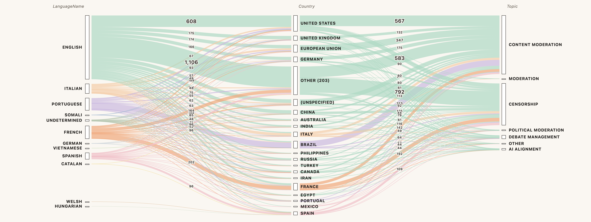
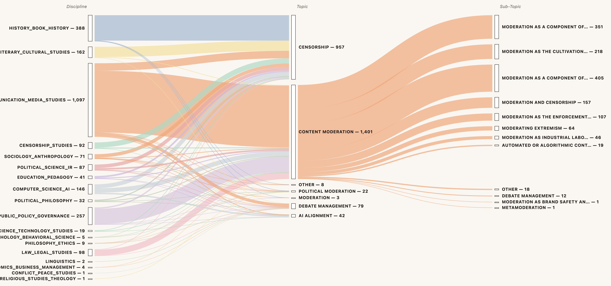

# Censorship and moderation: the oscillations of a contested practice

# Introduction

<div style="text-align: right;">The main thought that keeps running through my head..is that no-one seems to agree on what moderation is.</div>

<div style="text-align: right;">mod.comp-soc 4 September 1986 (Usenet newsgroup, accessed 29 Sept. 2023)</div>


At this point in its history, the term "moderation" has increasingly become associated with that of censorship. On one side, political actors of all strides no longer point to media conglomerates, governments or clerical forces as sole sources of censorship, but to platforms, be them social media or AI companies, as obstructing their rights to free and unfettered expression [@ganeshContentModerationCensorship2020]. On the other, platforms themselves have embraced this critique in more or less explicit terms [cit] as the primary reason for a u-turn, or at least change, to alternative philosophies of content moderation — be these a turn towards more discrete techniques, laissez-faire approaches, "prosocial" techniques or customisation [cit]. Indeed, from a purely technical standpoint, most applications of content moderation *can be* censorious [@gibsonFreeSpeechSafe2019]: they are designed to control the availability, visibility and flow of content and users based on normative (and legal) criteria [cit]. And though they are not always applied with an intent to suppress information, platforms have effectively, if "accidentally" (see [Chapter 4. Crisis III - Twitter as an accidental authority](Chapter%204.%20Crisis%20III%20-%20Twitter%20as%20an%20accidental%20authority.md)]), been bestowed powers once exclusive to historical censors, be them the state [@badouardRegulationContenusInternet2020; @klonickNewGovernorsPeople2017] or massive media conglomerates. Though they have long resisted formal responsibilities [@kaplanMoreSpeechFewer2025], the inevitable burden that comes from enforcing a minimum of protections against "systemic risks" [@europeanunionRegulationEU20222022] does indeed usher platforms into the polyvalent art of normative information management, alongside accusations of censorship this attracts from all sides of public debate.

As is common with controversies, it remains unclear what its central concept — moderation — has come to mean, except through its contestation. Etymological dictionaries tend to list at least two other families of definitions, the first being moderation as the Aristotelian "golden mean"; the art of reasonableness, balance and restraint in conduct and opinion [@oxfordenglishdictionaryModerationMeaningsEtymology2025a; @rabinowitzHarmonyCitySoul2014], be it political [@craiutuVirtuesPoliticalModeration2001], religious [@hasanConceptReligiousModeration2025], or other. The idea of moderation as balance does overlap that of *content* moderation around the idea of *restraint*: moderation is a cautionary measure to not necessarily suppress but reduce and attenuate what would otherwise be excessive (or "extreme"), and thus harmful, in a public sphere. At the same time, moderation also means the practical management of public debate. A moderator works to create intelligibility, coherence and continuous exchange in plurivocal environments, be those Church congregations, parliamentary debates, citizen assemblies, talk shows, academic symposia, labor union meetings, international diplomatic fora, and of course, as highlighted by early content moderation research [@edwardsModeratorEmergingDemocratic2002], a variety of online networks [@degandModerationFilsDiscussion2011, 2; @coleman2002hearing, 17; @seeringMetaphorsModeration2022]. There, specifically, the moderator is tasked with ensuring *informational coherence*: that, in a plural environment, information stemming from opinions and points of view retain a degree of balance, intelligibility, inclusivity and overall concord for a continuous and transformational synthesis of interests, ideas and other building blocks of public life [@oxfordenglishdictionaryModerationMeaningsEtymology2025].

Given the richness of the concept, in what circumstances did content moderation become restricted to its former definition as — that of a _restraint_ to dialogue? How did it come to contradict the practice _facilitating_ of dialogue? And to what extent is this separation even necessary, especially in light of increasing calls for a "prosocial" Internet to emerge _against_ moderation as a censorial force [@weylCommunityDesign2026a; @schirchBlueprintProsocialTech2025]? While discerning the practical differences between moderation as censorship and as the facilitation of public debate would require a long and winding history of their conceptual, material and institutional applications, I want to focus here on how each of these two notions have been described in scholarly literature about content moderation. A review of this kind does not always include a _material_ history of moderation, but it does show how moderation has been conceptualised in the context of its material evolution. Concretely, I propose a distant reading [@morettiDistantReading2013; @underwoodDistantReadingRecent2016] of the notion of moderation as defined by literature on (a) content moderation, primarily but not exclusively from media and communication studies; as compared to (b) notions of censorship and moderation outside of the topic of content moderation, which provide comparative and contextual material to historicise the former. 

By "notion", I mean four specific components I extract from the literature: (1) the definition each publication provides about moderation and adjacent practices, if available ("what"); (2) what actors they associate to their practice (for example, who is described as engaging in content moderation in a given publication — "who"); (3) the justifications described by the author for each practice ("why"); and (4) the techniques used to engaged in a practice ("how"). These components are extracted from 2 464 articles, books, preprints and theses from Google Scholar collected with keywords related content moderation and adjacent concepts ("content moderation", "content regulation", "community guidelines", "trust and safety", "platform governance"); censorship; and other notions that expand on the notion of moderation in other fields, particularly in debate management ("moderation debate", "debate moderator"); political moderation; and moderation proper ("moderation"). Gemini 3 Flash is used to collect sentences and paragraphs that constitute one of the four components described above from each publication. Sampling 500 items across disciplines, I then build a taxonomy of definitions, actors, justifications and techniques associated to content moderation, censorship, and adjacent concepts. 

With these, I gather discrete but meaningful data of how the notion of content moderation changed over time, as well as how it echoed other notions of moderation outside of the field. I find that, if we are to pinpoint a split of these two functions, one may remember studies of _content_ moderation before 2015 [@grimmelmannVirtuesModeration2015] as focusing primarily on moderation as the facilitation of online debates, particularly the opportunities it warrants for democratic governance to be "upscaled" online. Later studies have instead explored the more sinister effects of platforms being bestowed the power to moderate public speech, and what realities there are for norm enforcing powers to be negotiated between public, private and civil society actors [@gorwaPlatformGovernanceTriangle2019a]. And others, still, explored accountability mechanisms for keeping platform moderation — foreseen by Jansen as a form "corporate censorship" [@jansenCensorshipKnotThat1988] — in check [@douekGoverningOnlineSpeech2021]. But when one foregoes normative outlooks on moderation (as censorship scholars have done to their subject since the 1990s [@postCensorshipSilencingPractices1998]), one may view it within any other general _speech management technique_ endemic to public expression [@holquistIntroductionCorruptOriginals1994; @bourdieuLangagePouvoirSymbolique2001]. In that light, censorship and moderation can be seen as modalities of the same practice. Instead of contrasting the two, we consider _what kind_ [@jansenCensorshipKnotThat1988, 25] of speech management moderation may be within a long lineage of similar practices applicable to different environments and uses. 

In summary, moderation bears traits from both censorial practices — to frame the norms of public debate and delimit the reach and visibility of transgressive speech — and debate management norms — to facilitate the understanding, contextualisation and flow of information in plurivocal environments. Moderation "censors" in that it frames and enforces the norms within which information may flow in a public space, but it also prompts, contextualises, mediates, (re)directs and otherwise modulates exchanged information for the overall sake of social and informational _coherence_. When the balance between these two functions is lost and moderation is reduced to either one or another technique, it risks forfeiting its legitimacy. This is of course not the only reason behind legitimacy crises — there are power [@gorwaPoliticsPlatformRegulation2024], legal [@balkinFreeSpeechTriangle2018], institutional [@liuContentModerationPlatformised2024], and user [@myerswestCensoredSuspendedShadowbanned2018] and other dynamics that play an important (and non-exclusive) role. But this imbalance does indeed reveal a loss of consensus-building practices around defining the norms by which to carry public debate, which remains a legitimising [@allanBenchmarkPoliteness2016] and trust-building factor. The absence of these mechanisms in more centralised platforms is found in the recent history of platform content moderation, where mechanisms to frame, steer and contextualise debates from classic online public fora [@edwardsMODERATOREMERGINGDEMOCRATIC] have been progressively relegated to tasks automated "at scale" [@gorwaAlgorithmicContentModeration2020] and into logics of relevance, popularity and "freshness" [@davidsonYouTubeVideoRecommendation2010].

# Method

So far, histories of content moderation have centred around at least three categories: practices, systematic field literature reviews, and industry histories. By studying "practices", scholars have often responded to the impression of that moderation remains a polyvalent field whose main constant is its material manifestation, less than an authoritative definition. The practice may indeed materialise in telephone line surveillance [@carmiHiddenListenersRegulatingb], platform policies and algorithmic techniques [@decookSafeHarmGovernance2022b; @katzenbachPlatformGovernanceArchive2023; @dekeulenaarModerationCrisisYouTube2025], moderation as a profession [@seeringMetaphorsModeration2022], or the history of an industry [@robertsCommercialContentModeration2016]. 

Another is the study of content moderation as theorised by scholarly literature, specifically through systematic literature reviews around a research question needing to consolidate a state of consensus in the field (e.g., studies on how users perceive moderation [@maHowUsersExperience2023]), or through bibliometrics as form of "science mapping" [@oozanExploringContentModeration2024] — a reflection on the authors and topics that emerge from interactions between citation patterns and disciplinary convergences. Histories of moderation from an industry perspective also exist, typically in legal studies [@wuPrivacyFreeSpeech2022] that recollect the ways in which moderation has been adjudicated in landmark cases. These prove to be important turning points in how one can think of moderation with legal consequences.

The methods of histories of moderation as a practice tend to adapt to the material manifestations of their object of study. In the latter case, interviews and ethnographies [@gillespieCustodiansInternetPlatforms2018a; @robertsScreenContentModeration2019; @seeringMetaphorsModeration2022] as capturing moderation articulated from and by the ground: moderators making sense of their profession or commitment to an online community, particularly in a context where a practice, now industrialised, continues to be overlooked as a janitorial and underpaid task by workers of precarious economies, all while being crucial to the sustenance of public life around the world. There are other histories that focus on documented captured of moderation as a historical profession unbound by the Internet. Carmi [@carmiHiddenListenersRegulatingb] uses Bell Telephone Company articles on converging moderation technologies: how Bell workers modulated information transmissions, what their roles were, and what onboarding manuals could re-enact about the actual practice at that time [@carmiHiddenListenersRegulatingb, 444-445]. 

This is somewhat comparable to the study of platform policies, which indicate, to some degree, who partakes in the task of moderation, how moderation is done, why, and where. Beside algorithmic auditing [cit] and digital methods studies [cit], platform policies have been an oft-used source of documentation of moderation practices. For one, it is the manifestation of a platform corporate culture, and by extension of the inadvertent "governance" mechanisms [@gorwaWhatPlatformGovernance2019b] that make platforms new governing forces of public life [@klonickNewGovernorsPeople2017]. The method remains grounded in the industry itself: it uses platform policies are blueprints to occasionally reconstruct moderation as "platform effects" (see [Chapter 2. Methods for empirical content moderation research](Chapter%202.%20Methods%20for%20empirical%20content%20moderation%20research.md)). Conceptions of moderation are thus bound to how platforms define it in their own terms, and at most to how they are operationalised differently, in tension or in contradiction with policy clauses within auditable demotion, flagging, removal and reporting systems. 

Other histories can be weaved by systematic literature reviews for specific research questions — a state of epistemic affairs over, for example, of how users experience moderation [@maHowUsersExperience2023], or how moderators see their roles as "community managers" [@seeringMetaphorsModeration2022]. Beside aggregating knowledge on a given topic, the reason behind systematic literature reviews also consists in outlining a history of scholarly conceptions on a given phenomenon as part of a forming "epistemic culture" [@EpistemicCultures2015]. Different framings, topics and inferences emanate from a field in progression, and literature reviews tend to give a summarised picture of the state of the field. This is what bibliometric analyses [@oozanExploringContentModeration2024] also do: exposés of who is most cited around which topics, and what those topics reveal about which elements of content moderation become worthy of analysis over time. 

For the purposes of this project — a study of the notion of content moderation as compared with that of censorship and other information management techniques — it may be necessary to step beyond the field of content or platform governance alone, as well as the disciplines that typically take interest in them. The objective is to locate and compare content moderation within wider traditions of *public speech governance*, be them censorship, the management of public debate, political moderation, or related practices. This will be the common denominator for all publications and disciplines emerging in this analysis. From it emanate definitions, actors, techniques and justifications attributed to moderation, as well as sub-topics that help contextualise them: content moderation as platform governance; as part of platform regulation; as a form of compliance; as the enforcement of community norms by volunteer moderators; as a form of brand safety; as a form of industrial labor; as the need for moderating extremism; and as a form of censorship. Such components can then be compared to the study of other forms of speech governance: censorship; the management of public debate; media moderation; AI alignment; and, conceptually at least, political moderation. The procedure behind this comparison is explained in what follows. 

## Query design

To gather a corpus of literature that can capture *both* content moderation studies and adjacent literature on censorship and moderation, query design needed to reflect the conceptual diversity of the term. Queries spanned four conceptual clusters — censorship; content moderation; the pairing of moderation-and-censorship; and debate, media, and platform governance — across five languages spoken by the author: English, French, Portuguese, Spanish, and Italian. 

Three considerations motivated this breadth. The first is that moderation is a polysemic term whose (current) platform-bound usage participates in a much older web of meanings that contribute to contemporary definitions, from Aristotelian *sōphrosunē*, to parliamentary chairmanship, forum administration, to, indeed, censorial practices. Second, both moderation and censorship are heavily contested concepts [@delaatCoercionEmpowermentModeration2012] that are prone to deep disagreements even in scholarship, other than in rapid shifts in usage under conditions of public debate. Unearthing the conceptual backgrounds of moderation is a useful exercise to provide alternative frameworks for conceptualisation, especially when normative or methodological impasses prevent conceptual syntheses. Third, expanding the query set is one of the few defences against importing the framings the chapter aims to interrogate; querying *only* "content moderation" returns a literature already largely organised around platforms and online content more generally.

Some queries weighted more than others: moderation and censorship are central pieces of the study and were used to retrieve up to 500 results each, while surrounding queries yielded 100 results each (**[[#^table-queries|Table 1]]**). 

| Query                     | Type of concept | Language   | Results |
| ------------------------- | --------------- | ---------- | ------- |
| censorship                | key             | English    | 500     |
| moderation                | key             | English    | 500     |
| censor                    | key             | English    | 100     |
| community guidelines      | key             | English    | 100     |
| conflict moderation       | neighbour       | English    | 100     |
| conflict moderator        | neighbour       | English    | 100     |
| content moderation        | key             | English    | 100     |
| content moderator         | key             | English    | 100     |
| debate moderation         | neighbour       | English    | 100     |
| debate moderator          | neighbour       | English    | 100     |
| media moderation          | neighbour       | English    | 100     |
| media moderator           | neighbour       | English    | 100     |
| moderation censorship     | key             | English    | 100     |
| moderator                 | key             | English    | 100     |
| moderator censor          | key             | English    | 100     |
| television moderation     | neighbour       | English    | 100     |
| television moderator      | neighbour       | English    | 100     |
| trust and safety          | key             | English    | 100     |
| censeur                   | key             | French     | 100     |
| censure                   | key             | French     | 100     |
| modérateur                | key             | French     | 100     |
| modérateur censeur        | key             | French     | 100     |
| modérateur de conflits    | neighbour       | French     | 100     |
| modérateur de contenus    | key             | French     | 100     |
| modérateur de débat       | neighbour       | French     | 100     |
| modérateur des médias     | neighbour       | French     | 100     |
| modération                | key             | French     | 100     |
| modération censure        | key             | French     | 100     |
| modération de conflits    | neighbour       | French     | 100     |
| modération de contenu     | key             | French     | 100     |
| modération des débats     | neighbour       | French     | 100     |
| modération des médias     | neighbour       | French     | 100     |
| television modérateur     | neighbour       | French     | 100     |
| censura                   | key             | Spanish    | 100     |
| moderación                | key             | Spanish    | 100     |
| moderación de debates     | neighbour       | Spanish    | 100     |
| moderación de medios      | neighbour       | Spanish    | 100     |
| moderador                 | key             | Spanish    | 100     |
| moderador censor          | key             | Spanish    | 100     |
| moderador de conflictos   | neighbour       | Spanish    | 100     |
| moderador de debate       | neighbour       | Spanish    | 100     |
| Moderador de debate       | neighbour       | Spanish    | 100     |
| Moderador de medios       | neighbour       | Spanish    | 100     |
| moderación de conflictos  | neighbour       | Spanish    | 86      |
| il censore                | key             | Italian    | 100     |
| moderadore                | key             | Italian    | 100     |
| moderatore dei media      | neighbour       | Italian    | 100     |
| moderatore del dibattito  | neighbour       | Italian    | 100     |
| moderatore di conflitti   | neighbour       | Italian    | 100     |
| moderatore di contenuti   | neighbour       | Italian    | 100     |
| moderazione               | key             | Italian    | 100     |
| moderazione censura       | key             | Italian    | 100     |
| moderazione dei contenuti | key             | Italian    | 100     |
| moderazione dei media     | neighbour       | Italian    | 100     |
| moderazione del dibattito | neighbour       | Italian    | 100     |
| moderazione di conflitti  | neighbour       | Italian    | 100     |
| moderação                 | key             | Portuguese | 100     |
| moderação censura         | key             | Portuguese | 100     |
| moderação de conteúdo     | key             | Portuguese | 100     |
| moderação de debates      | neighbour       | Portuguese | 100     |
| moderação de mídia        | neighbour       | Portuguese | 100     |
| moderador de conflitos    | neighbour       | Portuguese | 100     |
| moderador de contéudos    | neighbour       | Portuguese | 100     |
| moderação de conflitos    | neighbour       | Portuguese | 57      |
**Table 1**. List of queries used in Google Scholar SerpAPI  ^table-queries

Multilingual coverage is instrumental for a number of reasons. Conceptually, Anglophone scholarship on content moderation often echoes US-centric legal debates about free speech rights and the needs for hate speech protections. Other languages bring their own contextual baggage: Portuguese and Spanish-speaking literature, for example, that of a particular experience of censorship during military regimes in Spain, Portugal and Latin America, as well as reflections on moderation as an instrument of transitional justice, political reform and historical reparation — all of which conceptualise moderation as the management of historical memory more than individual "harm" (see [Chapter 4. Crisis IV - Normative dislocation](Chapter%204.%20Crisis%20IV%20-%20Normative%20dislocation.md)). French and Italian scholarship contribute a rich theoretical tradition both in content moderation, political moderation and censorship rarely translated [@badouardRegulationContenusInternet2020; @degandModerationFilsDiscussion2011]. Though seminal contributions by Bourdieu and more recently Badouard may be read in English, other publications with strong conceptual anchors in French analytical traditions are often buried in old journals rarely visible in content moderation citation networks. And, though this literature is not often visible in the results, French and Portuguese also help capture contributions from geographical regions outside of the Western hemisphere. 

## Data collection

The queries above were used to obtain results from Google Scholar (via SerpAPI). Results were merged with an existing Zotero library of content moderation articles from all governance syllabi of PlatGovNet [@platgovnetResourcesPlatGov], producing a total of 7 772 books, book sections, journal publications, preprints, PhD theses and reports. 

Based publication titles, authors, abstract and URLs, a filtering process was applied to triage the relevance of each entry by prompting Gemini 3 Flash [@googleGemini3Flash2025] with a selection criteria and examples (**[[#^prompt-1|Prompt 1]]**). Results were validated manually, and only a total of 3,563 entries classified as "YES" or "MAYBE" were retained. 

```python
SYSTEM_PROMPT = """\
You are a research assistant screening academic literature for a PhD project \
on the history and theory of censorship and moderation.

Decide whether the item below is relevant to that project.

RELEVANT topics include (non-exhaustive):
- Censorship in any historical period or country
- Speech moderation in philosophy, political theory, sociology and other social science disciplines
- Moderation in conflict resolution
- Content moderation, platform governance, trust & safety
- Speech regulation, hate speech, harmful content policies
- Information control, propaganda, disinformation policy
- Press freedom, media law, broadcasting regulation
- Deplatforming, shadowbanning, algorithmic demotion
- Index of forbidden books, publication bans, prior restraint
- Computer science / AI / NLP applied to moderation or censorship
- Internet governance, online safety legislation
- The moderation of public debates (in any media)
- The moderation of public conflicts
- Moderating powers and roles in political and media systems
- Moderation in political philosophy, or philosophy in general
- The moderating role of different societal actors, such as media, schools, or other institutions
- Moderation in media, political, and religious contexts

NOT RELEVANT (answer NO):
- Medicine, clinical psychology, psychiatry, neuroscience
- Physics, chemistry, biology, ecology, earth sciences
- Engineering, materials science (unless about moderation tech)
- Mathematics (unless applied to moderation/censorship)
- Veterinary, agriculture, food science
- Items where censorship/moderation is mentioned only incidentally \
  (e.g. a history book that happens to mention a censor once)

Answer with EXACTLY one of: YES  /  NO  /  MAYBE
"""

ITEM_TEMPLATE = """\
Title:    {title}
Author:   {author}
URL:      {url}
Abstract: {abstract}
"""
```

**Prompt 1.** System prompt used by the relevance classifier. ^prompt-1

Full texts were obtained through a retrieval pipeline that scoured seven sources: direct URLs when containing PDFs; open-access repositories (HAL, archivesic, arXiv); the Royal Danish Library's catalogue; Anna's Archive (via their API), Sci-Hub (via API) and Google Search (via Serp API). Searched included author names and paper titles. In the absence of APIs, open access repositories were queried through an institutional VPN with cookies injected from a live browser session into a headless Selenium instance. For Google Searches, a separate relevance validator was used to confirm that retrieved PDFs matched their bibliographic entries by checking for the title as a contiguous phrase and the author surname in the first pages. From this process emerged 3 444 PDFs, including a handful converted from epub (**[[#^table-publications|Table 2]]**).

| Stage                                                                         | Items |
| ----------------------------------------------------------------------------- | ----: |
| Google Scholar search results                                                 | 7,143 |
| Zotero library                                                                | 5,512 |
| Tagged YES or MAYBE during relevance screening (**[[#^prompt-1\|Prompt 1]]**) | 4,278 |
| PDFs successfully downloaded                                                  | 3,444 |
| Retained in final results after manual screening                              | 2,514 |
**Table 2**. Number of publications found and downloaded from Google Scholar and PlatGovNet syllabi before and after validation. ^table-publications

The vast majority of results reflect the language of the queries, as well as the dominance of English-speaking research in the field (**[[#^table-languages|Table 3]]**). A few additional languages were picked up in the same lot: German, Welsh, Somali, Hungarian and Vietnamese are included, though in an exceedingly small percentage. 

| #  | Language     | Items | Share |
| --:| ------------ | -----:| -----:|
| 1  | English      | 1,306 | 51.9% |
| 2  | French       |   374 | 14.9% |
| 3  | Portuguese   |   349 | 13.9% |
| 4  | Italian      |   267 | 10.6% |
| 5  | Spanish      |   172 |  6.8% |
| 6  | German       |     4 |  0.2% |
| 7  | Catalan      |     2 |  0.1% |
| 8  | Somali       |     2 |  0.1% |
| 9  | Welsh        |     1 |  0.0% |
| 10 | Hungarian    |     1 |  0.0% |
| 11 | Vietnamese   |     1 |  0.0% |
| 12 | undetermined |    35 |  1.4% |
|    | **Total**    | **2,514** | **100%** |
**Table 3**. Distribution of the final corpus by language, detected with `langdetect` (seeded for reproducibility) over the concatenation of Title + Abstract Note. ^table-languages

Though English is the most predominant language, it is also used to speak of other regions — as are other languages — in an either self-referential or adversarial way (**[[#^figure-1|Figure 1]]**). In the former case, English-speaking publications will tend to more about the United States, the UK, EU and Germany; as will other languages about their own predominant countries. In the latter case, English-speaking publications will often problematise China as a source of censorship or peculiar moderation practices. The very few publications in Catalan will critique censorship cases in Spain. 

[](https://edekeulenaar.github.io/censorship-and-moderation/#fig-lang-country)

**Figure 1**. Where each language looks — alluvial flow from the publication's detected Language, through every Country it discusses, into the Topic it engages with. ^figure-1

## Metadata and discipline enrichment

Not all publications had complete metadata; some missed publication dates, others than incorrect author names, and others had no publication venue. Metadata was enriched across three sources: OpenAlex for DOI, journal metadata, citation counts, and open-access status; Crossref for publisher, ISSN, and author disambiguation; and Semantic Scholar as a fallback for citation counts and abstracts. The Zotero Web API supplied user-curated fields that DOI-based APIs may not always provide: canonical item keys, item type, normalised author lists, language, place, and library catalogue. 

Discipline labels were added to each publication through a Gemini 3 Flash classification step using title, abstract, and venue (**[[#^prompt-1|Prompt 2]]**). Disciplines were assigned per article — primary and secondary — through a Gemini classification step over title, abstract, and venue, and then validated manually. Labels distinguish communication and media studies (a  dominant articulator of *content* moderation as a concept) from history, book history, art and literary studies, political science, law, sociology, philosophy, and computer science and AI. 

Two labelling decisions deserve flagging. First, *censorship studies* proper — inaugurated by Robert C. Post's edited volume in the 1990s [@postCensorshipSilencingPractices1998] — was retained as a separable sub-field rather than folded into political science or literary studies. Second, *computer science and AI* was treated as a form of primary literature alongside its secondary status: technical papers on filtering, hashing, classification or recommendation are not only *about* moderation, they often *produce* the moderation infrastructure the rest of the literature theorises [@gorwaAlgorithmicContentModeration2020]. 

```python
NEW_COLS = [
    "Discipline",
    "Discipline Secondary",
    "Discipline Confidence",
    "Discipline Model",
]

DISCIPLINES = [
    "communication_media_studies",
    "law_legal_studies",
    "computer_science_ai",
    "political_science_ir",
    "sociology_anthropology",
    "philosophy_ethics",
    "history_book_history",
    "religious_studies_theology",
    "education_pedagogy",
    "psychology_behavioral_science",
    "economics_business_management",
    "statistics_methods",
    "arts_literary_cultural_studies",
    "science_technology_studies",
    "public_policy_governance",
    "other_unclear",
    "censorship_studies",
    "political_philosophy",
    "conflict_peace_studies",
    "rhetoric",
    "linguistics"
]

SYSTEM_PROMPT = f"""\
You classify scholarly bibliography items by the main academic discipline of
the work, using only the provided metadata. This project studies moderation,
censorship, and adjacent concepts across disciplines, so classify the scholarly
discipline, not whether the item is relevant.

Use exactly one primary discipline from this controlled vocabulary:
{", ".join(DISCIPLINES)}

Guidance:
- Choose the discipline that best describes the article/book/chapter itself.
- Publication venue and abstract are stronger signals than isolated keywords.
- For platform/content moderation law, choose law_legal_studies when the frame
  is legal doctrine or regulation; communication_media_studies when the frame is
  media/platform governance; computer_science_ai when the frame is technical.
- Use statistics_methods for moderation/censoring as a statistical method.
- Use censorship_studies for studies on censorship itself.
- Use political_philosophy for studies on moderation in political systems or political thought. 
- Use philosophy_ethics for studies on e.g. stoicism and other philosophical traditions interested in mental, physical or other moderation. 
- Use religious_studies_theology for studies on religious moderation.
- Use other_unclear only when metadata is too sparse or genuinely ambiguous.
- If a secondary discipline is useful, include it; otherwise use an empty string.

Return exactly one line and nothing else:
discipline<TAB>secondary_discipline<TAB>confidence

The first value must be one controlled vocabulary value. The second value must
be one controlled vocabulary value or empty. Confidence is a number from 0 to 1.
"""
```

**Prompt 2.** System prompt used by the discipline classifier. ^prompt-2

There are clear divisions amongst disciplines studying different speech governance techniques. Communication and media studies remain the most field in studying content moderation, as are, to a lesser extent, studies versed in public policy and governance and law and legal studies [@sanderFreedomExpressionAge2019; @douekGoverningOnlineSpeech2021; @degregorioDemocratisingOnlineContent2020], and computer science [@mhortaribeiroAutomatedContentModeration2023; @vlaiHumanaiCollaborationConditional; @binnsTrainerBotInheritance2017]. In turn, the vast majority of these studies are dedicated to the umbrella field of content moderation as a component of platform governance or regulation, with other, earlier studies examining it as a mechanism for managing democratic public spheres through, for example, debate moderation. Conversely, censorship is a topic far more dominated by book [@fiskeBookSelectionCensorship2022], press [@ljleffDameKimonoHollywood; @cscleggPressCensorshipElizabethan], and visual history [@huntInventionPornographyObscenity1993], literary [@pattersonCensorshipGenreInterpretation1990] and cultural studies [@coetzeeGivingOffenseEssays2005], as well as the specific sub-field that developed in the 1990s as "censorship studies" [@postCensorshipSilencingPractices1998; @holquistIntroductionCorruptOriginals1994], in addition to communication and media studies focusing on infrastructural censorship [@mackinnonFlatterWorldThicker2007], in various media beside the Internet [@mazzarellawilliamCensoriumCinemaOpen2013], or online [@sleeperPostThatWasnt2013a]. This division may be a cause to unclear overlaps of moderation and censorship as speech governance techniques; at least explicitly. 

[](https://edekeulenaar.github.io/censorship-and-moderation/#fig-sankey-discipline-topic)
**Figure 2**. Unique items flowing from Discipline to Topic, with a third hop to the four Sub-topics of Content moderation. ^figure-2

## Building a taxonomy

Next, publications were classified into three taxonomies: one, on the level of the *topic*; second, on a sub-topic; and third, on key components that constitute a publication's conception of moderation or censorship (the what, how, why and who mentioned above), as well as contextual fields: what media ("medium") and countr(ies) are described in the publication ("where"). The latter two are especially relevant for studying the material context in which a concept like moderation or censorship is defined and are, in some cases, defining features (**==section x==**). 

### Sampling ^sampling

Taxonomies were built based on canonical literature cited in PlatGovNet syllabi (i.e., definitions, actors and other points defined by those authors) and inductively, i.e., based on what emerges from publications. In the latter case, a stratified sample of 500 items was drawn for close manual reading. Sampling was done along four dimensions: query and language, to mirror the conceptual and linguistic structure of the search; discipline, with communication and media studies set at roughly half the sample; citation impact, with works above 200 citations were included so canonical contributions could not be missed; and publication year, binned into pre-2000, 2000–2009, 2010–2019, and 2020+ to retain historical depth. As citations were often incorrect or missing, they weighted less in the sampling calculation. Each sampled item was given a close reading. For each relevant passage, I recorded a type of claim (what moderation or censorship are; how they are done; who do it, and why) and a verbatim phrase anchoring it (**[Annex 1](https://docs.google.com/spreadsheets/d/1_UE4CWyFGLrsjfkC0e-Kp51l8Ue2nzR4DTa5Do7tZHY/edit?usp=sharing)**). 

### Topical and sub-topical categories

On the topical level (**[[#^topic-taxonomy|Topic and sub-topic taxonomy]]**), six categories were identified as relevant to the study: beside content moderation and censorship, this included the moderation of media in general (pre-Internet); political moderation; and moderation as the art of managing plural debate, which also echoes as a sub-topic within content moderation. The interest here is also to analyse the evolution of studies on content moderation, such as sub-topics for this field were also necessary. Drawing from chronologically sorted samples and canonical sources from syllabi, nine sub-topics were identified: the idea of moderation as a form of censorship, be it from the state, from platforms, or as a lived experience [@olhaimsonDisproportionateRemovalsDiffering; @bammanCensorshipDeletionPractices2012; @trottierSocialMediaPolitics2014a; @diasolivaFightingHateSpeech2021a]; as part of platform governance [@gorwaWhatPlatformGovernance2019b; @gillespieCustodiansInternet2018; @tgillespieGovernancePlatforms; @klonickNewGovernorsPeople2017; @caplanContemporaryIssuesConcerns]; of platform regulation [@gorwaPoliticsPlatformRegulation2024; @grstoneContentRegulationFirst1983; @langvardtRegulatingOnlineContent2017]; as industrial labour [@robertsScreenContentModeration2019; @ruckensteinRehumanizingPlatformContent2020; @rafaelgrohmannTrabalhoPorPlataformas; @arshtHumanCostOnline2018]; compliance [@karaganisjoeNoticeTakedownEveryday2017; @atrujilloDSATransparencyDatabase2025]; brand safety [@liuSocialMediaContent2021]; as a way of enforcing community norms and identity, particularly in creator cultures [@lampeSlashdotBurnDistributed2004; @wohnVolunteerModeratorsTwitch2019a; @chandrasekharanBagCommunitiesIdentifying2017a]; and as the art of managing public debate, towards a more or less ambitious goal at democratic or "prosocial" design and "healthy communities". Some of this early literature is nested in few but impactful studies of the role of moderators in online learning [@salmonEmoderatingKeyTeaching2011], which have spilled over in more or less contemporary explorations of moderation and moderators as key "intermediaries" for online public debate in online fora and with governmental actors [@edwardsMODERATOREMERGINGDEMOCRATIC; @wrightDemocracyDeliberationDesign2007b; @kieslersaraBuildingSuccessfulOnline2012]. 

These categories are by now means complete. They are combinations of field-specific denominations ("platform governance", "platform regulation", "trust and safety industry") and arbitrary categories useful for finding conceptual overlaps in conceptions of moderation, particularly "moderation as censorship" and "moderation as the cultivation of a democratic public sphere". The association of content moderation with censorship, where it occurs, is treated as a relation between two topics rather than a collapse of one into the other: an item is coded as "censorship" if the author primarily theorises censorship (whether or not they mention platforms), and as "content moderation" if the author primarily theorises platform-bound practice (whether or not they invoke censorship as critique). Items that link the two — from opinion pieces such as Kalev Leetaru's *"Content moderation is a euphemism for censorship"* to Drüeke et al.'s study of platform-censorship narratives in German-speaking COVID-19 conspiracy communities [@druekeTHEYWILLDESTROY2025] — are coded by which side of the linkage they primarily develop. The boundary cuts both ways: there are also moments at which *debate management* is itself linked to censorship [@shenPerceptionsCensorshipModeration2018], and these are coded as debate moderation when the practice under analysis is the chairing of exchange. *Platform governance*, finally, is delimited as literature treating moderation as one element within a broader institutional, legal or infrastructural arrangement, rather than as the practice itself.

| Topic                | Sub-topic                                                   | Definition                                                                                                                                                                                                                                                                                                                                                                                                                                                                                                                                                                         |
| -------------------- | ----------------------------------------------------------- | ---------------------------------------------------------------------------------------------------------------------------------------------------------------------------------------------------------------------------------------------------------------------------------------------------------------------------------------------------------------------------------------------------------------------------------------------------------------------------------------------------------------------------------------------------------------------------------- |
| Content moderation   | Moderation as censorship                                    | Frames content moderation as a form of censorship — the suppression, silencing or removal of speech that platforms or their political allies find objectionable. The item explicitly argues that moderation IS (or operates as) censorship, rather than merely critiquing specific moderation decisions in passing.                                                                                                                                                                                                                                                                |
| Content moderation   | Moderation as a means to reducing  extremism                | Frames content moderation as the task of containing or removing extremist content — terrorism, violent extremism, radicalisation pathways, and religious or political extremism — and treats extremist material as a distinct category demanding its own policies, operational responses and threat models.                                                                                                                                                                                                                                                                        |
| Content moderation   | Moderation as part of platform governance                   | Frames content moderation as the mechanism through which platforms exercise rule-making authority over their own ecosystems. Focuses on the design and management of internal rules, decision rights, enforcement procedures, appeals, and the policies that align moderation with the platform's architecture, business model and lifecycle. Concerns rule-making BY the platform, not regulation OF it.                                                                                                                                                                          |
| Content moderation   | Moderation as part of platform regulation                   | Frames content moderation as the object of external governance by states, courts and other public actors. Focuses on statutes and regulatory regimes (e.g. EU DSA, NetzDG, Section 230, Online Safety Acts), intermediary-liability doctrine, court rulings, regulator interventions, and the broader public-policy steering of platform moderation. Concerns regulation OF platforms, not their internal rule-making.                                                                                                                                                             |
| Content moderation   | Moderation as industrial labour                             | Frames content moderation as a global industrial labour process — the large-scale review of user-generated content by paid workers, typically outsourced to BPOs or crowd-work platforms — and foregrounds the working conditions, supply chains, psychological toll, and political economy of that workforce.                                                                                                                                                                                                                                                                     |
| Content moderation   | Moderation as compliance                                    | Frames content moderation as the operational mechanism through which platforms meet their legal and regulatory obligations — processing takedown notices, executing court orders, satisfying transparency mandates and statutory duties of care, and demonstrating conformity to regulators.                                                                                                                                                                                                                                                                                       |
| Content moderation   | Moderation as brand safety                                  | Frames content moderation as the production of advertiser-friendly, brand-safe environments that retain users and protect the platform's economic model. Conceives CM as a business function answerable primarily to advertisers, investors and growth metrics rather than to law, community or rights.                                                                                                                                                                                                                                                                            |
| Content moderation   | Moderation as community norms and identity                  | Frames content moderation as the upholding of a particular community's norms, rules and collective identity — typically performed by volunteer or user-moderators (subreddit mods, Wikipedia editors, Discord admins, forum operators) — rather than by platform-wide policy. Emphasises bottom-up, participatory rule-enforcement.                                                                                                                                                                                                                                                |
| Content moderation   | Moderation as the cultivation of a democratic public sphere | Frames content moderation as the cultivation of the conditions for democratic deliberation, civic discourse and political participation. Conceives CM as a public-sphere-sustaining activity with explicitly democratic-theoretical stakes (legitimacy, pluralism, inclusion, epistemic quality). Content moderation is the facilitation, structuring and promotion of online public debate — keeping discussions on topic, securing balanced participation, raising deliberative quality — typically in civic fora, comment sections, or dedicated online deliberation platforms. |
| Censorship           | —                                                           | Studies the suppression, prohibition or removal of speech, writing, images or other expression deemed obscene, politically unacceptable, blasphemous, or threatening to security — by state, religious, corporate or other authorities. The item's subject is censorship as such (historical, legal, political), not online content moderation.                                                                                                                                                                                                                                    |
| Debate management    | —                                                           | Studies moderation as the practice of managing debate — chairing, facilitating, structuring discussion — in democratic deliberation, mediation, conflict resolution, classroom and civic settings. Concerns face-to-face or institutional debate practice, distinct from online content moderation.                                                                                                                                                                                                                                                                                |
| Media moderation     | —                                                           | Studies moderation as practiced in legacy or non-platform media — broadcasting standards, editorial gatekeeping, press regulation, film classification, advertising standards — rather than on online platforms, fora or social media.                                                                                                                                                                                                                                                                                                                                             |
| Moderation           | —                                                           | Frames moderation as a concept, virtue or tradition within philosophy and intellectual history — temperance, the via media, the moderate disposition — rather than as a contemporary platform, media or political practice.                                                                                                                                                                                                                                                                                                                                                        |
| Political moderation | —                                                           | Studies moderation as a tradition in political theory and practice — the moderation of powers (separation of powers, checks and balances, constitutionalism) and the moderation of extreme political beliefs (the politics of the centre, deradicalisation). Concerns political institutions and ideologies, not online content.                                                                                                                                                                                                                                                   |
| Other                | —                                                           | Specify in three words.                                                                                                                                                                                                                                                                                                                                                                                                                                                                                                                                                            |
**Table 3.** Topic taxonmy ^topic-taxonomy

### Extracting and categorising the what, who, how and why of moderation

Another purpose of [[(#^sampling)|sampling]] was to categorise frequent patterns in how publications verbalised the what, how, who and why of moderation and related practices. In the "What" category, Gemini 3 Flash is asked in **[[#^prompt-3|Prompt 3]]** to extract *explicit* definitions of what moderation, censorship and adjacent practices are. In "How", it looks for how moderation, censorship and adjacent practices are carried out in the form of specific TECHNIQUES or methods used. This may include techniques proper to content moderation and censorship (e.g., keyword filtering, shadow-banning, algorithmic detection, content removal, labelling, throttling, demotion, account suspension, beeping, marginalising, suspensions, obfuscation), but also moderation as the management of public debate (facilitating discussions, recommending information to engaged participants, etc). In "Who", who performs moderation and adjacent practices (human moderators, automated systems, platforms, states, communities, hybrid actors, third-party contractors, or other). In "Why", what function or societal role moderation or censorship serve (e.g., norm enforcement, harm reduction, gatekeeping, legitimisation, information control, facilitation of dialogue).
 
```python

EXTRACTION_PROMPT = """\
In its history, MODERATION has been defined in a number of different ways, from a form of lessening extremes, to the moderation of public debates, to a form of censorship.

You are given a PDF (already uploaded).

Your task is to extract THE MOST SPECIFIC verbatim passages from the document that address the following five dimensions of moderation or censorship:

1. **WHAT** — Explicit definitions of what moderation or censorship are (conceptual definitions, distinguishing features, typologies).
2. **HOW** — HOW moderation or censorship are carried out in the form of specific TECHNIQUES or methods used (e.g., keyword filtering, shadow-banning, algorithmic detection, content removal, labelling, throttling, demotion, account suspension, beeping, marginalising, suspensions, obfuscation, facilitating discussions, recommending information to engaged participants, etc).
3. **WHO** — WHO performs moderation or censorship (human moderators, automated systems, platforms, states, communities, hybrid actors, third-party contractors).
4. **WHY** — What FUNCTION or societal role moderation or censorship serve (e.g., norm enforcement, harm reduction, gatekeeping, legitimisation, information control, facilitation of dialogue).

Rules:
- Provide the **exact** and **most specific** verbatim quote as it appears in the text. Do NOT paraphrase, summarise, or fabricate.
- Include the **page number** where the quote appears, as a string (e.g., "3").
- Do NOT repeat any quote. Each quote must appear only once in the output.
- If a passage is relevant to multiple dimensions, place it under its **primary** dimension only.
- If no relevant passage is found for a dimension, leave its list empty ([]).

Return your response as a **single JSON object** wrapped in triple backticks tagged as json:

```json
{
  "what": [{"quote": "...", "page": "N"}, ...],
  "how":  [{"quote": "...", "page": "N"}, ...],
  "who":  [{"quote": "...", "page": "N"}, ...],
  "why":  [{"quote": "...", "page": "N"}, ...]
}

"""

EXTRACT_FIELDS = [
    'File', 'PDF Path', 'Relevant',
    'Query', 'Authors', 'Year', 'Title', 'Snippet',
    'What', 'How', 'Who', 'Why', 'Raw JSON',
]
```

**Prompt 3**. Prompt used to extract the what, how, why, who, when of moderation and adjacent practices from each PDF. ^prompt-3

Categorising results manually meant using a combination of canonical theories from content moderation research (listed in PlatGovNet syllabi and most cited publications from the corpora) and what emerged from publications themselves. Categories, especially the "how", "why" and "who", are intentionally topic-agnostic (**[[#^tax-how|The "how" taxonomy]]**; (**[[#^tax-what|The "what" taxonomy]]**); (**[[#^tax-why|The "why" taxonomy]]**); (**[[#^tax-who|The "who" taxonomy]]**)). This allows cross-cutting comparisons across topics and disciplines; situations in which one finds descriptions of both content moderation and censorship using "filtering" or "blocking" techniques, for example. This also means generalising categories beyond field-specific terminologies. "Balancing", for example, is an information management technique used as much as in journalism (e.g., the idea of two-sided journalistic coverage and balance) as in the moderation of public debate: to provide counter-arguments or counter-speech; to control speaking time in political debates; to balance the visibility of posts across political divided in a ranking system [@weylCommunityDesign2026a]. "Enframing" is another example that touches upon any and all forms of information management of public spheres: to set the norms of public behaviour, and so on (**[[#^tax-how|The "how" taxonomy]]**). Some of these techniques may, however, be more more mentioned in one speech governance technique than another — the latter to, typically to moderation as a form of debate management. 

==To bundle up different speech governance techniques across censorship and moderation literature also offers an opportunity to consider their over-arching logics. Censorship literature often distinguishes "pre" and "post" interferences [cit], as have done some content moderation studies [@gillespieCustodiansInternet2018]. When the literature mentions a wide array of media, however, these techniques often fail to reflect cross-cutting forms of speech governance. Here, one can identify at least ==

| Category                 | Definition                                                                                                                                                                                                                                                                                                                                                                                                                                                                                                                       | Relevant keywords                                                                                                                                                                                                                                                                                                                                                                                                                                                                                                                                                                                                         |
| ------------------------ | -------------------------------------------------------------------------------------------------------------------------------------------------------------------------------------------------------------------------------------------------------------------------------------------------------------------------------------------------------------------------------------------------------------------------------------------------------------------------------------------------------------------------------- | ------------------------------------------------------------------------------------------------------------------------------------------------------------------------------------------------------------------------------------------------------------------------------------------------------------------------------------------------------------------------------------------------------------------------------------------------------------------------------------------------------------------------------------------------------------------------------------------------------------------------- |
| Balancing                | Distributing speaking time, visibility, or representation equitably across actors — controlling speaking time (*contrôle du temps de parole*), equal-time rules, party-representation quotas in broadcast, setting a pace, prioritising voices by institutional function. Moderation operates on the distribution of voice, not its content.                                                                                                                                                                                     | providing counter-arguments or counter-speech; contrôle de temps de parole; distribute / equalize speaking time; representation equitable des partis; setting a pace; temps d'antenne aux partis; prioritising voices based on their institutional function; two-sided journalistic coverage and balance                                                                                                                                                                                                                                                                                                                  |
| Blocking                 | Temporary suspension of content, account, or output — per-incident bans, content holds, information blackouts, single-query LLM refusals. Distinguished from *Removal* (intent to destroy), *Deplatforming* (severing the speaker), and *Restricting access* (infrastructural reach) by its provisional, often automated, per-incident character.                                                                                                                                                                                | LLM refusals; account or content suspensions; information blackouts                                                                                                                                                                                                                                                                                                                                                                                                                                                                                                                                                       |
| Bridging                 | Facilitating exchanges of information across groups, ideological divides, or communities that would not otherwise encounter each other — bridging-based ranking (e.g., Twitter/X Community Notes, Polis), surfacing cross-cleavage agreement, prioritising content with cross-divide endorsement. CODE HERE when moderation aims to surface common ground or weight cross-group consensus.                                                                                                                                       | finding unifying threads in participant comments; prioritising content across user divides                                                                                                                                                                                                                                                                                                                                                                                                                                                                                                                                |
| Coersive                 | Threats of physical, personal, or legal persecution directed at potentially problematic speech, producing a chilling or "spiral" effect that disincentivises authentic and spontaneous expression. Distinct from *Economic* (money) and *Self-censorship* (internal): coercion operates through the credible prospect of state or private violence/sanction, even when no act of suppression is formally executed.                                                                                                               | —                                                                                                                                                                                                                                                                                                                                                                                                                                                                                                                                                                                                                         |
| Coherence                | Maintaining the social fabric, momentum, and safety of the conversation — building trust, summarising, archiving forgotten threads, repairing the discussion after conflict, restoring dialogue when it breaks down. Moderation as care for the conversational fabric over time.                                                                                                                                                                                                                                                 | creating an atmosphere of trust; summarise a debate; tidying up forgotten topics by freezing and archiving; recompose the discussion after conflict; restoring debate or dialogue when it breaks down                                                                                                                                                                                                                                                                                                                                                                                                                     |
| Confiscation             | Interception and seizure of problematic material to keep it out of public circulation — customs interception, police seizure, asset takeover. The content is taken into the censor's custody rather than destroyed or merely de-listed.                                                                                                                                                                                                                                                                                          | interception; capture; confiscation                                                                                                                                                                                                                                                                                                                                                                                                                                                                                                                                                                                       |
| Correcting               | Rectifying or counter-stating a piece of information rather than suppressing it — fact-checking, accuracy labels, promotion of corrective information. Moderation operates by adding true information, not removing the disputed item.                                                                                                                                                                                                                                                                                           | promotion of accurate information; fact-checking                                                                                                                                                                                                                                                                                                                                                                                                                                                                                                                                                                          |
| Deplatforming            | Permanently or temporarily severing a speaker or venue from a distribution channel — account bans, revoked broadcasting licences, closure of publishing houses or news offices, shutdown of distribution units. Distinguished from *Removal* (acts on an item) and *Blocking* (temporary, per-incident) by acting on the speaker or the venue as a whole.                                                                                                                                                                        | banning content or a user; deplatforming content or a user; permanent user bans; temporary user bans; revoke broadcasting licenses; suspending licences; closure of distribution units (e.g. blocking platforms; closing publishing houses or news media offices)                                                                                                                                                                                                                                                                                                                                                         |
| Disclosure               | Compelling the surfacing of hidden, encrypted, or implicit content for review — backdoor or decryption mandates, identity-disclosure rules, requirements to reveal sources or beneficial owners, forced unveiling of latent meaning. Restriction is conditioned on what disclosure reveals.                                                                                                                                                                                                                                      | uncovering meaning                                                                                                                                                                                                                                                                                                                                                                                                                                                                                                                                                                                                        |
| Economic                 | Disincentivising the production or circulation of problematic speech through monetary means — defunding, demonetisation, payment-processor exclusion, advertiser withdrawal, contract cancellation, SLAPP litigation, denial of public subsidies. The censorial pressure operates through money flows rather than through content rules directly.                                                                                                                                                                                | demonetization; economic sabotage; pressure over circulation of goods; withdrawal of public funds; contract cancellation; economic sanctioning                                                                                                                                                                                                                                                                                                                                                                                                                                                                            |
| Enframing                | Setting the conditions under which debate or publication may occur — community guidelines, developer guidelines, format rules, mandatory themes, statements of purpose, press codes, topical scoping. The moderator does not remove items but constrains the shape of what can be said.                                                                                                                                                                                                                                          | community guidelines; controls the manner or form that the messages are allowed to take; controls what can be said in a forum; délimiter un cadre et un mode d'expression; developer guidelines; establish a structure for dialogue; establishing the boundaries of the discussion; imposing formats; imposing mandatory themes; limiting the expansion of debate; preparing the discussion; provides a statement of purpose; shaping discussion boundaries; suggests limits; taking care of conditions and provisions; establish norms of publication format; issuing a press code; redirect toward main topic of debate |
| Filtering                | Selectively removing some but not all material before publication, on the basis of a criterion or classifier — packet filtering, SNI/URL filtering, keyword filters, dataset cleaning, triage of incoming questions or prompts, selection of debate participants, editorial gatekeeping. Distinct from *Removal* in being routine, criterion-based, and often automated.                                                                                                                                                         | cleaning sanitized content out of training data; packet filtering; pre-filter; selection; SNI filtering; URLF filtering; filtering; keyword filtering; tri des questions et des interventions; triaging questions or prompts; choosing the participants of a debate; selecting calls, letters, tweets and questions for inclusion in programming                                                                                                                                                                                                                                                                          |
| Intelligibility          | Providing the information necessary for participants to understand the topic and participate meaningfully — contextualising the debate, supplying expertise, supplying background, removing communication barriers. Moderation as the production of understanding.                                                                                                                                                                                                                                                               | when participants of a debate are actively included                                                                                                                                                                                                                                                                                                                                                                                                                                                                                                                                                                       |
| Interiorisation          | The process by which a speaker, a machine, or a society absorbs and reproduces speech norms autonomously, without ongoing external enforcement — self-censorship as habit, RLHF-trained model behaviour, Bourdieu's *habitus*, Freud's *Zensur*.                                                                                                                                                                                                                                                                                 | reinforcement learning; self-censorship                                                                                                                                                                                                                                                                                                                                                                                                                                                                                                                                                                                   |
| Intermediate             | Embedding a discussion within a wider political and organisational environment — brokering exchanges between elected representatives and citizens, negotiating discussion agendas with political formations, mediating between platforms and external bodies. The moderator acts as a broker between speech contexts and external power.                                                                                                                                                                                         | embedding a discussion in a political and organizational environment; facilitating debate between elected representatives and citizens; negotiate issues to be discussed with political formations                                                                                                                                                                                                                                                                                                                                                                                                                        |
| Labeling                 | Written, visual, or oral interjections that frame a piece of information in a normative direction — content warnings, ideological footnotes, clarifying phrases, disclaimers, "disputed" tags. The original content is unaltered; the frame around it is the moderation.                                                                                                                                                                                                                                                         | ideological interjection (clarifying phrases and footnotes); warnings                                                                                                                                                                                                                                                                                                                                                                                                                                                                                                                                                     |
| Marginalisation          | Decreasing the visibility, ranking, or reach of content to diminish its influence without removing it — downranking, shadow-banning, de-prioritisation, "privishing" (publishing without promotion). The item remains technically available but is made hard to find or engage with.                                                                                                                                                                                                                                             | exclusion; marginalisation; toning down; reducing visibility; reducing reach; downranking; privishing; de-prioritization; shadowbanning; weakening of meaning                                                                                                                                                                                                                                                                                                                                                                                                                                                             |
| Metamoderation           | Deliberation and clarification of the moderation norms themselves, by moderators and/or participants — public consultation on community guidelines, collective Constitutional AI, justifications attached to takedowns, election of moderators. Metamoderation can also operate repressively, e.g., by limiting or prohibiting critique of censorship itself.                                                                                                                                                                    | explain any censorship; collective constitutional AI; limiting or prohibiting critique of censorship; public consultation processes; choosing moderators                                                                                                                                                                                                                                                                                                                                                                                                                                                                  |
| Moderating powers        | A constitutional "moderating power" (*poder moderador*): an overarching, ostensibly neutral branch of government empowered to resolve conflicts and balance executive, legislative, and judicial interests — and, by extension, debate-management functions that temper, reconcile, or hold the middle ground.                                                                                                                                                                                                                   | moderate parliamentary sessions; reconcile extremes; subject parties to compromises; maintaining a middle ground; preserving peace; updating language of debate; tempering language                                                                                                                                                                                                                                                                                                                                                                                                                                       |
| Modification             | Altering a piece of information to reduce its offensive impact or change its meaning, instead of removing it altogether — expurgation, redaction, doctoring, rewriting, retranslation. The content survives but in altered form.                                                                                                                                                                                                                                                                                                 | expurgation; redaction; substitution; editing; translation; information manipulation; doctoring images; revision; modify; mutilate; rewrite; shift of accent                                                                                                                                                                                                                                                                                                                                                                                                                                                              |
| Monitoring               | Surveilling the presence and flow of problematic information in public circulation without (yet) acting on it — traffic monitoring, wiretapping, deep packet inspection, traffic analysis and fingerprinting, payload/flow analysis, content-quality auditing. Often a precondition for downstream *Filtering*, *Blocking*, or *Coercion*.                                                                                                                                                                                       | traffic monitoring; wiretapping; eavesdropping; deep packet inspection; traffic analysis; reassemble fragmented packets; maintain connection state; protocol classification (VPN detection); payload analysis; flow analysis; traffic fingerprinting; monitoring information quality                                                                                                                                                                                                                                                                                                                                      |
| Obfuscation              | Partially hiding problematic content while leaving its presence detectable — pixelating, scrambling, blacking out sentences, euphemisms, veiled allusions, dubbing over offensive audio. The reader/viewer knows something is concealed.                                                                                                                                                                                                                                                                                         | dubbing; coining euphemisms; blacking out sentences; veiled allusions; crossing out text; scramble channels; pixelating; euphemistic locution; cutout                                                                                                                                                                                                                                                                                                                                                                                                                                                                     |
| Profiling                | Building taxonomies of permitted and prohibited content or speakers — blacklists, whitelists, banned-term lists, unparliamentary-language registers, target profiles. The classificatory artefact precedes and enables downstream removal/filtering.                                                                                                                                                                                                                                                                             | blacklisting; profiling targets; whitelists; lists of banned terms; unparliamentary-language list                                                                                                                                                                                                                                                                                                                                                                                                                                                                                                                         |
| Prompting                | Ensuring continued discursive activity — initiating the session, eliciting participation, raising unanswered questions, surfacing overlooked contributions. Moderation as the production of more speech, not less.                                                                                                                                                                                                                                                                                                               | initiates the conference; ensuring participation; furthering the progress of the discussion; raising questions that have remained unanswered; relaying overlooked messages                                                                                                                                                                                                                                                                                                                                                                                                                                                |
| Rating                   | Classifying or scoring content (age ratings, advisory labels, user-supplied karma, trust scores) to condition its access, audience, or reach without removing it. The classification itself is the moderating act; downstream effects (gating, surfacing, demonetising) follow from the rating.                                                                                                                                                                                                                                  | parental advisory; rating comments with karma                                                                                                                                                                                                                                                                                                                                                                                                                                                                                                                                                                             |
| Redirection              | Rerouting a problematic utterance or destination toward a more acceptable alternative, on either a verbal or technical level. Verbally: replacing a sanctioned word (external redirection) or shifting its meaning (internal redirection) — remodelling, relexicalising, coining replacements. Technically: rerouting URLs, DNS, or generated text — DNS hijacking, search-engine reprogramming, state-sponsored information campaigns, training an LLM to say X instead of Y. The censorial act substitutes rather than blocks. | remodelling a word; borrowing words; give new meaning to words; remodel existing terms; DNS hijacking or tampering; neutrolling; programming search-engine algorithms; substitution; change of words; relexicalizing; create new expressions; state subsidies for approved content; promotion of content (infrastructure tampering); state-sponsored information campaigns; search-engine optimisation; training an LLM to say X instead of Y; redirecting comments                                                                                                                                                       |
| Removal                  | Eliminating problematic information from a public sphere with the intent of destroying it or making it irrecoverable — deletion, content takedown, dataset purging, destruction of source materials. Distinct from *Marginalisation* (still visible, just less so), *Removal from circulation* (taken out of distribution but not destroyed), and *Blocking* (temporary).                                                                                                                                                        | abandoning a vocabulary; deletion; content removal; curating LLM datasets; destruction of sources                                                                                                                                                                                                                                                                                                                                                                                                                                                                                                                         |
| Removal from circulation | Placing content out of distribution or reach without necessarily destroying it — de-indexing from search, withdrawing from sale, halting dissemination, disruption by trolls/hackers. The item may still exist in archives or copies but is taken off the market or out of the accessible commons.                                                                                                                                                                                                                               | de-indexing; curtailing dissemination; disruption (via trolls and hackers); banning sales; removal from circulation                                                                                                                                                                                                                                                                                                                                                                                                                                                                                                       |
| Restricting access       | Imposing technical or material guardrails that limit availability without targeting the content as such — connection throttling, IP/SNI/domain blocking, geoblocking, rationing, bandwidth caps, jamming, blacklisting, RST-packet injection, TCB teardown, LLM refusals, DDoS. The content may remain published; the audience's ability to reach it is curtailed.                                                                                                                                                               | connection throttling; IP blocking; rationing; quotas; slowing connection speeds; traffic prioritization; blocking platforms; manipulating connections; material restrictions; disabling switchboards; domain de-registrations; sending spoofed RST packets; jamming; blocking of SSL; blacklisting; injecting RST packets; forged SYN/ACK packet; TCB teardown; LLM refusals; DDoS; blocking content; geoblocking; bandwidth restrictions                                                                                                                                                                                |
| Review                   | Examining a piece of information against given norms to decide whether or how it should circulate — compliance review, classification, screening, audit, benchmarking, toxicity detection, copyright matching, formal *procès-verbaux*. The reviewing act is the moderation decision-input, even when it does not itself remove anything.                                                                                                                                                                                        | compliance; analysis; classification; reviewing; screening; systematic deciding whether a comment is rude or uncivil; benchmarking; *procès-verbaux et rapports*; tools designed to match, flag or remove copyrighted material; *vérifier la teneur des contenus*; detecting toxicity                                                                                                                                                                                                                                                                                                                                     |
| Self-censorship          | Anticipatory suppression performed by the speaker themselves, in response to internalised norms, fear of sanction, or strategic calculation — without direct external coercion at the moment of suppression. Includes Cook & Heilmann's public/private distinction.                                                                                                                                                                                                                                                              | —                                                                                                                                                                                                                                                                                                                                                                                                                                                                                                                                                                                                                         |
| Agenda setting           | Media moderation through the salience and ordering of topics in public attention.                                                                                                                                                                                                                                                                                                                                                                                                                                                | —                                                                                                                                                                                                                                                                                                                                                                                                                                                                                                                                                                                                                         |
| Inclusion                | When moderators take provisions to include everyone necessary in a debate, including those that are typically not present.                                                                                                                                                                                                                                                                                                                                                                                                       | right-of-reply procedures; triaging participants                                                                                                                                                                                                                                                                                                                                                                                                                                                                                                                                                                          |
| Fairness                 | When controversial issues are represented fairly, i.e. with enough context, background and balance between different points of view.                                                                                                                                                                                                                                                                                                                                                                                             | Fairness Doctrine                                                                                                                                                                                                                                                                                                                                                                                                                                                                                                                                                                                                         |
**Table 4**. The "how" taxonomy ^tax-how

The "What" categories are simpler, but denser. Though they overlap with topics (e.g., platform governance), they are reflect the broad functions of moderation across collected publications. Communicative / discourse ethics / debate management will refer to moderation as the management of the conditions under which legitimate public dialogue can occur, echoing in particular Habermasian literature, theories on deliberative democracy, debate management and civic dialogue [@habermasTheoryCommunicativeAction; @habermasNewStructuralTransformation2023; @waltondouglasn.CommitmentDialogue1995; @ehningerDecisionDebate1766]. This is of course a tradition not exclusive to *content* moderation that does nevertheless heavily anchor in earlier definitions of the practice [@twbensonRhetoricCivilityCommunity; @wojcikForumsElectroniquesMunicipaux2003; @papacharissiDemocracyOnlineCivility2004b], which is today better known under the mantle of "pro-social" platform design [@gruningProsocialDesignTrust; @strayProsocialRankingChallenge2026; @schirchBlueprintProsocialTech2025]. *Constitutive* moderation or censorship is a term that originates from censorship literature, particularly the works of Robert Post, Sue Curry Jansen and Judith Butler [@postCensorshipSilencingPractices1998; @butlerExcitableSpeechPolitics1997a; @jansensuecurryCensorshipKnotThat1988]. This tradition recognises that censorship, loosely defined as the *precondition* for what can be said in a given time and place, and indeed echoes a great deal of recent scholarship in content moderation as both a constraining and enabling affordance for online expression [@gillespieCustodiansInternetPlatforms2018a]; see also [Chapter 3. Speech affordances](Chapter%203.%20Speech%20affordances.md). This differs from conceptions of speech governance as *regulative*; that is, a top-down, intentional regulation by power-holders (state, church, employer, platform owner) acting on speech they deem normatively transgressive. This is also found in platform regulation and governance research, particularly in implications that speech affordances are top-down applications by states, platforms or legislations that constraint users from legitimate expression. 
 
| Category                                             | Definition                                                                                                                                                                                                                                                                                                                                                    | Keywords                                                                                                         |
| ---------------------------------------------------- | ------------------------------------------------------------------------------------------------------------------------------------------------------------------------------------------------------------------------------------------------------------------------------------------------------------------------------------------------------------- | ---------------------------------------------------------------------------------------------------------------- |
| Communicative / discourse-ethics / debate management | Frames moderation/censorship as the management of the conditions under which legitimate public dialogue can occur (Habermas, deliberative-democracy traditions, debate-management literature). The moderator–censor enforces procedural conditions — equality of voice, mutual intelligibility, civility, focus — held necessary for public dialogue.         | —                                                                                                                |
| Constitutive                                         | Censorship treated not as the opposite of speech but as its precondition — the foreclosing operation that produces speakable subjects, intelligible utterances, and the very norms of discourse (Butler, Bourdieu, Post). Productive rather than purely restrictive: what cannot be said is what makes what is said legible.                                  | —                                                                                                                |
| Infrastructural                                      | Preventing access to content below the application layer — at the network, transport, hosting, or payment layer rather than on the content surface itself. Includes DNS poisoning, BGP hijacking, throttling, internet shutdowns, and stack-level deplatforming via hosting, CDN, DDoS-mitigation, or payment-processor withdrawal.                           | —                                                                                                                |
| Platform governance                                  | Klonick's framing of platforms as "New Governors" exercising quasi-state, quasi-judicial functions over speech, paired with Douek's "mass speech administration" — a systemic, probabilistic, error-laden bureaucracy of rules, classifiers, and appeals rather than discrete adjudications.                                                                  | —                                                                                                                |
| Regulative                                           | Top-down, intentional suppression by power-holders (state, church, employer, platform owner) acting on speech they deem dangerous, immoral, or destabilising. The relation is asymmetric: the censor holds coercive authority — legal, financial, infrastructural, or doctrinal — over the speaker, and acts deliberately to prohibit, sanction, or pre-empt. | criminalisation; forbidding; penalties; regulating expression categories; sanctioning; speech codes; inquisition |
**Table 5**. The "what" taxonomy ^tax-what

==More straightforwardly, all actors were collected from the sampling process and categorised ==

| Category                                             | Definition                                                                                                                                                                                                                                                                                 | Keywords                                                                                                                                                                                                                                                                                                                                                                                                                                                                                         |
| ---------------------------------------------------- | ------------------------------------------------------------------------------------------------------------------------------------------------------------------------------------------------------------------------------------------------------------------------------------------ | ------------------------------------------------------------------------------------------------------------------------------------------------------------------------------------------------------------------------------------------------------------------------------------------------------------------------------------------------------------------------------------------------------------------------------------------------------------------------------------------------ |
| Advertisers                                          | Brand sponsors withdrawing spend over controversial content.                                                                                                                                                                                                                               | public-relations industries                                                                                                                                                                                                                                                                                                                                                                                                                                                                      |
| AI labs as moderators                                | Frontier labs maintaining safety teams and harm taxonomies.                                                                                                                                                                                                                                | red teamers                                                                                                                                                                                                                                                                                                                                                                                                                                                                                      |
| Algorithmic moderation systems                       | Hash-matching, classifiers, ML detection pipelines.                                                                                                                                                                                                                                        | algorithms; bots; human–AI collaboration                                                                                                                                                                                                                                                                                                                                                                                                                                                         |
| App stores                                           | Mobile-distribution gatekeepers.                                                                                                                                                                                                                                                           | app stores                                                                                                                                                                                                                                                                                                                                                                                                                                                                                       |
| Censorship boards or agencies                        | Specialised state / quasi-state bodies pre-clearing or rating cultural products. Bureaucracies whose entire mission is content review.                                                                                                                                                     | British Board of Film Censors; film associations; Motion Picture Promotion Corporation; Turkish Phonographic Industry Society; *commissions de censure*; public-performance ethics committee; *inspectores de espectáculos*; *Sociedad General de Autores de España*; censors; literary censors; literary counsellors; *dictaminadoras*; *funcionarios lectores*; special commissions; commissions; press bureau; press associations (trade body)                                                |
| Civil society                                        | Organized parental and community challenges to perceived problematic content.                                                                                                                                                                                                              | parents; the family; activists; activist groups; advocacy groups; identity groups; nationalists; pressure groups; moral entrepreneurs; custodians of public morality; civil associations; civil-society actors; civil-society stakeholders; nongovernmental agencies; special-interest groups; organisations for public morality; lobbying groups; *ligues de moralité*; *ligues familiales*; minority groups (typically targets, not agents); religious associations (generic); Sleeping Giants |
| Cloud / infrastructure providers                     | Hosting, DNS, CDN, DDoS-mitigation as withdrawable chokepoints.                                                                                                                                                                                                                            | internet service providers; cable internet access providers; cable operators; collective access providers; content-hosting platforms; internet-café owners; middleboxes                                                                                                                                                                                                                                                                                                                          |
| Content moderators / BPO workforces                  | Outsourced CCM labour in Manila, Hyderabad, Dublin, Nairobi, Kraków.                                                                                                                                                                                                                       | moderators; moderation workers; gig workers; site moderators; site administrators; volunteer moderators; crowd moderators; website administrators; firms specialised in screening content; facilitator; helper; fireman; referee; intermediary; social host; cybrarian; help desk; janitor; webmaster                                                                                                                                                                                            |
| Courts and prosecutors                               | Judicial enforcement of obscenity, blasphemy, sedition, defamation, hate-speech or other law.                                                                                                                                                                                              | courts; judges; judicial agencies; magistrates; court prosecutor; court of justice; clerks; independent courts                                                                                                                                                                                                                                                                                                                                                                                   |
| Government agencies                                  | Single decision-makers issuing speech-restrictive decrees, typically from state agencies.                                                                                                                                                                                                  | government agencies; governments; local governments; local self-governing bodies; politicians; polities; public officials; state; the state; government; the monarchy; governing classes; civilian officials; social agencies; government ministries; Committee of Union and Progress; tax authorities; *delegados comarcales*; *delegación nacional*; governmental agencies; civil servants; municipal employees; members of the municipality; local authorities; states; state agency          |
| Legislatures                                         | Statutes criminalising specific historical or political speech.                                                                                                                                                                                                                            | legislators; policy-makers; conservative legislations; European Parliament                                                                                                                                                                                                                                                                                                                                                                                                                       |
| Media owners                                         | Media proprietors censoring via editorial control, hiring/firing, agenda-setting.                                                                                                                                                                                                          | media owners; media conglomerates; media organisations; media personalities; the media; the press; broadcasters; journalists; journalist; press organisations; publishers; record companies; record labels; television industry; distribution companies; corporate boards; business elites; commercial forces; game producers; editors; editor; *jefe de ordenación editorial*; *responsable de rédaction*; *service public*                                                                     |
| Military censors                                     | Wartime suppression of battlefield reporting and dissent.                                                                                                                                                                                                                                  | the army; the military; military; defence ministries                                                                                                                                                                                                                                                                                                                                                                                                                                             |
| Online mobs / pile-ons                               | Distributed user networks coordinating mass harassment.                                                                                                                                                                                                                                    | independent hackers and trolls; hackers; Christian hackers                                                                                                                                                                                                                                                                                                                                                                                                                                       |
| Other                                                | Keywords that do not fit any existing category cleanly, or that span multiple categories without a dominant fit.                                                                                                                                                                           | paramilitary associations; employee associations; trade association; organised crime; concierges; translators; anything other                                                                                                                                                                                                                                                                                                                                                                    |
| Payment processors / financial infrastructure        | Stripe, PayPal, Visa, Mastercard, banks as monetization chokepoints.                                                                                                                                                                                                                       | financial intermediaries                                                                                                                                                                                                                                                                                                                                                                                                                                                                         |
| Platform oversight bodies                            | Quasi-judicial appellate bodies.                                                                                                                                                                                                                                                           | oversight board                                                                                                                                                                                                                                                                                                                                                                                                                                                                                  |
| Platforms                                            | Social-media platforms or other platforms with in-house corporate teams writing Community Standards and adjudicating edge cases via Trust & Safety or other internal organs.                                                                                                               | platform trust-and-safety teams; platforms; platform; social-media platforms; tech companies; VLOPs; team manager; marketer; open censor (removing material while explaining why)                                                                                                                                                                                                                                                                                                                |
| Police / intelligence services                       | State apparatus surveilling and pre-empting expression.                                                                                                                                                                                                                                    | the police; law-enforcement agencies; secret services; National Security Agency; customs; collation of police/judicial intervention; paramilitary force                                                                                                                                                                                                                                                                                                                                          |
| Political groups                                     | Political movements, groups, associations or parties pushing for the banning of specific political expressions, typically for ideological, moral or other reasons.                                                                                                                         | right-wing individuals; left-wing individuals; political opposition                                                                                                                                                                                                                                                                                                                                                                                                                              |
| Private firms                                        | Private firms pressuring the removal of a product or content from the market.                                                                                                                                                                                                              | firms; private companies; security and commercial sectors; pharmaceutical companies                                                                                                                                                                                                                                                                                                                                                                                                              |
| Public–private partnerships ("free-speech triangle") | Speech regulation through intermediaries; collateral censorship.                                                                                                                                                                                                                           | external fact-checkers; regulatory intermediaries; independent third party; independent bodies; industry-guidelines organisation                                                                                                                                                                                                                                                                                                                                                                 |
| Regulators                                           | Sectoral regulators with content-adjacent powers.                                                                                                                                                                                                                                          | Federal Communications Commission; Information and Communication Technologies Authority; government regulators; regulators; regulatory bodies; European Commission                                                                                                                                                                                                                                                                                                                               |
| Religious authorities                                | Formal clerical actors with authority to censor information, from whatever religion.                                                                                                                                                                                                       | the Inquisition; *Tribunale della Santa Inquisizione*; the Church; Islamic authorities                                                                                                                                                                                                                                                                                                                                                                                                           |
| Religious organisations                              | Clerical authorities dictating and pushing for the removal of immoral content.                                                                                                                                                                                                             | religious groups; conservative groups; clerics (generic — neither C1 nor C2 fits cleanly); churches (generic); the English Church (Anglican — no Anglican-specific category)                                                                                                                                                                                                                                                                                                                     |
| Schools, curricula, librarians, academia             | Curricular or epistemic gatekeepers.                                                                                                                                                                                                                                                       | librarians; libraries; educational experts; students; academic staff; teacher; academic; tutors; scholars                                                                                                                                                                                                                                                                                                                                                                                        |
| Self-censorship (analytical)                         | Public vs private suppression by the speaker.                                                                                                                                                                                                                                              | individuals; a person; writers; *le titulaire du blog*; *créateur du blog*                                                                                                                                                                                                                                                                                                                                                                                                                       |
| Users                                                | Coordinated use of platform reporting mechanisms by users. User-led moderation, particularly in online fora like Reddit, 4chan or specific platform affordances like Facebook Groups. Frontline reporters and tagging participants whose flags and reactions trigger moderation pipelines. | community members; users in content-rating systems; a panel of trusted users; community of practice; group moderation                                                                                                                                                                                                                                                                                                                                                                            |
| Pre-platform moderators                              | First generation of online moderators with unilateral authority over their space, typically in a distributed-peer model.                                                                                                                                                                   | BBS sysops; IRC ops; Usenet moderators; cancelbots; Slashdot moderators and metamoderators                                                                                                                                                                                                                                                                                                                                                                                                       |
| RLHF annotators                                      | Outsourced labour producing the human-preference data used to train models.                                                                                                                                                                                                                | —                                                                                                                                                                                                                                                                                                                                                                                                                                                                                                |
| Journalists                                          | Frontline agents who perform moderation through source selection, framing, and verification in the daily production of news.                                                                                                                                                               | —                                                                                                                                                                                                                                                                                                                                                                                                                                                                                                |
| Broadcasting regulators                              | Independent state-adjacent authorities enforcing programme standards on radio, television or other media.                                                                                                                                                                                  | —                                                                                                                                                                                                                                                                                                                                                                                                                                                                                                |
| Fact-checkers and verification units                 | Specialised agents who moderate public claims by checking them against evidence.                                                                                                                                                                                                           | —                                                                                                                                                                                                                                                                                                                                                                                                                                                                                                |
| Debate moderators                                    | Agents whose authority over time, turn-taking, and topic structures televised or other political debate. Third-party agents enforcing rules of orderly exchange in structured debate.                                                                                                      | —                                                                                                                                                                                                                                                                                                                                                                                                                                                                                                |
| Editors                                              | Managerial agents who set editorial line, approve coverage, and arbitrate among competing stories.                                                                                                                                                                                         | —                                                                                                                                                                                                                                                                                                                                                                                                                                                                                                |
| Mediators                                            | Third parties who facilitate dialogue between disputing interlocutors.                                                                                                                                                                                                                     | —                                                                                                                                                                                                                                                                                                                                                                                                                                                                                                |
**Table 6**. The "who" taxonomy. ^tax-who

==Blurb here==

| Category                                   | Definition                                                                                                                                                                                                                                                                                                                                                                                                                                             | Keywords                                                                                                                                                                                                                                                                                                                                                                                                                                                                                                                                                                                                                  |
| ------------------------------------------ | ------------------------------------------------------------------------------------------------------------------------------------------------------------------------------------------------------------------------------------------------------------------------------------------------------------------------------------------------------------------------------------------------------------------------------------------------------ | ------------------------------------------------------------------------------------------------------------------------------------------------------------------------------------------------------------------------------------------------------------------------------------------------------------------------------------------------------------------------------------------------------------------------------------------------------------------------------------------------------------------------------------------------------------------------------------------------------------------------- |
| Brand safety                               | Restriction motivated by the protection of corporate reputation, advertiser comfort, or legal liability — keeping a platform, broadcaster, or publication "safe" for commercial association and shielded from regulatory or tort exposure. The protected interest is the brand and its commercial position, not the audience.                                                                                                                          | public-relations scandals; maintaining credibility and reputation; complying with local speech-regulation laws; limiting the responsibility of platforms; shielding a platform from legal liability                                                                                                                                                                                                                                                                                                                                                                                                                       |
| Clear and present danger                   | Speech is restrictable only when "directed to inciting or producing imminent lawless action and likely to incite or produce such action" (*Brandenburg v. Ohio*, 1969; earlier Schenck/Holmes formulation). Imminence and likelihood of lawless action are required; advocacy in the abstract is not enough.                                                                                                                                           | —                                                                                                                                                                                                                                                                                                                                                                                                                                                                                                                                                                                                                         |
| Coherence                                  | Restriction or moderation justified by the need to keep online discussion focused, on-topic, and low-noise — limiting redundancy, off-topic posts, junk, abuse, and incoherence. The protected interest is the signal-to-noise quality of the conversation itself, not safety, dignity, or law.                                                                                                                                                        | reducing redundant traffic within an online community; decrease the volume of off-topic posts and increase the significant on-topic content of posts; limit exposure to junk and abuse; toning down noise / incoherence; improve discussion coherence                                                                                                                                                                                                                                                                                                                                                                     |
| Compliance                                 | Restriction justified by the need to comply with applicable law or regulation — DSA, NetzDG, GDPR, copyright statutes, sanctions regimes, national content laws. Compliance itself (not the underlying value the law encodes) is the offered rationale. Frequently invoked by intermediaries to explain takedowns without endorsing the substantive rule.                                                                                              | —                                                                                                                                                                                                                                                                                                                                                                                                                                                                                                                                                                                                                         |
| Democratic enhancement                     | Restriction or moderation justified as strengthening democratic life — broadening participation, improving deliberative quality, enhancing access to political institutions and public administration.                                                                                                                                                                                                                                                 | promoting democracy; protecting against dangers to free societies; enhancing deliberative democracy; accessibility of public administration and institutional politics; public participation; participation in public policy; accessing political space                                                                                                                                                                                                                                                                                                                                                                   |
| Economic pressure                          | Restriction justified by the protection of economic interests — copyright and intellectual-property enforcement, moral and property rights, defence of commercial position, trade-secret protection. The censorial act protects a market position or rights-holder rather than a moral, political, or safety interest.                                                                                                                                 | regulation of intellectual property and copyright; protection of economic and political interests; moral-rights provision; property rights                                                                                                                                                                                                                                                                                                                                                                                                                                                                                |
| Genocide prevention / dangerous speech     | Incitement-prevention framework drawing on Susan Benesch's "dangerous speech" criteria — speaker influence, audience grievance, speech act, historical/social context, dissemination — and on classic "hallmarks" of dehumanisation and "accusation in a mirror". Restriction is justified by the role of speech in mass atrocity.                                                                                                                     | —                                                                                                                                                                                                                                                                                                                                                                                                                                                                                                                                                                                                                         |
| Harm principles and hate-speech regulation | Restriction justified on the Millian principle that speech is restrictable only to prevent harm to others (Mill, Feinberg, Waldron). Targeted vilification and hate speech are framed as injuring and subordinating, and as damaging the public good of assured-equal-citizenship. Offence alone is not harm; harm requires demonstrable injury or systemic effect.                                                                                    | protection of dignity                                                                                                                                                                                                                                                                                                                                                                                                                                                                                                                                                                                                     |
| Ideological consolidation                  | Restriction aimed at normalising a normative ideology, requiring the limitation of opposing political-group expressions ("leftist" or "right-wing" propaganda) and blocking value-systems contrary to the regime's.                                                                                                                                                                                                                                    | *impedir difusión de valores contrarios*; prohibiting "leftist" or "right-wing" propaganda                                                                                                                                                                                                                                                                                                                                                                                                                                                                                                                                |
| Misinformation or disinformation as harm   | Restriction justified by the claim that false or misleading information at scale corrupts democratic epistemics, distorts elections, undermines public health, or enables foreign interference. The protected interest is the integrity of the public's information environment. Distinct from harm-principle/hate-speech (targets identifiable persons), from political control (regime preservation), and from brand safety (commercial reputation). | —                                                                                                                                                                                                                                                                                                                                                                                                                                                                                                                                                                                                                         |
| Obscenity and decency                      | Restriction grounded in the regulation of public morals, particularly sexual or indecent expression — the common-law "tendency to deprave and corrupt" (*Hicklin*, 1868); the modern US *Miller* test (community standards / patent offence / lacking serious literary-artistic-political-scientific value); broadcast indecency (*FCC v. Pacifica*). Decency standards, traditional values, and public taste are the framing language.                | sexual norms; redressing negative media effects; maintaining decency standards; opposing decadence; preserving traditional values; safeguarding American standards; uplifting public taste; family traditions                                                                                                                                                                                                                                                                                                                                                                                                             |
| Political control                          | Restriction whose imputed purpose is the preservation of regime power, ruling-party legitimacy, or political stability. Often the analyst's framing rather than the regime's own justification. Distinct from *State security* (protects the polity) and *Ideological consolidation* (protects a worldview): political control protects incumbents.                                                                                                    | political popularity; political reasons; political repression; political stability; state hegemony; political legitimacy                                                                                                                                                                                                                                                                                                                                                                                                                                                                                                  |
| Protection of children                     | Pre-emptive content regulation grounded in the special vulnerability of minors — age-gating, age-rating, obscenity/indecency standards for broadcast, CSAM regulation, online-safety statutes (e.g. UK OSA 2023, KOSA).                                                                                                                                                                                                                                | child protection; protection of children; protecting children                                                                                                                                                                                                                                                                                                                                                                                                                                                                                                                                                             |
| Religious moral authority                  | Restriction grounded in doctrinal authority over what may be published — ecclesiastical pre-clearance (*imprimatur*, *nihil obstat*), fatwa, blasphemy law, protection of dogma. The censoring authority claims jurisdiction over the spiritual welfare of the faithful or the integrity of doctrine.                                                                                                                                                  | spiritual welfare of the people; religious morality; *ofensas al dogma católico*                                                                                                                                                                                                                                                                                                                                                                                                                                                                                                                                          |
| Social cohesion                            | Restriction justified by the need to preserve communal bonds, peaceful coexistence, public order, or shared norms — preventing ethnic or religious strife, neutralising conflict, securing public morale, civility, cultural uniformity, "historical cohesion". Often invoked in plural societies, post-conflict contexts, or by states managing intercommunal tension.                                                                                | codifying group norms; promote involvement in the community; social cohesion; communitarian goals; *neutralizzazione del conflitto religioso*; acceptance of *democracia racial*; removing troublesome users; peaceful co-existence; prevent ethnic and religious strife; public morale and order; disturbing public tranquillity; public confidence; guaranteeing civility; ensuring social stability; social harmony; reconciliating interests; communal understanding; to resolve community problems; management of conflicts; management of controversies; peaceable debate; cultural uniformity; historical cohesion |
| State secrets                              | Categorical secrecy of security, defence, intelligence, or diplomatic material — official-secrets statutes, classification regimes, espionage law. Notable for selective, prosecutorially-shaped enforcement as the actual operating mode (most leaks unpunished; selected ones punished severely).                                                                                                                                                    | —                                                                                                                                                                                                                                                                                                                                                                                                                                                                                                                                                                                                                         |
| State security                             | Restriction justified by national-security or counter-terrorism rationales, including pre-criminal radicalisation framings that legitimate pre-emptive speech restriction. Distinct from *Political control* (regime preservation): state security frames the protected interest as the polity itself, not the incumbents.                                                                                                                             | national sovereignty fears; public safety; keeping civilian morale; protection against enemies of the state; national security; protection against state enemies; stopping terrorist propaganda; preventing malicious use                                                                                                                                                                                                                                                                                                                                                                                                 |
| Wartime necessity                          | Restriction justified by the conditions of war — operational secrecy, civilian morale, prevention of aid-and-comfort to the enemy. "Truth is war's first casualty"; each major conflict produces its own censorship architecture (Office of Censorship 1941–45; Gulf War pool system 1991; Russia 2022 Article 207.3).                                                                                                                                 | —                                                                                                                                                                                                                                                                                                                                                                                                                                                                                                                                                                                                                         |
| Alignment with human values                | AI-era moderation as the technical project of aligning model behaviour with human preferences and principles.                                                                                                                                                                                                                                                                                                                                          | —                                                                                                                                                                                                                                                                                                                                                                                                                                                                                                                                                                                                                         |
| Conflict transformation                    | Dialogue as the means of converting antagonism into agonism within a shared symbolic space.                                                                                                                                                                                                                                                                                                                                                            | —                                                                                                                                                                                                                                                                                                                                                                                                                                                                                                                                                                                                                         |
**Table 7**. The "why" taxonomy ^tax-who

Each category was given an operational definition with an explicit "CODE HERE when…" trigger and disambiguation clauses distinguishing it from neighbours (*Removal* vs. *Marginalisation* vs. *Blocking* vs. *Deplatforming*; *Brand safety* vs. *Compliance*), anchored to canonical sources where the category was already named in the literature [@klonickNewGovernorsPeople2017; @douekGoverningOnlineSpeech2021; @bourdieuLangagePouvoirSymbolique2001; @jansenCensorshipKnotThat1988]. The final vocabulary contains 97 category labels (HOW=31, WHAT=5, WHO=43, WHY=18); the WHO axis distinguishes state / private / civil society / communal / technical actors.

## Classifying the corpus

The hand-built taxonomy was then applied to all 2,405 PDFs using Gemini 3 Flash (**[[#^prompt-4|Prompt 4]]**). Four design choices kept the procedure tethered to the close reading. First, the vocabulary is loaded at runtime from the live taxonomy file, so manual refinements propagate to the next run. Second, up to six verbatim example phrases per category are injected into the prompt, calibrating the model against the same instances used to develop each label. Third, the model is asked to identify *predominant* framings only — at most two findings per type per article — since the interest is in evolving conceptions, not exhaustive technique inventories. Fourth, every finding must be anchored by a verbatim quoted phrase (≤12 words) and a list of taxonomy terms that actually appear in the passage; the model is forbidden from inventing terms or coding inferentially. Article-level metadata is joined from the bibliography rather than generated.

For items without a retrievable PDF, classification falls back to title plus abstract or Scholar snippet, with the source recorded per row so analyses can be filtered to PDF-grounded findings where higher confidence is required. Each finding also carries two item-level geographic fields: *country* (the jurisdictions or regions the item empirically discusses, blank if purely theoretical) and *medium* (the specific platforms or technologies discussed — Facebook, YouTube, television, radio, print press, AI/LLM — blank if medium-agnostic). The country field was further enriched by joining a parallel *Where* extraction from another project and decomposing each raw value into separate lists of countries and media platforms; of 12,877 finding rows, 79% carry normalised geography, 18% a raw-string fallback, and 3% no geographic information.

```python

PROMPT_TEMPLATE = """\
You are an expert research assistant coding academic literature on moderation
and censorship in their many senses (political moderation, debate/discussion
management, media moderation, and platform content moderation). You will read
ONE academic item (either the full PDF or its title + abstract/snippet) and
classify it in TWO STAGES.

You must be VERY SPECIFIC and VERY ACCURATE. Code only what the item ACTUALLY
STATES — its stated beliefs, arguments, definitions, or dominant framings.
Do NOT infer or extrapolate beyond the text. When in doubt, leave it out.

################################################################
STAGE 1 — TOPIC (and SUB-TOPIC)
################################################################
Decide which Topic best captures HOW THIS ITEM FRAMES its subject, by matching
the item against each Topic's Definition below. Choose EXACTLY ONE Topic.

TOPICS (match on Definition):
{topics}

Stage-1 rules:
  • Pick the SINGLE Topic whose Definition best fits the item's dominant
    framing (its title, abstract, thesis, and conclusion).
  • If — and only if — you choose Topic = "{subtopic_parent}", you MUST also
    choose EXACTLY ONE Sub-topic from its listed sub-topics (matched on their
    Definitions). For every other Topic, leave "subtopic": "".
  • If NO Topic's Definition genuinely fits, set
    "topic": "Other: <three words>"  (literally the word "Other:" followed by a
    three-word description of the actual framing, e.g. "Other: legal doctrine
    analysis"). Use this sparingly — only when no listed Topic applies.
  • Likewise, if Topic = "{subtopic_parent}" but no listed Sub-topic fits, set
    "subtopic": "Other: <three words>".

################################################################
STAGE 2 — CONTENT FINDINGS (WHAT / HOW / WHO / WHY)
################################################################
Extract the item's STATED, PREDOMINANT framings — not every passing mention.
For each TYPE, identify the categories that the item explicitly develops.

TYPES:
- WHAT : how the item DEFINES or FRAMES the practice itself.
- HOW  : the techniques, mechanisms, or operations the item describes.
- WHO  : the agents the item identifies as performing the practice.
- WHY  : the motivations or justifications the item identifies or argues for.

Use ONLY the category labels listed below. Each category has:
  - a Definition: the precise meaning to use when matching.
  - Example keywords: terms that, if they (or close synonyms) appear in the
    item, are strong evidence the category applies.

A finding is valid ONLY IF the item explicitly states or argues something that
falls within the category's Definition. Coincidental keyword overlap without
conceptual alignment is NOT enough. If a finding genuinely fits NO listed
category for its Type, set "category": "Other: <three words>" (the word
"Other:" followed by a three-word description), and put the author's own term
in "mentioned_item". Use "Other:" sparingly.

Per-Type cap: AT MOST 2 findings of any single Type. Most items will have
0–1 findings per Type. Emit nothing for a Type the item does not engage.

================================================================
CATEGORIES (use ONLY these labels — definitions and example keywords below)
================================================================

{categories}

################################################################
ITEM-LEVEL WHERE FIELDS (country, medium)
################################################################
  • "country" : the country, region, or jurisdiction the item empirically
    discusses (e.g. "Brazil", "China", "European Union", "United States").
    Several → separate with "; ". Purely theoretical/normative → "". Use
    English names.
  • "medium" : the media/technology the item discusses — specific platforms
    ("Facebook", "YouTube", "TikTok", "X / Twitter", "Reddit", "WeChat",
    "Wikipedia"), broader categories ("social media platforms"), legacy media
    ("television", "radio", "print press", "newspapers", "cinema", "book
    publishing"), or technologies ("AI / LLM", "search engines",
    "ISPs / infrastructure"). Several → "; ". Name the SPECIFIC platform when
    the item names one; fall back to the broader category only when it does
    not. Medium-agnostic → "".
Both reflect what the item ACTUALLY STATES — do not infer.

================================================================
"mentioned_item" FIELD (per finding)
================================================================
A short verbatim phrase from the item (≤ 12 words, no ellipses) that grounds
the finding — the fragment where the framing appears. Translate NOTHING: if the
item is in French/Spanish/Portuguese/etc., quote in the original language.

================================================================
"page" FIELD (per finding)
================================================================
The page on which the verbatim "mentioned_item" passage appears.
  • Page as printed in the document (a string, e.g. "7"); if only the PDF's
    sequential page is available, use that.
  • Passage spanning two pages → the page where it starts.
  • Reading TITLE + ABSTRACT/SNIPPET only, or page undeterminable → "".
  • NEVER guess a page. An honest "" is better than a fabricated number.

================================================================
OUTPUT FORMAT
================================================================
Return ONLY a JSON object wrapped in ```json``` fences. No prose.

```json
{{
  "topic": "{subtopic_parent}",
  "subtopic": "Commercial content moderation",
  "country": "United States; Philippines",
  "medium": "Facebook; YouTube",
  "findings": [
    {{
      "type": "HOW",
      "category": "Marginalisation",
      "mentioned_item": "shadowbanning is an opaque form of moderation",
      "page": "7"
    }},
    {{
      "type": "WHO",
      "category": "Content moderators / BPO workforces",
      "mentioned_item": "outsourced workers screen flagged content",
      "page": "12"
    }},
    {{
      "type": "WHY",
      "category": "Other: shielding platform liability",
      "mentioned_item": "platforms shield themselves from liability",
      "page": "3"
    }}
  ]
}}

================================================================
RULES (read carefully)
================================================================
1. "topic" MUST be one of the listed Topic names verbatim, OR "Other: <three
   words>". It is an item-level field.
2. "subtopic" MUST be one of the "{subtopic_parent}" sub-topic names verbatim,
   OR "Other: <three words>", and ONLY when topic = "{subtopic_parent}".
   For every other topic, "subtopic" MUST be "".
3. "country" and "medium" are item-level, semicolon-separated strings ("" when
   the item has no empirical case / is medium-agnostic).
4. Each finding's "type" is one of WHAT, HOW, WHO, WHY (uppercase). Category
   labels MUST come verbatim from the list above, OR be "Other: <three words>".
5. "page" is per-finding (string), or "" when reading title+abstract only or
   when it cannot be determined. NEVER fabricate a page.
6. mentioned_item must be a VERBATIM quote from the item (≤ 12 words).
7. Do not invent practices, actors, motivations, topics, countries, or media
   not in the item.
8. Be SELECTIVE, not exhaustive. Code only the item's STATED, dominant framings.
9. If the same framing is expressed via multiple specific terms, pick the ONE
   category the item most centrally develops and emit a single finding for it.
10. Match on DEFINITION first, keywords second — at BOTH stages. Coincidental
    keyword overlap without conceptual alignment is NOT enough. Example: an item
    using "filtering" about water filtration, or "moderation" meaning
    temperance/restraint, does NOT support a moderation finding. When the
    surrounding argument does not actually concern the concept, emit NOTHING.
"""
```

**Prompt 4**. Prompting Gemini 3 Flash to categorise the what, who, why and how of moderation and adjacent practices in each publication. ^prompt-4

After classification, the findings dataset was subjected to a smart deduplication step keyed on duplicate verbatim quotes. The 164 duplicate groups identified were not treated uniformly: exact duplicates and same-paper multi-PDF cases were merged into a single row. Same-paper multi-finding cases (one paper genuinely making distinct what / how / who / why claims) were kept separate but had their paper-level fields harmonised; preprint–published pairs within ±1 year were merged into the later version. Coincidentally shared quotes across different authors were kept as distinct rows; and cross-attribution cases — where two reviewers cite the same passage from the same source — were merged only when the publication years sat within three years of each other, to avoid collapsing separate book reviews written a decade apart. The procedure brought 12,709 rows down to roughly 12,622, with every decision logged to an audit file.

## Validation

Validation proceeded on three levels. At the *bibliographic* level, every retrieved PDF passed through a relevance check on its first three pages: the article title had to appear as a contiguous phrase in the metadata or page 1, and the author surname had to be present in the metadata or in the first ~600 characters of page 1 — the region where authorship signatures sit, as distinct from any later mention in the body. Items where the title appeared only in the body (likely a citation), or where the title sat on page 1 without an author signature (likely a passing mention), were rejected. Ambiguous cases were tied-broken by a small LLM call. The validator caught false positives that a word-bag method would have let through and informed the manual cleaning that followed.

At the *category* level, disciplines and topics were cleaned by hand against the master bibliography. Mislabelled items — typically a literary studies article tagged as communication studies because of an abstract heavy in platform vocabulary, or a computer science paper tagged as media studies because of a venue overlap — were corrected directly. Where categories appeared too coarse or too fine after the first classification pass, the taxonomy file was edited and the affected items reclassified; because the vocabulary is loaded at runtime, this loop is cheap.

At the *finding* level, the requirement that every coded finding carries a verbatim quote ≤12 words means that any decision can be traced back to the page on which it was made. During analysis, an interactive interface was built to inspect findings in their context (with the source passage, page reference and category label visible), to relabel them where the LLM had misread, and to mark items as irrelevant; edits are saved locally and exportable as CSV. This is not validation in the inter-coder-reliability sense — there is no second coder — but it does mean the final dataset is one I have personally vetted at the level of the passage rather than the document.

## What is distant reading after LLMs?

This chapter reconstructs how moderation and censorship have been theorised across a body of scholarly literature too large for a single reader. The approach belongs to what Moretti called *distant reading*: a deliberate displacement from close, sequential reading toward procedures that can hold many texts in view at once [@morettiDistantReading2013; @underwoodDistantReadingRecent2016]. Distant reading is a family of computational techniques that each operationalise different reading inferences, each with its own trade-offs between scale and interpretive grain. Within natural language processing, topic modelling [@templetonTopicModelingHumanities2011], lexical co-occurrence analysis, and earlier NLP pipelines have all been used to extract "meaningful elements" from large corpora, but each works by reducing texts to bags of features whose relation to authorial argument is mediated by statistical assumptions the analyst must take on trust [@underwoodWhyLiteraryPeriods2019].

Deciding how to *delegate* reading to an LLM thus invites new reflections on how much (and what) we delegate, especially in comparison to other distant reading methods that previously relied mostly on topic modelling, bibliometrics and other natural language processing techniques. One important difference with these statistical methods is that an LLM's pre-eminent "intention" is less clear, or at least more opaque. Earlier techniques had recognisable "personalities": one could guess, on the basis of one's understanding of the technique, why the result was what it was — why a particular cluster emerged, why a particular word dominated a topic, why a particular co-occurrence was foregrounded. That guessability was itself integrative to the reading: knowing why the technique produced *this* result was part of how one interpreted the result.

With LLMs, and with this corpus, there are two problems of breadth at once: that of the *model* — which, with a context window approaching a million tokens, acts within a large and unknowable margin of choices — and that of the *publications* themselves, which are vast enough that reading them risks becoming arbitrary. One way to address this (beside accepting a degree of opacity as a precondition for any knowledge to be obtained from a corpus of this size) is to be explicit about how reading is *delegated*. Delegation, here, means deciding what portion of a reading task is given to the LLM and what portion is retained by the analyst. 

Concretely, four delegations were made in this chapter. First, the LLM is used to annotate material that I have already read, at least in smaller quantities — the inductive coding was developed against the 500-item manual sample. Second, the taxonomy itself was co-produced: the LLM proposed candidate clusters, but the categories, their definitions and their disambiguation clauses were authored by hand. Third, page references and verbatim quotes are required for every finding, so that the analyst can co-read the passage and validate the selection. And fourth — the delegation in which the model retains most authority — the *selection* of which passages count as the predominant framing of an article is left entirely to the LLM. The method below is designed around this distribution of authority: every classification is tethered to a verbatim phrase from the source, the coding vocabulary is built inductively by hand from close reading of a sample, and the LLM is constrained to label within that fixed vocabulary rather than to generate its own.

## Limitations

Several constraints bound the corpus. The first and perhaps most important is the choice of languages, which excludes literatures that have innovated and brought unique contributions to the topics of censorship and moderation in both scientific writing and general culture. These include Russian — from where stems a compendium of writings on Soviet censorship — German, where considerations on moderation as a debate management technique often speak in dialogue with Habermas, Mandarin, where the literature on internet control and *héxié shèhuì* ("harmonious society") sits largely untranslated, and Arabic, where a substantial body of work on censorship and religious authority is similarly inaccessible to anglophone synthesis. In the case of Russian and Chinese literature, what anglophone scholarship knows about those contexts tends to be filtered through Cold-War critical frameworks and area-studies translations. Likewise, moderation and censorship in the Middle East tend to be read in the context of theocratic authoritarianism. 

A second constraint is the query set itself. It does not include *media curation*, *gatekeeping*, *recommendation*, *ranking*, *editorial selection*, or related vocabularies that arguably name forms of moderation under other names. The decision to anchor on *moderation* and *censorship* keeps the corpus tractable, but it does mean that adjacent practices — particularly the curatorial and algorithmic-recommendation literatures — enter the corpus only when an author already chooses to frame them in moderation or censorship terms.

A third concerns the structure of the platform critique. The chapter codes content moderation as approaching censorship only where an author themselves makes the linkage; this is appropriate for a *reception* study of how moderation has been theorised, but it leaves out work where moderation is straightforwardly described as a censorial practice without using the word. The taxonomy compensates partly by coding *how* findings independently of *what* findings — so that a paper describing platform deletion without naming it as censorship is still legible as describing a censorial technique — but the partition between the two is interpretive.

A fourth concerns the LLM-assisted classification itself. Even with verbatim-quote anchoring and a fixed vocabulary, the model exercises judgment in selecting which passages count as the *predominant* framing of a paper, and that judgment is not perfectly stable across runs. Where the analyses below turn on small differences between categories, this should be borne in mind; where they turn on large patterns (a discipline favouring one cluster of categories over another, a topic gaining or losing share over a decade), it should not. Finally, the taxonomy itself reflects a particular reading. Categories are grounded in verbatim phrases, but their clustering is interpretive, and an alternative reader might draw the lines differently — particularly at the boundary between *content moderation* and *platform governance*, which I have placed at the level of analytical scope (the practice itself vs. the institutional, legal and infrastructural arrangement around it) but which other readers might place elsewhere.

# Content moderation: an overview


# Censorship 

Censorship is primarily nested in disciplines other than communication and media studies, which tend to be the primary articulators of content moderation and platform governance. History, the history of books, arts, literary and cultural studies, political science, and the specifics of censorship studies — inaugurated around the publication of Robert C Post's volume on Censorship [...] in the 1990s — tend to focus on censorship as the artefact of regulative, constitutive, and at most infrastructural practice. 

***Primary definitions of censorship***

As such, cultural and literature historians have pinpointed to different actors exercising different forms of censorship. One of the earliest of these is the censor as one who “administers” public manners and morals [@jansenCensorshipKnotThat1988, 14] through legislation — what Moore has identified as “custos morum”. The censor was one of two magistrates in Roman censorial bureaucracy tasked with supervising public morals by “overseeing”, “appraising”, “valuing” or “judging” individuals in the register or census of citizens [@jansenCensorshipKnotThat1988, 14]. This definition may well be extended to the “tutelary” role of modern states [@levinson1998tutelary], who, through more or less democratic processes, may initiate laws intended to maintain a historical status quo (e.g. against historical revisionism) or moderate historically extreme language. These practices have altogether consisted of “public and communal forms of regulation” by the state, the church or other institutions capable of “contracted and legitimated forms of power over groups or populations” [@mooreCensorship2016; @esquerreAffresDisparitionCensure2020, 2]. The emphasis falls less on a singular authority than on the routinisation of supervision across institutions charged with conserving a particular moral or historical settlement.

This definition is extended to nineteen and mid-twentieth century dictionaries, which by then had given an institutional dimension to censorship, exercised in particular in the exchange of public information. In a 1974 dictionary uncovered by Moore (2016), for example, a censor was defined as “an official whose duty it is to inspect books, journals, plays […] before publication, to ensure that they contain nothing immoral, heretical, or offensive or injurious to the State” [@mooreCensorship2016]. Several actors have taken this role. Literary scholars have written about editors in sixteenth century Britain [@burtAdministrationAestheticsCensorship1994], eighteenth (Darnton) and nineteenth century France (E. S. Burt, 1998), as well as the bureaucratic apparatus of the German Democratic Republic’s (GDR) media or information bureau [@darntonCensorshipComparativePerspective1994]. 

[GRAPH - SENTENCES APPEARING IN 'WHAT' CENSORSHIP]

***These definitions have a strong dependency on the actors that do censorship.***

- Government agencies: ...
- Censorship boards: ...
- Religious authorities: ...
- Courts and prosecutors: ...
- Media owners: ...
- Platforms: ...

[GRAPH - SENTENCES APPEARING IN 'WHO' CENSORSHIP]

***...acting in a different information environment***

- Primary media: ...
- Describe a situation where the circulation of information is easier to control: the capacity to precondition format, content and circulation of information as gatekeepers.

[GRAPH - CONNECTIONS BETWEEN WHO, MEDIUM AND HOW]

***Each of these actors tend to do different things in different media types.*** 

- Modification of items: ... 
- Reviewing: the evolution of a technique ...
- Filtering: in the sense of x, y and z
- Coercive means: ...
- Restriction of access: ...
- ...but not necessarily removal!
- Usually pointed at specific countries: China, Syria, Iran, India

Typically, moderation is seen as exercising a more complex repertoire of techniques, different in kind to "censor" as “only removal of material” [@klonickNewGovernorsPeople2017, 1601]. Censorial regimes across time and space have combined _pre_- and _post_-publication methods through multiple spaces, such as punishing individuals (via prosecutions); minimising public information; surveilling groups (via customs, visa controls, point-of-scale, postal regulation, consumer education, ratings systems); or, as pointed out by Badouard (2020), via industry regulation (Moore 2016). The repertoire is therefore modular and cumulative, mixing visibility management with sanction, and coupling prior restraint with downstream discipline.

Scholars still speak of censorship online when the practice involves techniques used by governmental agencies designed to monitor, detect, limit and block entire sites or specific content. Authors like Zuckerman, X, Y and Z were instrumental in pointing censorship studies to a new breadth of techniques that specialise in passively intercepting content *posterior* to publication, in accordance with the abundance of new information sources that new media provide. These techniques sit in between pre-emptive and posterior censorship techniques by actively *monitoring* information production as it comes in. 

[GRAPH - SENTENCES APPEARING IN 'HOW' CENSORSHIP]

***For specific reasons:***

- Political control — also in the sense that the very term 'censorship' implies something a publication is critical of. 
- Obscenity and decency
- Social cohesion
- Religious moral authority
- Ideological consolidation. 

- In environments where information is produced within, and without as much of the control that publishing, radio and television infrastructure granted, studies point to a diversification of methods that tap into online information access:
	- TCP etc in Chinese media infrastructure 

[GRAPH - SENTENCES APPEARING IN 'WHY' CENSORSHIP]

# Moderation - general 

***Now, the moment in which moderation appears is markedly different!*** 

- moderation underwent a lot of transformations *as a concept*
	- *religious* moderation
	- moderation as debate management
	- *content* moderation 

- This is reflected in studies of moderation: 
	- early moderation studies were about moderation as *facilitation* of dialogue in forums 
	- And then as something that platforms did in a more centralised form, leading to a question of platform governance 
	- And then as a matter of platform regulation — how to reimpose public mechanisms on the public things that platforms do privately 

[GRAPH - CONCEPTUAL LINKS/EVOLUTION OF MODERATION]

***This transformation is also linked to transformations of information management in different media***

- Increasingly decentralised media + pluralist media
- Beginning from the fact we are describing a different *norm* in information filtering: that of *restraint* more so than destruction or inaccessibility; something meant to simply reduce rather than destroy.
- Already comes with this more liberal connotation: the fact of managing information in a place where censorship should **not** be used, a place opposed to censorship and turned toward free market of ideas, information free flowing environment.

The difference here is that censorial powers have been distributed and to a certain extent “democratised” as a _private_ right granted to a variety of private actors [@gyetvanCensorshipFreedomExpression2025; @amadieuFormesContemporainesCensure2020], who themselves may grant the right affordances for groups of all levels to exercise censorial powers of their own. On an infrastructural level, we may find states, cloud service providers or app stores, removing access to entire platforms. On a platform level, of course, we will see swathes of users, groups or content being removed. Within and by way of platforms, we will find “more or less ephemeral associations […], groups or subgroups” [@amadieuFormesContemporainesCensure2020, 91] exercising pressure or “cancel” campaigns against another group, issue or cultural asset. We may also, of course, find smaller and more frequent instances of censorship by moderations within their self-regimented groups. In other words, there is a democratisation of censorship in the sense of wider access to censorial affordances, as well as a diversification of actors that use them to manage, grant and remove information from the public sphere.

[GRAPH - TOP MEDIUM CONTENT MODERATION + DEBATE MANAGEMENT]

***Early moderation techniques - Moderation as a debate management mechanism***

- Moderation begins in the very specific circumstance that is *managing plurivocal environments in the absence of information sorting algorithms*. 
- Forum managers were responsible for: 
	- enframing debate
	- Promoting it
	- Metamoderation

[GRAPH - CONTENT MODERATION AS DEBATE MANAGEMENT ACTORS + TECHNIQUES]

***Early moderation techniques - Why***

- Norms
	- information coherence conditioned to social coherence: intelligibility, etc
	- with platforms, a lot of these mechanisms were changed with a variety of algos

[GRAPH - CONTENT MODERATION AS DEBATE MANAGEMENT WHY]

# Moderation as censorship

***Change of media circumstances***

- Platforms take mantle of managing massively plurivocal environments with mass information management techniques 

[GRAPH - CONTENT MODERATION BECOMING MORE LINKED TO PLATFORMS]

***More centralised re "algorithmic" techniques***

- Techniques meant to keep information flowing as much as possible 
- This means: 
	- Filtering info
	- Restricting info: marginalisation
	- Obfuscation 
	- Etc 

[GRAPH - CONTENT MODERATION TECHNIQUES]

***Moderators become censors***

- These techniques become more and more visible, but without public consultation they need
	- this is when censorship critiques emerge

[GRAPH - CONTENT MODERATION ACTORS <--> CENSORS]

# Conclusions

But what about censorship as info management technique? 
- the imperative remains the same: to make information environments socially coherent, moderation needs to manage information as a social product, with social relations 
- Notions of intellibility, consensus, etc 


Censorship and moderation are just *different kinds of information management systems*. In their foundation, they all consist in managing the visibility, circulation and access of information based on normative criteria. 


## Conclusion: what changes when WHY moves to the center

Three things change when justifications are placed at the center of the analytical frame rather than treated as background to acts and agents.

First, the **methodological pluralism of censorship studies becomes legible as a feature, not a defect**. Each justification family is privileged by a distinct evidentiary practice: liberal-harm by doctrinal jurisprudence; authoritarian stability by computational political science; dignitary by German constitutional theory; AI safety by ML papers and corporate frameworks; epistemic violence by postcolonial deconstruction. Section 1's two-axis map (regulative ↔ constitutive; archival ↔ philosophical) is partly *generated* by Section 3's diversity of justification regimes — different justifications require different epistemic registers to be visible at all.

Second, the **agent and mechanism taxonomies turn out to be partial implementations of the justification taxonomy**. A platform's Trust & Safety team (D1) is structurally a hybrid of liberal-harm (A1), dignity (D1), brand-safety (K1), and platform-integrity (K3) reasoning; a Cloudflare deplatforming (B4) typically appeals to ToS (K2) but operates through infrastructural mechanism (Cluster 7); a wartime censor (A6) appeals to public-order (B1) but operates through prior-restraint mechanism (Cluster 1). Mapping the cross-product of agents × mechanisms × justifications is the actual research agenda the four-part taxonomy enables.

Third, and most importantly, **Margaret Roberts's "porous justification" thesis generalizes**. The Bourdieu-Foucault-Roberts triad treats justifications not as reasons that *explain* censorship but as practices that *constitute* it. Liberal democracies today operate a censorship regime no individual justification could support: each of brand safety, copyright, anti-disinformation, child protection, hate-speech, NCII, AI safety, antiterrorism, and data protection appears separately plausible; in aggregate they constitute the most extensive content-control infrastructure in human history. The postdoctoral analytical task — for the reader this taxonomy is designed for — is precisely to track this aggregation: how justifications co-implicate one another across the moderation stack; which mechanisms are activated by which justifications under which agent configurations; and where, in this distributed regime, democratic legitimacy can plausibly be located.

If there is a single novel insight to crystallize, it is this: **censorship studies has been historically organized around the WHAT and HOW (the act and its technique), more recently around the WHO (the agent), and is only now beginning to grapple seriously with the WHY**. The justification dimension is the one where critical theory (Marcuse, Spivak, Foucault, Bourdieu) meets empirical political science (King-Pan-Roberts, Roberts 2018) meets doctrinal scholarship (Schauer, Waldron, Post, Citron, Klonick, Douek) meets corporate-policy text (Anthropic RSP, OpenAI Spec, GARM Floor) meets transnational and non-Western normative orders (héxié shèhuì, traditional values, Asian values, ubuntu). Treating WHY as the missing center reframes the field's existing dispersion as a coherent research agenda rather than a methodological scattering.

# References

A Trujillo, T. F., S. Cresci. (2025). The DSA Transparency Database: Auditing self-reported moderation actions by social media. _Proceedings of the ACM on Human-Computer Interaction_, _9_(2), 1–28. [https://doi.org/10.1145/3711085](https://doi.org/10.1145/3711085)

Allan, K. (2016). A Benchmark for Politeness. In A. Capone & J. L. Mey (Eds.), _Interdisciplinary Studies in Pragmatics, Culture and Society_ (Vol. 4, pp. 397–420). Springer International Publishing. [https://doi.org/10.1007/978-3-319-12616-6_15](https://doi.org/10.1007/978-3-319-12616-6_15)

Arsht, A., & Etcovitch, D. (2018, March 2). _The Human Cost of Online Content Moderation_. Harvard Journal of Law & Technology. [https://jolt.law.harvard.edu/digest/the-human-cost-of-online-content-moderation](https://jolt.law.harvard.edu/digest/the-human-cost-of-online-content-moderation)

Badouard, R. (2020). La régulation des contenus sur Internet à l’heure des « fake news » et des discours de haine. _Communications_, _n° 106_(1), 161–173. [https://doi.org/10.3917/commu.106.0161](https://doi.org/10.3917/commu.106.0161)

Balkin, J. M. (2018, May 28). _Free Speech is a Triangle_ (SSRN Scholarly Paper No. 3186205). [https://papers.ssrn.com/abstract=3186205](https://papers.ssrn.com/abstract=3186205) (Pre-published)

Bamman, D., O’Connor, B., & Smith, N. (2012). Censorship and deletion practices in Chinese social media. _First Monday_. [https://doi.org/10.5210/fm.v17i3.3943](https://doi.org/10.5210/fm.v17i3.3943)

Bourdieu, P. (2001). _Langage et pouvoir symbolique_. Seuil. [https://books.google.com?id=_7akmgEACAAJ](https://books.google.com?id=_7akmgEACAAJ)

Butler, J. (1997). _Excitable speech: A politics of the performative_. Routledge.

Caplan, R., & Boyd, D. (2016). _Who Controls the Public Sphere in an Era of Algorithms? Mediation, Automation, Power_ [Contemporary Issues and Concerns Primer]. Data & Society.

Carmi, E. (2019). The Hidden Listeners: Regulating the Line from Telephone Operators to Content Moderators. _International Journal of Communication_, _13_, 440–458.

Cetina, K. K. & Werner Reichmann. (2015). Epistemic Cultures. In J. D. Wright (Ed.), _International Encyclopedia of the Social & Behavioral Sciences_ (Second edition, pp. 873–880). Elsevier. [https://doi.org/10.1016/B978-0-08-097086-8.10454-4](https://doi.org/10.1016/B978-0-08-097086-8.10454-4)

Chandrasekharan, E., Samory, M., Srinivasan, A., & Gilbert, E. (2017). The Bag of Communities: Identifying Abusive Behavior Online with Preexisting Internet Data. _Proceedings of the 2017 CHI Conference on Human Factors in Computing Systems_, 3175–3187. [https://doi.org/10.1145/3025453.3026018](https://doi.org/10.1145/3025453.3026018)

Coleman, S., Hall, N., & Howell, M. (2002). _Hearing voices: The experience of online public consultation and discussion in UK governance_. Hansard Society.

Craiutu, A. (2001). The Virtues of Political Moderation. _Political Theory_, _29_(3), 449–468. [https://doi.org/10.1177/0090591701029003008](https://doi.org/10.1177/0090591701029003008)

Davidson, J., Liebald, B., Liu, J., Nandy, P., Van Vleet, T., Gargi, U., Gupta, S., He, Y., Lambert, M., Livingston, B., & others. (2010). The YouTube video recommendation system. _Proceedings of the Fourth ACM Conference on Recommender Systems_, 293–296. [http://dl.acm.org/citation.cfm?id=1864770](http://dl.acm.org/citation.cfm?id=1864770)

de Keulenaar, E. (2025, May 16). _Moderation in crisis: YouTube and Twitter debates on the boundaries of acceptable speech_ [Conference presentation]. All Things in Moderation, Online. [https://drive.google.com/file/d/1y0lUhhVJ7bgP7kMfvOPWsX7Sc0NjxGDe/view?pli=1](https://drive.google.com/file/d/1y0lUhhVJ7bgP7kMfvOPWsX7Sc0NjxGDe/view?pli=1)

de Laat, P. B. (2012). Coercion or empowerment? Moderation of content in Wikipedia as “essentially contested” bureaucratic rules. _Ethics and Information Technology_, _14_(2), 123–135. [https://doi.org/10.1007/s10676-012-9289-7](https://doi.org/10.1007/s10676-012-9289-7)

DeCook, J. R., Cotter, K., Kanthawala, S., & Foyle, K. (2022). Safe from “harm”: The governance of violence by platforms. _Policy & Internet_, _14_(1), 63–78. [https://doi.org/10.1002/poi3.290](https://doi.org/10.1002/poi3.290)

Degand, A., & Simonson, M. (2011). _La modération des fils de discussion dans la presse en ligne_. _22_.

Dias Oliva, T., Antonialli, D. M., & Gomes, A. (2021). Fighting Hate Speech, Silencing Drag Queens? Artificial Intelligence in Content Moderation and Risks to LGBTQ Voices Online. _Sexuality & Culture_, _25_(2), 700–732. [https://doi.org/10.1007/s12119-020-09790-w](https://doi.org/10.1007/s12119-020-09790-w)

Douek, E. (2021). Governing Online Speech: From ’Posts-As-Trumps’ to Proportionality and Probability. _Columbia Law Review_, _121_(3), 759–834. [https://doi.org/10.2139/ssrn.3679607](https://doi.org/10.2139/ssrn.3679607)

Drüeke, R., Peil, C., & Spencer-Smith, C. (2025). “THEY WILL DESTROY TELEGRAM” – NARRATIVES OF PLATFORM CENSORSHIP IN THE GERMAN-SPEAKING COVID-19 CONSPIRACY COMMUNITY ON TELEGRAM. _AoIR Selected Papers of Internet Research_. [https://doi.org/10.5210/spir.v2024i0.13931](https://doi.org/10.5210/spir.v2024i0.13931)

Edwards, A. R. (2002a). The moderator as an emerging democratic intermediary: The role of the moderator in Internet discussions about public issues. _Information Polity_, _7_(1), 3–20. [https://doi.org/10.3233/IP-2002-0002](https://doi.org/10.3233/IP-2002-0002)

Edwards, A. R. (2002b). Them moderator as an emerging democratic intermediary: The role of the moderator in Internet discussions about public issues. _Information Polity_, _7_, 3–20.

Ehninger, D., & Brockriede, W. (1766). _Decision by Debate_. Dodd, Mead. [https://books.google.com?id=NLRUE7BYZq8C](https://books.google.com?id=NLRUE7BYZq8C)

Ganesh, B. (2020). Content Moderation and Censorship: Can we Handle a Double Standard. In E. Leidig (Ed.), _Mainstreaming the Global Radical Right_ (pp. 280–284). ibidem-Verlag.

Gibson, A. (2019). Free Speech and Safe Spaces: How Moderation Policies Shape Online Discussion Spaces. _Social Media + Society_, _5_(1), 2056305119832588. [https://doi.org/10.1177/2056305119832588](https://doi.org/10.1177/2056305119832588)

Gillespie, T. (2017). Governance of and by platforms. In J. Burgess, T. Poell, & A. Marwick (Eds.), _SAGE Handbook of Social Media_ (pp. 254–278). SAGE Publications Ltd. [https://doi.org/10.4135/9781473984066.n15](https://doi.org/10.4135/9781473984066.n15)

Gillespie, T. (2018a). _Custodians of the Internet_. MIT Press.

Gillespie, T. (2018b). _Custodians of the internet: Platforms, content moderation, and the hidden decisions that shape social media_. Yale University Press.

Google. (2025). _Gemini 3 Flash model card_ [Model card]. Google.

Gorwa, R. (2019a). The platform governance triangle: Conceptualising the informal regulation of online content. _Internet Policy Review_, _8_(2). [https://doi.org/10.14763/2019.2.1407](https://doi.org/10.14763/2019.2.1407)

Gorwa, R. (2019b). What is platform governance? _Information, Communication & Society_, _22_(6), 854–871. [https://doi.org/10.1080/1369118X.2019.1573914](https://doi.org/10.1080/1369118X.2019.1573914)

Gorwa, R. (2024). _The Politics of Platform Regulation: How Governments Shape Online Content Moderation_. Oxford University Press.

Gorwa, R., Binns, R., & Katzenbach, C. (2020). Algorithmic content moderation: Technical and political challenges in the automation of platform governance. _Big Data & Society_, _7_(1), 2053951719897945. [https://doi.org/10.1177/2053951719897945](https://doi.org/10.1177/2053951719897945)

GR Stone. (1983). Content regulation and the first amendment. _GR Stone - Wm. & Mary L. Rev., 1983 - HeinOnline_, _25_, 189. [https://heinonline.org/hol-cgi-bin/get_pdf.cgi?handle=hein.journals/wmlr25&section=14](https://heinonline.org/hol-cgi-bin/get_pdf.cgi?handle=hein.journals/wmlr25&section=14)

Grimmelmann, J. (2015). The Virtues of Moderation. _Yale Journal of Law and Technology_, _17_, 42. [https://heinonline.org/HOL/Page?handle=hein.journals/yjolt17&id=42&div=&collection=](https://heinonline.org/HOL/Page?handle=hein.journals/yjolt17&id=42&div=&collection=)

Grüning, D., & Kamin, J. (n.d.). _Prosocial Design in Trust and Safety_.

Habermas, J. (1984). _The theory of communicative action: Reason and the rationalization of society: Vol. One_ (T. McCarthy, Trans.). Beacon Press.

Habermas, J. (2023). A New Structural Transformation of the Public Sphere and Deliberative Politics. In _9781509558957_. Polity Press.

Hasan, H. (2025). The Concept of Religious Moderation: Debates and Implications. _Journal of Comparative Study of Religions_, _6_(1), 35–56. [https://doi.org/10.21111/jcsr.v6i1.14440](https://doi.org/10.21111/jcsr.v6i1.14440)

Holquist, M. (1994). Introduction: Corrupt Originals: The Paradox of Censorship. _PMLA_, _109_(1), 14–25. [https://doi.org/10.1632/S0030812900058363](https://doi.org/10.1632/S0030812900058363)

Jansen, S. C. (1988). _Censorship: The Knot that Binds Power and Knowledge_. Oxford University Press. [https://books.google.com?id=GtfgAAAAMAAJ](https://books.google.com?id=GtfgAAAAMAAJ)

Jansen Sue Curry. (1988). _Censorship: The Knot That Binds Power and Knowledge_ (Vol. 19). SAGE Publishing. [https://doi.org/10.2307/2072621](https://doi.org/10.2307/2072621)

Kaplan, J. (2025, January 7). _More Speech and Fewer Mistakes_. Meta Newsroom. [https://about.fb.com/news/2025/01/meta-more-speech-fewer-mistakes/](https://about.fb.com/news/2025/01/meta-more-speech-fewer-mistakes/)

Karaganis Joe. (2017). _Notice and Takedown in Everyday Practice_. [https://doi.org/10.31235/osf.io/59m86](https://doi.org/10.31235/osf.io/59m86)

Katzenbach, C., Dergacheva, D., Fischer, A., Kopps, A., Kolesnikov, S., Redeker, D., & Viejo Otero, P. (2023, July 20). _Platform Governance Archive (PGA): Dataset PGA v2 [Data Paper]_. [https://doi.org/10.26092/ELIB/2373](https://doi.org/10.26092/ELIB/2373)

Kiesler Sara. (2012). _Building Successful Online Communities_. The MIT Press. [https://doi.org/10.7551/mitpress/8472.001.0001](https://doi.org/10.7551/mitpress/8472.001.0001)

Klonick, K. (2017). The New Governors: The People, Rules, and Processes Governing Online Speech. _Harvard Law Review_, _131_, 1598–1669. [https://heinonline.org/HOL/Page?handle=hein.journals/hlr131&id=1626&div=&collection=](https://heinonline.org/HOL/Page?handle=hein.journals/hlr131&id=1626&div=&collection=)

Lampe, C., & Resnick, P. (2004). Slash(dot) and burn: Distributed moderation in a large online conversation space. _Proceedings of the SIGCHI Conference on Human Factors in Computing Systems_, 543–550. [https://doi.org/10.1145/985692.985761](https://doi.org/10.1145/985692.985761)

Langvardt, K. (2017–2018). Regulating Online Content Moderation. _Georgetown Law Journal_, _106_, 1353. [https://heinonline.org/HOL/Page?handle=hein.journals/glj106&id=1367&div=&collection=](https://heinonline.org/HOL/Page?handle=hein.journals/glj106&id=1367&div=&collection=)

Liu, D. (2024). Content Moderation, Platformised Speech Governance, and Legitimacy: TikTok in South and Southeast Asia. _Companion Proceedings of the 16th ACM Web Science Conference_, 27–31. [https://doi.org/10.1145/3630744.3658613](https://doi.org/10.1145/3630744.3658613)

Liu, Y., Yildirim, P., & Zhang, Z. J. (2021). Social Media, Content Moderation, and Technology. _arXiv.Org_. [https://doi.org/10.1287/mksc.2022.1361](https://doi.org/10.1287/mksc.2022.1361)

Ma, R., You, Y., Gui, X., & Kou, Y. (2023). How Do Users Experience Moderation?: A Systematic Literature Review. _Proc. ACM Hum.-Comput. Interact._, _7_, 278:1-278:30. [https://doi.org/10.1145/3610069](https://doi.org/10.1145/3610069)

Moretti, F. (2013). _Distant reading_. Verso.

Myers West, S. (2018). Censored, suspended, shadowbanned: User interpretations of content moderation on social media platforms. _New Media & Society_, _20_(11), 4366–4383. [https://doi.org/10.1177/1461444818773059](https://doi.org/10.1177/1461444818773059)

OL Haimson, D. D., P. Nie…. (2021). Disproportionate removals and differing content moderation experiences for conservative, transgender, and black social media users: Marginalization and moderation …. _Proceedings of the ACM on Human-Computer Interaction_, _5_, 1–35. [https://doi.org/10.1145/3479610](https://doi.org/10.1145/3479610)

Oxford English Dictionary. (2025a). _Moderation, n. Meanings, etymology and more_. Oxford English Dictionary. [https://www.oed.com/dictionary/moderation_n](https://www.oed.com/dictionary/moderation_n)

Oxford English Dictionary. (2025b). _Moderation, n. Meanings, etymology and more | Oxford English Dictionary_. Oxford English Dictionary. [https://www.oed.com/dictionary/moderation_n](https://www.oed.com/dictionary/moderation_n)

Ozan, O., & Sadıkzade, A. R. (2024). Exploring Content Moderation Research: Insights from a Bibliometric Analysis. _European Conference on Social Media_, _11_(1), 186–197. [https://doi.org/10.34190/ecsm.11.1.2114](https://doi.org/10.34190/ecsm.11.1.2114)

Papacharissi, Z. (2004). Democracy online: Civility, politeness, and the democratic potential of online political discussion groups. _New Media & Society_, _6_(2), 259–283. [https://doi.org/10.1177/1461444804041444](https://doi.org/10.1177/1461444804041444)

PlatGovNet. (2026). _Resources — PlatGov_. PlatGovNet. [https://platgov.net/resources](https://platgov.net/resources)

Post, R. (1998). _Censorship and Silencing: Practices of Cultural Regulation_. Getty Publications. [https://books.google.com?id=Kcz1yp0w1qYC](https://books.google.com?id=Kcz1yp0w1qYC)

Rabinowitz, L. (2014). _Harmony of City and Soul: Plato and the Classical Virtue of Moderation_. University of Texas at Austin.

Rafael Grohmann, Julice Salvagni, & Sergio Amadeu da Silveira. (n.d.). _Trabalho por plataformas digitais: Do aprofundamento da precarização à busca por alternativas democráticas_. [https://books.google.com/books?hl=en&lr=&id=sozhEAAAQBAJ&oi=fnd&pg=PT4&dq=moderador+de+cont%C3%A9udos&ots=wFxUuFVPyV&sig=jkW0xVUhCGbeI-_Mnb9PqN0g9Lo](https://books.google.com/books?hl=en&lr=&id=sozhEAAAQBAJ&oi=fnd&pg=PT4&dq=moderador+de+cont%C3%A9udos&ots=wFxUuFVPyV&sig=jkW0xVUhCGbeI-_Mnb9PqN0g9Lo)

Regulation (EU) 2022/2065 (Digital Services Act), Pub. L. No. OJ L 277, 27.10.2022, pp. 1–102 (2022). [https://www.eu-digital-services-act.com/Digital_Services_Act_Article_34.html](https://www.eu-digital-services-act.com/Digital_Services_Act_Article_34.html)

Roberts, S. T. (2016). Commercial Content Moderation: Digital Laborers’ Dirty Work. _Dirty Work_, 12.

Roberts, S. T. (2019). _Behind the screen: Content moderation in the shadows of social media_. Yale University Press.

Ruckenstein, M., & Turunen, L. L. M. (2020). Re-humanizing the platform: Content moderators and the logic of care. _New Media & Society_, _22_(6), 1026–1042. [https://doi.org/10.1177/1461444819875990](https://doi.org/10.1177/1461444819875990)

Salmon, G. (2011). _E-moderating: The Key to Teaching and Learning Online_. Routledge. [https://books.google.com?id=ZdUHfAEACAAJ](https://books.google.com?id=ZdUHfAEACAAJ)

Schirch, L. (2025). _Blueprint on prosocial tech design governance_. Council on Technology and Social Cohesion.

Seering, J., Kaufman, G., & Chancellor, S. (2022). Metaphors in moderation. _New Media & Society_, _24_(3), 621–640. [https://doi.org/10.1177/1461444820964968](https://doi.org/10.1177/1461444820964968)

Shen, Q., Yoder, M., Jo, Y., & Rose, C. (2018). Perceptions of Censorship and Moderation Bias in Political Debate Forums. _Proceedings of the International AAAI Conference on Web and Social Media_, _12_(1). [https://doi.org/10.1609/icwsm.v12i1.15002](https://doi.org/10.1609/icwsm.v12i1.15002)

Stray, J., Baker, I., Beknazar-Yuzbashev, G., Budak, C., Kamin, J., Rutherford, K., Stalinski, M., Acosta, T., Bail, C., Bernstein, M., Brandt, M., Bruckman, A., Chhabra, A., De, S., Duskin, K., Fish, S., Goldberg, B., Guess, A., Hadfield-Menell, D., … Zheng, S. (2026, March 20). _The Prosocial Ranking Challenge: Reducing Polarization on Social Media without Sacrificing Engagement_. [https://doi.org/10.48550/arXiv.2603.19626](https://doi.org/10.48550/arXiv.2603.19626)

Templeton, C. (2011, August 1). _Topic Modeling in the Humanities: An Overview_. Maryland Institute for Technology in the Humanities. [http://mith.umd.edu/topic-modeling-in-the-humanities-an-overview/](http://mith.umd.edu/topic-modeling-in-the-humanities-an-overview/)

Trottier, D. 1981-, & Fuchs, C. 1976-. (2014). _Social Media, Politics and the State_ (D. Trottier & C. Fuchs, Eds.; 0 ed.). Routledge. [https://doi.org/10.4324/9781315764832](https://doi.org/10.4324/9781315764832)

TW Benson. (n.d.). Rhetoric, civility, and community: Political debate on computer bulletin boards. _Communication Quarterly_, _44_(3), 359–378. [https://doi.org/10.1080/01463379609370023](https://doi.org/10.1080/01463379609370023)

Underwood, T. (2016). Distant Reading and Recent Intellectual History. _Debates in the Digital Humanities 2016_, 530–533.

Walton Douglas N. (1995). _Commitment in Dialogue_.

Weyl, E. G., Thorburn, L., Keulenaar, E. de, Mchangama, J., Siddarth, D., & Tang, A. (2026, January 11). _Community by Design_. [https://doi.org/10.48550/arXiv.2502.10834](https://doi.org/10.48550/arXiv.2502.10834)

Wohn, D. Y. (2019). Volunteer Moderators in Twitch Micro Communities: How They Get Involved, the Roles They Play, and the Emotional Labor They Experience. _Proceedings of the 2019 CHI Conference on Human Factors in Computing Systems_, 1–13. [https://doi.org/10.1145/3290605.3300390](https://doi.org/10.1145/3290605.3300390)

Wojcik, S. (2003). Les forums électroniques municipaux, espaces de débat démocratique? _Sciences de la Société_.

Wright, S., & Street, J. (2007). Democracy, deliberation and design: The case of online discussion forums. _New Media & Society_, _9_(5), 849–869. [https://doi.org/10.1177/1461444807081230](https://doi.org/10.1177/1461444807081230)

Wu, Y. (2022). Privacy, Free Speech and Content Moderation: A Literature Review and Constitutional Framework Analysis. _Innovation in Science and Technology_, _1_(4), 30–39. [https://doi.org/10.56397/ist.2022.11.04](https://doi.org/10.56397/ist.2022.11.04)