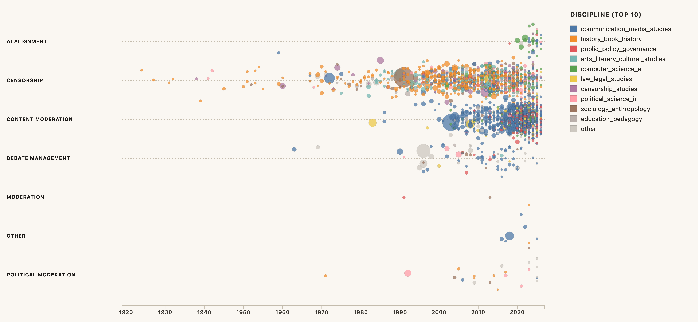
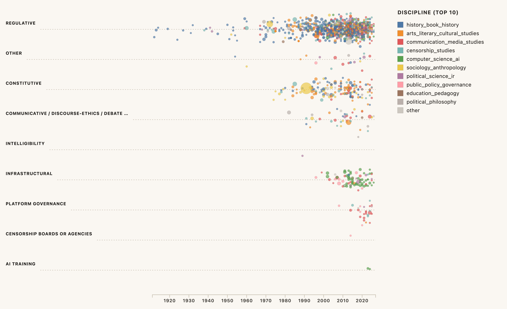
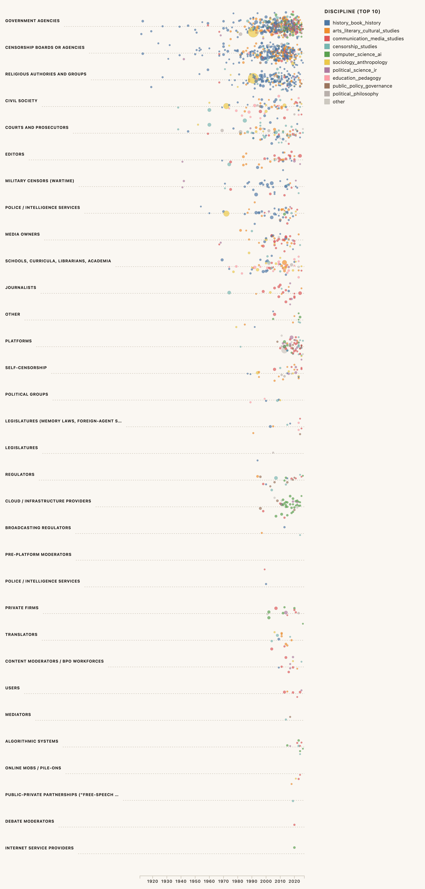
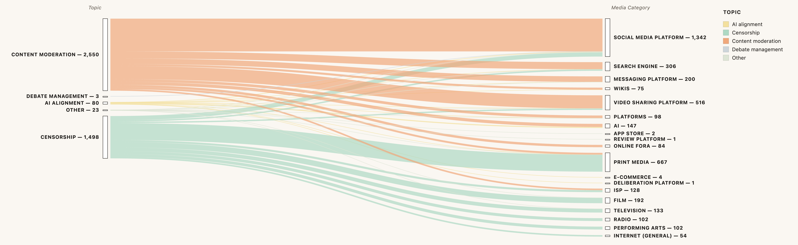
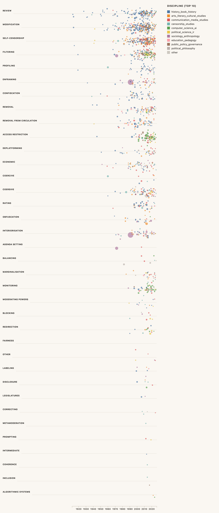
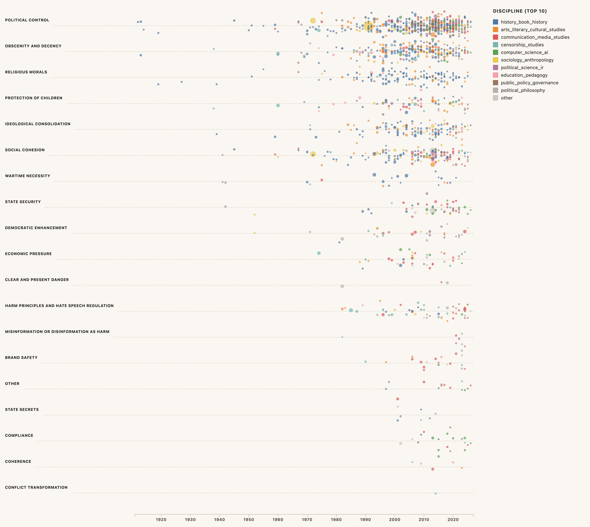
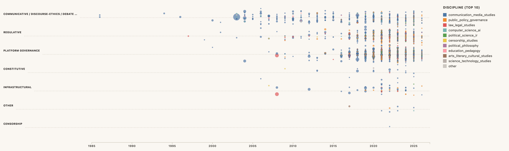
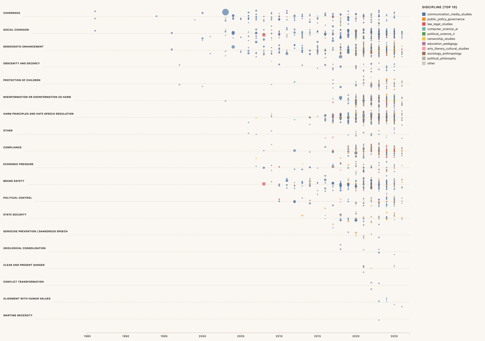
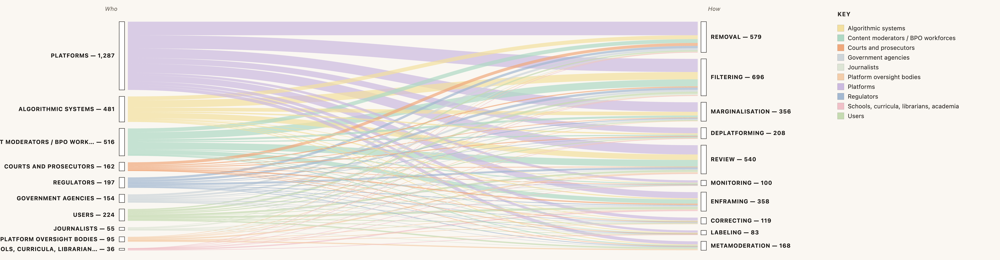

# **Chapter 1**
# Censorship and moderation: the oscillations of a contested practice


<div style="text-align: right;">The main thought that keeps running through my head..is that no-one seems to agree on what moderation is.</div>
<div style="text-align: right;">mod.comp-soc 4 September 1986 (Usenet newsgroup, accessed 29 Sept. 2023)</div>


At this point in its history, the term "moderation" has increasingly become associated with that of censorship. Political actors of all strides no longer point to media conglomerates, governments or clerical forces as as obstructing their rights to free and unfettered expression, but to platforms [@rbadouardPlateformesNouveauxCenseurs; @leetaru]. Platforms themselves have embraced this critique as the primary reason for a u-turn in favour of laissez-faire approaches or "prosocial" techniques in the form of Community Notes [@hendrixTranscriptMarkZuckerberg2025]. Most applications of content moderation are at least *technically* censorious [@gibsonFreeSpeechSafe2019]: they are designed to control the availability, visibility and flow of content and users based on normative criteria. And though they are not always applied with an intent to suppress information, platforms have effectively, if "accidentally" (see [Chapter 8. Twitter as an accidental authority](Chapter%208.%20Twitter%20as%20an%20accidental%20authority.md)]) been bestowed powers once exclusive to historical censors, be them the state [@badouardRegulationContenusInternet2020; @klonickNewGovernorsPeople2017] or massive media conglomerates. Though they have long resisted formal responsibilities [@kaplanMoreSpeechFewer2025], the inevitable burden that comes from enforcing a minimum of protections against "systemic risks" [@europeanunionRegulationEU20222022] does indeed usher platforms into the polyvalent art of normative information management, alongside accusations of censorship this attracts from all sides of public debate.

As is common with controversies, it remains unclear what the concept of moderation has come to mean except through its contestation. Etymological dictionaries tend to list at least two other families of definitions. One is moderation as the Aristotelian golden mean: the art of reasonableness, balance and restraint in conduct and opinion [@oxfordenglishdictionaryModerationMeaningsEtymology2025a; @rabinowitzHarmonyCitySoul2014], be it political [@craiutuVirtuesPoliticalModeration2001] or religious [@hasanConceptReligiousModeration2025]. This meaning overlaps with that of content moderation as a form of *restraint*: a cautionary measure to reduce but not necessarily remove what becomes extreme as it approaches a finite threshold of tolerance. The other meaning is that of moderation as the practical management of public debate. A moderator works to create intelligibility, coherence and continuous exchange in plurivocal environments in Church congregations, parliamentary debates, citizen assemblies, talk shows, academic symposia, labor union meetings, international diplomatic fora, and of course, a wide variety of online networks [@degandModerationFilsDiscussion2011, 2; @coleman2002hearing, 17; @seeringMetaphorsModeration2022]. There, the moderator is tasked with ensuring *socio-informational coherence*: retaining a degree of informational balance, intelligibility and inclusivity for a continuous and transformational synthesis of ideas, interests and other fundaments of collective livinghood [@oxfordenglishdictionaryModerationMeaningsEtymology2025].

Given the richness of the concept, why has content moderation so often been reduced is to its restrictive function? How did this meaning come to contradict that of the facilitation of dialogue? And to what extent is this distinction even necessary in light of increasing calls for "prosocial" algorithms to emerge _against_ moderation as a censorial force [@weylCommunityDesign2026a; @schirchBlueprintProsocialTech2025]? While discerning the practical differences between the two meanings would require a long and winding history of their conceptual, material and institutional evolution, I want to focus here on how each of these two notions have been described as *speech governance techniques*. When one foregoes normative conceptions of moderation or censorship (as censorship scholars have done to their subject since the 1990s [@postCensorshipSilencingPractices1998]), we may view both as speech governance techniques endemic to any and all forms of public expression [@holquistIntroductionCorruptOriginals1994; @bourdieuLangagePouvoirSymbolique2001]; different modalities of the same practice. Instead of antagonising the two, we consider _what kind_ [@jansensuecurryCensorshipKnotThat1988, 25] of technique moderation may be within a long lineage of practices applicable to different media environments based on its applications, actors and the theorisations that ensue. 

Concretely, I propose a distant reading [@morettiDistantReading2013; @underwoodDistantReadingRecent2016] of the notion of moderation in: (a) content moderation literature, primarily but not exclusively from media and communication studies; and (b) literature on neighbouring speech governance techniques, particularly censorship, and moderation as a whole. By "notion", I mean four conceptual components: (1) the definition each publication provides about moderation and adjacent practices ("what"); (2) what actors they associate to each practice ("who"); (3) the justifications offered for each practice ("why"); and (4) the techniques used by each ("how"). By "distant reading", I mean using computational means to process large quantities of text in discrete but meaningful segments that inform each of these components. Here, I use a combination of manual reading and a battery of large language models — six were tested for inter-rater reliability against a hand-authored closed-set taxonomy, with GPT-5.4 calibrated against Claude Opus 4.7 selected as the production coder (**[[#^table-kappa|Table 4]]**), the latter filling in 159 of the 1,985 documents where a rate constraint interrupted the GPT-5.4 pass — to collect sentences and paragraphs that constitute one of the four components above from 1,985 articles, books, preprints and theses. These items were obtained from PlatGovNet syllabi and Google Scholar API search with keywords related content moderation and neighbouring concepts of *speech governance* ("content moderation", "content regulation", "community guidelines", "trust and safety", "platform governance"; "censorship"). Sampling 500 items across disciplines, I then build and compare a taxonomy of definitions, actors, justifications and techniques associated to each notion ([[#^tax-building|Taxonomy building]]). 

I propose that moderation bears traits from both censorial practices (to frame the norms of public debate and delimit the reach and visibility of transgressive speech) and debate management norms (to facilitate the understanding, contextualisation and flow of information in plurivocal environments). Moderation "censors" in that it frames and enforces the norms within which information may flow in a public space, but it also prompts, contextualises, mediates, (re)directs and otherwise modulates exchanged information for the overall sake of *social and informational coherence*. When the balance between these two functions is lost and moderation is reduced to either one or another technique, it risks forfeiting its legitimacy. Though this is of course not the only cause, this imbalance signals a more profound loss of consensus-building conventions for something that approximates what Habermas called "the lifeworld" of dialogue: the collective construction of common definitions of speech norms and rules that regiment public debate. The absence of such conventions in centralised platforms can be seen in the recent history of platform content moderation, where mechanisms to frame, steer, contextualise and metamoderate debates in earlier online fora [@edwardsMODERATOREMERGINGDEMOCRATIC] have been progressively relegated to tasks automated "at scale" [@gorwaAlgorithmicContentModeration2020] and into logics of relevance, popularity and "freshness" [@davidsonYouTubeVideoRecommendation2010] that do not account for socio-informational coherence. 

# Method

By studying its practices, scholars have often responded to the impression that moderation remains a polyvalent field whose main constant is its material manifestation less than an authoritative definition. Interviews and ethnographies [@gillespietarletonCustodiansInternet2018; @robertsScreenContentModeration2019; @seeringMetaphorsModeration2022] capture moderation articulated from and by the ground: moderators making sense of their profession or commitment to an online community, particularly in a context where a practice, now industrialised, continues to be overlooked as a janitorial and underpaid task by workers of precarious economies, despite being crucial to the sustenance of public life around the world. There are other histories that focus on documented captured of moderation as a historical profession unbound by the Internet. Carmi [@carmiHiddenListenersRegulatingb] uses Bell Telephone Company articles on converging moderation technologies: how Bell workers modulated information transmissions, what their roles were, and what onboarding manuals could re-enact about the actual practice at that time [@carmiHiddenListenersRegulatingb, 444-445]. 

This is somewhat comparable to the study of platform policies, which indicate to some degree who partakes in the task of moderation, how moderation is done, why, and where. Beside algorithmic auditing [@epremAlgorithmicContentModeration] and digital methods studies of deplatforming events [@rogersDeplatformingFollowingExtreme2020], platform policies have been an oft-used source of documentation of moderation practices. For one, it is the manifestation of a platform corporate culture, and by extension of the inadvertent "governance" mechanisms [@gorwaWhatPlatformGovernance2019b] that make platforms new governing forces of public life [@klonickNewGovernorsPeople2017]. The method remains grounded in the industry itself: it uses platform policies are blueprints to occasionally reconstruct moderation as "platform effects" (see [Chapter 2. After deplatforming](Chapter%202.%20After%20deplatforming.md)). Conceptions of moderation are thus bound to how platforms define it in their own terms, and at most to how they are operationalised differently, in tension or in contradiction with policy clauses within auditable demotion, flagging, removal and reporting systems. 

Another way of historicising the notion of content moderation is through systematic literature reviews aiming to consolidate a state of consensus in the field (e.g., studies on how users perceive moderation [@maHowUsersExperience2023]), or through bibliometrics as form of "science mapping" [@oozanExploringContentModeration2024]. Beside aggregating knowledge on a given topic, the reason behind systematic literature reviews also consists in outlining a history of scholarly conceptions on a given phenomenon as part of a forming "epistemic culture" [@EpistemicCultures2015]. Industry perspectives also exist, typically in legal studies [@wuPrivacyFreeSpeech2022] that recollect the ways in which moderation has been adjudicated in landmark cases, or how moderators see their roles as "community managers" [@seeringMetaphorsModeration2022].

For the purposes of this study, it may be necessary to step beyond a literature review, intellectual or material history of the notion of moderation alone. The exercise is a literature review in the sense that it documents and engages with publications on moderation and censorship, but it does so from a point of view distant enough to trace discrete but meaningful conceptual overlaps. The objective is to locate and compare content moderation within wider traditions of public speech governance from which emanate key components — definitions, actors, techniques and justifications attributed to moderation — that can be interchangeable and comparable across disciplines. The procedure behind this comparison is explained in what follows.  

## Query design

To gather a corpus of literature that can capture content moderation studies and adjacent literature on censorship and moderation, queries spanned four conceptual clusters — censorship; content moderation; the pairing of moderation-and-censorship; and debate, media, and platform governance — across five languages spoken by the author: English, French, Portuguese, Spanish, and Italian. Three considerations motivated this breadth. The first is that moderation is a polysemic term whose (current) platform-bound usage participates in a much older web of meanings that contribute to contemporary definitions. The second is that both moderation and censorship tend to be essentially contested concepts [@delaatCoercionEmpowermentModeration2012] prone to deep disagreements even within scholarship. Unearthing the conceptual backgrounds of moderation is a useful exercise to provide alternative frameworks for their conceptualisation, especially when normative or methodological impasses prevent conceptual syntheses. Third, expanding the query set is one of the few defences against importing the framings the chapter aims to interrogate; querying *only* "content moderation" returns a literature already largely organised around platforms and online content more generally.

Multilingual coverage is instrumental for a number of reasons. Conceptually, Anglophone scholarship on content moderation often echoes US-centric legal debates about free speech rights and the needs for hate speech protections. Other languages bring their own contextual baggage: Portuguese and Spanish-speaking literature, for example, that of a particular experience of censorship during military regimes in Spain, Portugal and Latin America, as well as reflections on moderation as an instrument of transitional justice, political reform and historical reparation (see [Chapter 9. Normative dislocation](Chapter%209.%20Normative%20dislocation.md)). Though seminal contributions by Bourdieu and more recently Badouard may be read in English, other publications with strong conceptual anchors in French analytical traditions are often buried in journals rarely visible in content moderation citation networks. French and Portuguese (as well as English) also capture publications outside European and US universities. 

Some queries weighted more than others: moderation and censorship are central pieces of the study and were used to retrieve up to 500 results each, while surrounding queries yielded 100 results each (**[[#^table-queries|Table 1]]**). 

| Query                     | Type of concept | Language   | Results |
| ------------------------- | --------------- | ---------- | ------- |
| censorship                | key             | English    | 500     |
| moderation                | key             | English    | 500     |
| censor                    | key             | English    | 100     |
| community guidelines      | key             | English    | 100     |
| conflict moderation       | neighbour       | English    | 100     |
| conflict moderator        | neighbour       | English    | 100     |
| content moderation        | key             | English    | 100     |
| content moderator         | key             | English    | 100     |
| debate moderation         | neighbour       | English    | 100     |
| debate moderator          | neighbour       | English    | 100     |
| media moderation          | neighbour       | English    | 100     |
| media moderator           | neighbour       | English    | 100     |
| moderation censorship     | key             | English    | 100     |
| moderator                 | key             | English    | 100     |
| moderator censor          | key             | English    | 100     |
| television moderation     | neighbour       | English    | 100     |
| television moderator      | neighbour       | English    | 100     |
| trust and safety          | key             | English    | 100     |
| censeur                   | key             | French     | 100     |
| censure                   | key             | French     | 100     |
| modérateur                | key             | French     | 100     |
| modérateur censeur        | key             | French     | 100     |
| modérateur de conflits    | neighbour       | French     | 100     |
| modérateur de contenus    | key             | French     | 100     |
| modérateur de débat       | neighbour       | French     | 100     |
| modérateur des médias     | neighbour       | French     | 100     |
| modération                | key             | French     | 100     |
| modération censure        | key             | French     | 100     |
| modération de conflits    | neighbour       | French     | 100     |
| modération de contenu     | key             | French     | 100     |
| modération des débats     | neighbour       | French     | 100     |
| modération des médias     | neighbour       | French     | 100     |
| television modérateur     | neighbour       | French     | 100     |
| censura                   | key             | Spanish    | 100     |
| moderación                | key             | Spanish    | 100     |
| moderación de debates     | neighbour       | Spanish    | 100     |
| moderación de medios      | neighbour       | Spanish    | 100     |
| moderador                 | key             | Spanish    | 100     |
| moderador censor          | key             | Spanish    | 100     |
| moderador de conflictos   | neighbour       | Spanish    | 100     |
| moderador de debate       | neighbour       | Spanish    | 100     |
| Moderador de debate       | neighbour       | Spanish    | 100     |
| Moderador de medios       | neighbour       | Spanish    | 100     |
| moderación de conflictos  | neighbour       | Spanish    | 86      |
| il censore                | key             | Italian    | 100     |
| moderadore                | key             | Italian    | 100     |
| moderatore dei media      | neighbour       | Italian    | 100     |
| moderatore del dibattito  | neighbour       | Italian    | 100     |
| moderatore di conflitti   | neighbour       | Italian    | 100     |
| moderatore di contenuti   | neighbour       | Italian    | 100     |
| moderazione               | key             | Italian    | 100     |
| moderazione censura       | key             | Italian    | 100     |
| moderazione dei contenuti | key             | Italian    | 100     |
| moderazione dei media     | neighbour       | Italian    | 100     |
| moderazione del dibattito | neighbour       | Italian    | 100     |
| moderazione di conflitti  | neighbour       | Italian    | 100     |
| moderação                 | key             | Portuguese | 100     |
| moderação censura         | key             | Portuguese | 100     |
| moderação de conteúdo     | key             | Portuguese | 100     |
| moderação de debates      | neighbour       | Portuguese | 100     |
| moderação de mídia        | neighbour       | Portuguese | 100     |
| moderador de conflitos    | neighbour       | Portuguese | 100     |
| moderador de contéudos    | neighbour       | Portuguese | 100     |
| moderação de conflitos    | neighbour       | Portuguese | 57      |
**Table 1**. List of queries used in Google Scholar SerpAPI  ^table-queries

## Data collection

These queries were used to search Google Scholar via SerpAPI. Results were merged with an existing Zotero library of content moderation articles from all syllabi listed in PlatGovNet [@platgovnetResourcesPlatGov], totalling 7 772 books, book sections, journal publications, preprints, PhD theses and reports. A filtering process was then applied to triage their relevance by prompting Gemini 3 Flash [@googleGemini3Flash2025] with a selection criteria and examples on publication titles, authors, abstract and URLs (**[[#^prompt-1|Prompt 1]]**). Results were validated manually with the same criteria, reducing the total to 4,278 entries. 

```python
SYSTEM_PROMPT = """\
You are a research assistant screening academic literature for a PhD project \
on the history and theory of censorship and moderation.

Decide whether the item below is relevant to that project.

RELEVANT topics include (non-exhaustive):
- Censorship in any historical period or country
- Speech moderation in philosophy, political theory, sociology and other social science disciplines
- Moderation in conflict resolution
- Content moderation, platform governance, trust & safety
- Speech regulation, hate speech, harmful content policies
- Information control, propaganda, disinformation policy
- Press freedom, media law, broadcasting regulation
- Deplatforming, shadowbanning, algorithmic demotion
- Index of forbidden books, publication bans, prior restraint
- Computer science / AI / NLP applied to moderation or censorship
- Internet governance, online safety legislation
- The moderation of public debates (in any media)
- The moderation of public conflicts
- Moderating powers and roles in political and media systems
- Moderation in political philosophy, or philosophy in general
- The moderating role of different societal actors, such as media, schools, or other institutions
- Moderation in media, political, and religious contexts

NOT RELEVANT (answer NO):
- Medicine, clinical psychology, psychiatry, neuroscience
- Physics, chemistry, biology, ecology, earth sciences
- Engineering, materials science (unless about moderation tech)
- Mathematics (unless applied to moderation/censorship)
- Veterinary, agriculture, food science
- Items where censorship/moderation is mentioned only incidentally \
  (e.g. a history book that happens to mention a censor once)

Answer with EXACTLY one of: YES  /  NO  /  MAYBE
"""

ITEM_TEMPLATE = """\
Title:    {title}
Author:   {author}
URL:      {url}
Abstract: {abstract}
"""
```
**Prompt 1.** System prompt used by the relevance classifier. ^prompt-1

Publications were retrieved through seven sources: URLs; open-access repositories (HAL, archivesic, arXiv); the Royal Danish Library's catalogue; Anna's Archive API; Sci-Hub's API; and Google Search via Serp API. Open access repositories were queried via an institutional VPN with cookies injected from a live browser session into a headless Selenium instance. Google searches included paper titles and author names. A separate relevance validator was used to confirm that retrieved PDFs matched their bibliographic entries. Of 4,278 relevant entries, 3 444 PDFs were found. 

A final temporal-scope filter then restricted the corpus to publications addressing twentieth- or twenty-first-century material, as censorship and moderation become commensurable only against a roughly shared media environment. The filter was applied in four passes: (1) a join against a prior Gemini 3 Flash extraction in which a `When` field was recorded for ~2,570 candidate items, matched by PDF basename, DOI, and normalised title; (2) a rule-based classifier over Title and `Media category` that tags an item as in-scope when it references platforms, internet infrastructure, AI / ML, post-1900 regulatory frameworks (Section 230, GDPR, DSA, …), or modern broadcast media; (3) the same classifier applied to the Abstract Note where available; and (4) a manual review of the residual silent set. The retained corpus contains 2,307 unique publications (**[[#^table-publications|Table 2]]**).

| Metric                                          | Count | How they are counted                                                                                                                                                                                  |
| ----------------------------------------------- | ----: | ----------------------------------------------------------------------------------------------------------------------------------------------------------------------------------------------------- |
| Master bibliography — all candidate items       | 5,232 | Unique `Key` values in `master_bibliography.csv` after every temporal filter pass (annotation-derived `When`, rule-based Title / `Media category` classifier, Abstract Note pass, and manual review). |
| Master bibliography — Relevant = YES / MAYBE    | 3,974 | Subset of the above where the manual `Relevant` column is `YES` or `MAYBE`.                                                                                                                           |
| Final corpus (unique publications, all 20C–21C) | 2,307 | Unique `Key` values in `Chapter 1 – Final results – Results.csv` after all temporal filters; every retained Key carries a `When` value.                                                               |
| Final corpus with PDF available locally         | 1,985 | Unique `Key` values whose `PDF Path` field resolves to a file on disk.                                                                                                                                |
**Table 2**. Number of publications found and downloaded from Google Scholar and PlatGovNet syllabi before and after validation. ^table-publications

The majority of retained results were in English or in the language of each query (**[[#^table-languages|Table 3]]**). Additional languages were picked up, though in small percentages. 

|   # | Language     |     Items |    Share |
| --: | ------------ | --------: | -------: |
|   1 | English      |     1,116 |    56.9% |
|   2 | Portuguese   |       310 |    15.8% |
|   3 | French       |       222 |    11.3% |
|   4 | Italian      |       148 |     7.6% |
|   5 | Spanish      |       130 |     6.6% |
|   6 | German       |         3 |     0.2% |
|   7 | Catalan      |         2 |     0.1% |
|   8 | Somali       |         2 |     0.1% |
|   9 | Welsh        |         1 |     0.1% |
|  10 | Hungarian    |         1 |     0.1% |
|  11 | Vietnamese   |         1 |     0.1% |
|  12 | undetermined |        25 |     1.3% |
|     | **Total**    | **1,961** | **100%** |
**Table 3**. Distribution of the final corpus by language, detected with `langdetect` (seeded for reproducibility) over the concatenation of Title + Abstract Note. ^table-languages

While each language will tend to speak about its country of origin, others will echo histories of censorial relations (**[[#^figure-1|Figure 1]]**). English-speaking publications tend to problematise China, Russia and Iran as sources of censorship, while the very few publications in Catalan will critique censorship cases in Spain.  

[](https://edekeulenaar.github.io/censorship-and-moderation/#fig-lang-country)^figure-1

## Metadata and discipline enrichment

Publication metadata was enriched across three sources: OpenAlex for DOI, journal metadata, citation counts, and open-access status; Crossref for publisher, ISSN, and author disambiguation; and Semantic Scholar as a fallback for citation counts and abstracts. The Zotero Web API supplied user-curated fields that DOI-based APIs may not always provide: canonical item keys, item type, normalised author lists, language, place, and library catalogue. 

Discipline labels were added to each publication using Gemini 3 Flash to classify titles, abstracts, and publication venue (**[[#^prompt-1|Prompt 2]]**). Two labelling decisions deserve flagging. First, *censorship studies* proper was retained as a separable sub-field rather than folded into political science or literary studies. Second, *computer science and AI* was treated as primary literature alongside its secondary status. Technical papers on filtering, hashing, classification or recommendation are not only about moderation, but also produce the moderation infrastructure the rest of the literature theorises. 

```python
NEW_COLS = [
    "Discipline",
    "Discipline Secondary",
    "Discipline Confidence",
    "Discipline Model",
]

DISCIPLINES = [
    "communication_media_studies",
    "law_legal_studies",
    "computer_science_ai",
    "political_science_ir",
    "sociology_anthropology",
    "philosophy_ethics",
    "history_book_history",
    "religious_studies_theology",
    "education_pedagogy",
    "psychology_behavioral_science",
    "economics_business_management",
    "statistics_methods",
    "arts_literary_cultural_studies",
    "science_technology_studies",
    "public_policy_governance",
    "other_unclear",
    "censorship_studies",
    "political_philosophy",
    "conflict_peace_studies",
    "rhetoric",
    "linguistics"
]

SYSTEM_PROMPT = f"""\
You classify scholarly bibliography items by the main academic discipline of
the work, using only the provided metadata. This project studies moderation,
censorship, and adjacent concepts across disciplines, so classify the scholarly
discipline, not whether the item is relevant.

Use exactly one primary discipline from this controlled vocabulary:
{", ".join(DISCIPLINES)}

Guidance:
- Choose the discipline that best describes the article/book/chapter itself.
- Publication venue and abstract are stronger signals than isolated keywords.
- For platform/content moderation law, choose law_legal_studies when the frame
  is legal doctrine or regulation; communication_media_studies when the frame is
  media/platform governance; computer_science_ai when the frame is technical.
- Use statistics_methods for moderation/censoring as a statistical method.
- Use censorship_studies for studies on censorship itself.
- Use political_philosophy for studies on moderation in political systems or political thought. 
- Use philosophy_ethics for studies on e.g. stoicism and other philosophical traditions interested in mental, physical or other moderation. 
- Use religious_studies_theology for studies on religious moderation.
- Use other_unclear only when metadata is too sparse or genuinely ambiguous.
- If a secondary discipline is useful, include it; otherwise use an empty string.

Return exactly one line and nothing else:
discipline<TAB>secondary_discipline<TAB>confidence

The first value must be one controlled vocabulary value. The second value must
be one controlled vocabulary value or empty. Confidence is a number from 0 to 1.
"""
```
**Prompt 2.** System prompt used by the discipline classifier. ^prompt-2

Communication and media studies remain the most field in studying content moderation, as are, to a lesser extent, studies versed in public policy, governance, legal studies [@sanderFreedomExpressionAge2019; @douekGoverningOnlineSpeech2021; @degregorioDemocratisingOnlineContent2020], and computer science [@mhortaribeiroAutomatedContentModeration2023; @vlaiHumanaiCollaborationConditional; @binnsTrainerBotInheritance2017]. In turn, the vast majority of these studies are dedicated to the umbrella field of content moderation as a component of platform governance or regulation, with other, earlier studies examining it as a mechanism for managing democratic public spheres through, for example, debate moderation. Conversely, censorship is a topic dominated by book [@fiskeBookSelectionCensorship2022], press [@ljleffDameKimonoHollywood; @cscleggPressCensorshipElizabethan], and visual history [@huntInventionPornographyObscenity1993], literary [@pattersonCensorshipGenreInterpretation1990] and cultural studies [@coetzeeGivingOffenseEssays2005; @darntonCensorshipComparativePerspective1994], as well as censorship studies [@postCensorshipSilencingPractices1998; @holquistIntroductionCorruptOriginals1994]. Later contributions from communication and media studies focus on infrastructural censorship [@mackinnonFlatterWorldThicker2007; @zuckermanIntermediaryCensorship2010], with material examinations of how states monitor and reduce information access via TSP, traffic monitoring, deep packet inspection, traffic analysis, reassembling fragmented packets, protocol classification, and other underlying stacks of Internet access. 

[](https://edekeulenaar.github.io/censorship-and-moderation/#fig-sankey-discipline-topic)^figure-2

## Building a taxonomy ^tax-building

Next, publications were classified on the level topics, sub-topics, and on the four components mentioned above: the what, how, why and who of a given speech governance technique. Media ("medium") and countr(ies) are relevant for the material context of each technique, and are in some cases defining features (see **[[#^the-why-of-content-moderation|The circumstances of content moderation]]**).

### Sampling ^sampling

Taxonomies were built based on canonical literature cited in PlatGovNet syllabi and on what emerged from publications themselves. For this kind of inductive coding, a sample of 500 items was drawn for close manual reading. It was done along query and language, to mirror the conceptual and linguistic structure of the search; discipline, with communication and media studies set at roughly half the sample; citation impact, including works above 200 citations as potential canonical contributions; and publication year binned into pre-2000, 2000–2009, 2010–2019, and 2020+ to retain historical depth. Citations weighted less in the sampling calculation as they were often outdated or missing. Each sampled item was given a close reading. A type of claim was recorded for each relevant passage (what moderation or censorship are; how they are done; who do it, and why) with a verbatim phrase to anchor it (**[Annex 1](https://docs.google.com/spreadsheets/d/1_UE4CWyFGLrsjfkC0e-Kp51l8Ue2nzR4DTa5Do7tZHY/edit?usp=sharing)**). 

### Topical and sub-topical categories

On the conceptual level (**[[#^topic-taxonomy|The "what" taxonomy]]**), five categories were retained as relevant to the study. Beside content moderation and censorship, these were media moderation, media regulation, and moderation as a debate management mechanism. The criterion for inclusion is that a topic must denote a *speech governance mechanism*: a practice that conditions the access, visibility or consumption of information. Two candidate topics from earlier iterations of the taxonomy were dropped under this criterion — moderation as a philosophical virtue or tradition (temperance, the *via media*) and political moderation (the moderation of powers and of extreme political beliefs) — as both concern dispositions or institutional arrangements rather than the governance of information flows. Gatekeeping, by contrast, enters the taxonomy as a sub-category of media moderation (gatekeeping as selection theory), where it names the structured scarcity of attention and space through which editorial actors decide what enters circulation. Nine sub-topics within content moderation were identified: the idea of moderation as a form of censorship, be it from states [@bammanCensorshipDeletionPractices2012; @trottierSocialMediaPolitics2014a], platforms, or as a user experience [@olhaimsonDisproportionateRemovalsDiffering; @diasolivaFightingHateSpeech2021a]; moderation as part of platform governance [@gorwaWhatPlatformGovernance2019b; @gillespieCustodiansInternet2018; @tgillespieGovernancePlatforms; @klonickNewGovernorsPeople2017; @caplanContemporaryIssuesConcerns]; moderation and platform regulation [@gorwaPoliticsPlatformRegulation2024; @stoneContentRegulationFirst; @langvardtRegulatingOnlineContent2017]; as industrial labour [@robertsScreenContentModeration2019; @ruckensteinRehumanizingPlatformContent2020; @rafaelgrohmannTrabalhoPorPlataformas; @arshtHumanCostOnline2018]; compliance [@karaganisjoeNoticeTakedownEveryday2017; @atrujilloDSATransparencyDatabase2025]; brand safety [@liuSocialMediaContent2021]; as a way of enforcing community norms and identity, particularly in creator cultures [@lampeSlashdotBurnDistributed2004; @wohnVolunteerModeratorsTwitch2019a; @chandrasekharanBagCommunitiesIdentifying2017a]; and as the art of managing public debate [@edwardsModeratorEmergingDemocratic2002; @wrightGovernmentrunOnlineDiscussion2006; @wojcikForumsElectroniquesMunicipaux2003]. Some of this early content moderation literature is nested in niche studies on  the role of moderators in online learning [@salmonEmoderatingKeyTeaching2011].

An item is coded as "censorship" if the author primarily theorises censorship (whether or not they mention platforms), and as "content moderation" if the author primarily theorises platform-bound practice (whether or not they invoke censorship as critique). Items that link the two are coded by which side of the linkage they primarily develop. The boundary cuts both ways: there are moments at which *debate management* is itself linked to censorship [@shenPerceptionsCensorshipModeration2018], and these are coded as debate moderation when the practice under analysis is the chairing of exchange. *Platform governance* is delimited as literature treating moderation as one element within a broader institutional, legal or infrastructural arrangement rather than the practice itself.

The "What" categories reflect the broad functions of moderation across collected publications. Communicative / discourse ethics / debate management will refer to moderation as the management of the conditions under which public dialogue can occur, echoing in particular Habermasian literature, theories on deliberative democracy, debate management and civic dialogue [@habermasTheoryCommunicativeAction; @habermasNewStructuralTransformation2023; @waltondouglasn.CommitmentDialogue1995; @ehningerDecisionDebate1766]. *Constitutive* moderation or censorship is a term that originates from censorship literature [@postCensorshipSilencingPractices1998; @butlerExcitableSpeechPolitics1997a; @jansensuecurryCensorshipKnotThat1988] that echoes the idea from recent content moderation scholarship that scholarship, loosely defined as a *precondition* for expression, is both a constraining and enabling affordance for online expression [@gillespieCustodiansInternet2018]; see also [Part II. Speech affordances](Part%20II.%20Speech%20affordances.md). This differs from conceptions of speech governance as regulative, i.e., a top-down, intentional suppression of speech by power-holders (state, church, employer, platform owner) acting on speech they deem normatively transgressive.  

| Topic | Sub-topic | Definition |
| ----- | --------- | ---------- |
| Content moderation | Censorship | Conceptualises content moderation as a form of censorship — the suppression, silencing or removal of speech that platforms or their political allies find objectionable. The item explicitly argues that moderation IS (or operates as) censorship, rather than merely critiquing specific moderation decisions in passing. |
| Content moderation | Moderation as industrial labour | Conceptualises content moderation as a global industrial labour process — the large-scale review of user-generated content by paid workers, typically outsourced to BPOs or crowd-work platforms — and foregrounds the working conditions, supply chains, psychological toll, and political economy of that workforce. |
| Content moderation | Platform governance | Conceptualises content moderation as the mechanism through which platforms exercise rule-making authority over their own ecosystems. Focuses on the design and management of internal rules, decision rights, enforcement procedures, appeals, and the policies that align moderation with the platform's architecture, business model and lifecycle. Concerns rule-making BY the platform, not regulation OF it. |
| Content moderation | Platform regulation | Conceptualises content moderation as the object of external governance by states, courts and other public actors. Focuses on statutes and regulatory regimes (e.g. EU DSA, NetzDG, Section 230, Online Safety Acts), intermediary-liability doctrine, court rulings, regulator interventions, and the broader public-policy steering of platform moderation. Concerns regulation OF platforms, not their internal rule-making. |
| Content moderation | Compliance | Conceptualises content moderation as the operational mechanism through which platforms meet their legal and regulatory obligations — processing takedown notices, executing court orders, satisfying transparency mandates and statutory duties of care, and demonstrating conformity to regulators. |
| Content moderation | Brand safety | Conceptualises content moderation as the production of advertiser-friendly, brand-safe environments that retain users and protect the platform's economic model. Conceives CM as a business function answerable primarily to advertisers, investors and growth metrics rather than to law, community or rights. |
| Content moderation | Moderating extremism | Conceptualises content moderation as the task of containing or removing extremist content — terrorism, violent extremism, radicalisation pathways, and religious or political extremism — and treats extremist material as a distinct category demanding its own policies, operational responses and threat models. |
| Content moderation | Community norms and identity | Conceptualises content moderation as the upholding of a particular community's norms, rules and collective identity — typically performed by volunteer or user-moderators (subreddit mods, Wikipedia editors, Discord admins, forum operators) — rather than by platform-wide policy. Emphasises bottom-up, participatory rule-enforcement. |
| Content moderation | Debate management | Conceptualises moderation/censorship as the management of the conditions under which public dialogue can occur (Habermas, deliberative-democracy traditions, debate-management literature). The moderator enforces procedural conditions — equality of voice, mutual intelligibility, civility, focus — held necessary for public dialogue. Moderation is here the facilitation, structuring and promotion of online public debate — keeping discussions on topic, securing balanced participation, raising deliberative quality — typically in civic fora, comment sections, or dedicated online deliberation platforms. |
| Censorship | — | Studies the suppression, prohibition or removal of speech, writing, images or other expression deemed obscene, politically unacceptable, blasphemous, or threatening to security — by state, religious, corporate or other authorities. The item's subject is censorship as such (historical, legal, political), not online content moderation. |
| Censorship | Constitutive | Censorship treated not as the opposite of speech but as its precondition — the foreclosing operation that produces speakable subjects, intelligible utterances, and the very norms of discourse (Butler, Bourdieu, Post). Productive rather than purely restrictive: what cannot be said is what makes what is said legible. |
| Censorship | Infrastructural | Preventing access to content below the application layer — at the network, transport, hosting, or payment layer rather than on the content surface itself. Includes DNS poisoning, BGP hijacking, throttling, internet shutdowns, and stack-level deplatforming via hosting, CDN, DDoS-mitigation, or payment-processor withdrawal. The censor acts on the pipes, not on the post. |
| Censorship | Regulative | Top-down, intentional suppression by power-holders (state, church, employer, platform owner) acting on speech they deem dangerous, immoral, or destabilising. The relation is asymmetric: the censor holds coercive authority — legal, financial, infrastructural, or doctrinal — over the speaker, and acts deliberately to prohibit, sanction, or pre-empt. Censorship in this register is a systematic distortion of the conditions for a free market of ideas. |
| Media moderation | Gatekeeping (selection theory) | Conceptualises information management as selection: items pass or fail a series of 'gates' (the wire editor, the news desk, the front page) governed by news values, organisational routines and professional judgment (White's Mr. Gates; Shoemaker & Vos). Moderation is neither suppression nor dialogue but the structured scarcity of attention and space - the gatekeeper decides what exists for an audience by deciding what enters circulation. |
| Media moderation | Common carriage / neutral conduit | Conceptualises the medium as a channel whose operator must transmit without discrimination - the carrier as a filter that must not become an editor (common-carrier doctrine; Carmi's switchboard operators who embody both the channel and the filter). Moderation here is the management of the line itself: noise, etiquette, connection and disconnection, rather than judgment on an authored work. |
| Media moderation | Social responsibility / self-regulation | Conceptualises the press as a self-governing trustee whose freedom entails duties - accuracy, fairness, accountability through codes, councils and ombudsmen rather than state command (Hutchins Commission; social-responsibility theory in Four Theories of the Press). Moderation appears as professional ethics institutionalised: self-imposed restraint adopted to forestall imposed restraint. |
| Media regulation | Public trusteeship / public interest | Conceptualises broadcasters as fiduciaries of a scarce public resource (spectrum), licensed on condition that they serve the public interest - balance, impartiality, protection of minors, public-service remits (Red Lion; the Reithian tradition). Moderation is a condition of the licence rather than an editorial choice, and the regulator polices the trust. |
| Media regulation | Advisory classification / audience segmentation | Conceptualises content governance as informing and segmenting audiences rather than suppressing works - age categories, descriptors and advisory labels that route content to the appropriate audience (classification boards; classificacao indicativa as the post-censorship settlement). The work circulates; it is the audience that is moderated. |
| Debate management | — | Conceptualises moderation as the practice of managing debate — chairing, facilitating, structuring discussion — in democratic deliberation, mediation, conflict resolution, classroom and civic settings. Concerns face-to-face or institutional debate practice, distinct from online content moderation. |
| Other | — | Specify in three words. |
**Table 3.** The "what" categories. ^topic-taxonomy

### Extracting and categorising the who, how and why of moderation

Another purpose of [[(#^sampling)|sampling]] was to categorise frequent patterns in how publications verbalised the what, how, who and why of moderation and related practices. In the "What" category, Gemini 3 Flash is asked in **[[#^prompt-3|Prompt 3]]** to extract *explicit* definitions of what moderation, censorship and adjacent practices are. In "How", it looks for how moderation, censorship and adjacent practices are carried out in the form of specific techniques. This may include methods proper to content moderation and censorship (e.g., keyword filtering, shadow-banning, algorithmic detection, content removal, labelling, throttling, demotion, account suspension, beeping, marginalising, suspensions, obfuscation), but also moderation as the management of public debate (facilitating discussions, recommending information to engaged participants, etc). In "Who", I consider who performs moderation and adjacent practices (human moderators, automated systems, platforms, states, communities, hybrid actors, third-party contractors, or other); and in "why", what function or societal role moderation or censorship serve (e.g., norm enforcement, harm reduction, gatekeeping, legitimisation, information control, facilitation of dialogue).
 
```python
EXTRACTION_PROMPT = """\
In its history, MODERATION has been defined in a number of different ways, from a form of lessening extremes, to the moderation of public debates, to a form of censorship.

You are given a PDF (already uploaded).

Your task is to extract THE MOST SPECIFIC verbatim passages from the document that address the following five dimensions of moderation or censorship:

1. **WHAT** — Explicit definitions of what moderation or censorship are (conceptual definitions, distinguishing features, typologies).
2. **HOW** — HOW moderation or censorship are carried out in the form of specific TECHNIQUES or methods used (e.g., keyword filtering, shadow-banning, algorithmic detection, content removal, labelling, throttling, demotion, account suspension, beeping, marginalising, suspensions, obfuscation, facilitating discussions, recommending information to engaged participants, etc).
3. **WHO** — WHO performs moderation or censorship (human moderators, automated systems, platforms, states, communities, hybrid actors, third-party contractors).
4. **WHY** — What FUNCTION or societal role moderation or censorship serve (e.g., norm enforcement, harm reduction, gatekeeping, legitimisation, information control, facilitation of dialogue).

Rules:
- Provide the **exact** and **most specific** verbatim quote as it appears in the text. Do NOT paraphrase, summarise, or fabricate.
- Include the **page number** where the quote appears, as a string (e.g., "3").
- Do NOT repeat any quote. Each quote must appear only once in the output.
- If a passage is relevant to multiple dimensions, place it under its **primary** dimension only.
- If no relevant passage is found for a dimension, leave its list empty ([]).

Return your response as a **single JSON object** wrapped in triple backticks tagged as json:

```json
{
  "what": [{"quote": "...", "page": "N"}, ...],
  "how":  [{"quote": "...", "page": "N"}, ...],
  "who":  [{"quote": "...", "page": "N"}, ...],
  "why":  [{"quote": "...", "page": "N"}, ...]
}

"""

EXTRACT_FIELDS = [
    'File', 'PDF Path', 'Relevant',
    'Query', 'Authors', 'Year', 'Title', 'Snippet',
    'What', 'How', 'Who', 'Why', 'Raw JSON',
]
```
**Prompt 3**. Prompt used to extract the what, how, why, who, when of moderation and adjacent practices from each PDF. ^prompt-3

Categories, especially the "how", "why" and "who", are intentionally topic-agnostic (**[[#^tax-how|The "how" taxonomy]]**; (**[[#^tax-what|The "what" taxonomy]]**); (**[[#^tax-why|The "why" taxonomy]]**); (**[[#^tax-who|The "who" taxonomy]]**)). This allows cross-cutting comparisons across topics and disciplines; situations in which one finds descriptions of both content moderation and censorship using "filtering" or "blocking" techniques. This also means generalising categories beyond field-specific terminologies. In **[[#^tax-who|the "who" taxonomy]]**, "balancing" is an information management technique used as much as in journalism (e.g., the idea of two-sided journalistic coverage and balance) as in the moderation of public debate, where the moderator prompts counter-arguments and and controls speaking time; or as in platform design, when the ranking systems balance the visibility of posts across user divides [@ovadyaBridgingSystemsOpen2023]. "Enframing" is another example from any from of information management: platform content moderation sets the norms of public debate, as do moderators when prompting a debate. 

| Category                 | Definition                                                                                                                                                                                                                                                                                                                                                                                                                                                                                                                       | Relevant keywords                                                                                                                                                                                                                                                                                                                                                                                                                                                                                                                                                                                                         |
| ------------------------ | -------------------------------------------------------------------------------------------------------------------------------------------------------------------------------------------------------------------------------------------------------------------------------------------------------------------------------------------------------------------------------------------------------------------------------------------------------------------------------------------------------------------------------- | ------------------------------------------------------------------------------------------------------------------------------------------------------------------------------------------------------------------------------------------------------------------------------------------------------------------------------------------------------------------------------------------------------------------------------------------------------------------------------------------------------------------------------------------------------------------------------------------------------------------------- |
| Balancing                | Distributing speaking time, visibility, or representation equitably across actors — controlling speaking time (*contrôle du temps de parole*), equal-time rules, party-representation quotas in broadcast, setting a pace, prioritising voices by institutional function. Moderation operates on the distribution of voice, not its content.                                                                                                                                                                                     | providing counter-arguments or counter-speech; contrôle de temps de parole; distribute / equalize speaking time; representation equitable des partis; setting a pace; temps d'antenne aux partis; prioritising voices based on their institutional function; two-sided journalistic coverage and balance                                                                                                                                                                                                                                                                                                                  |
| Blocking                 | Temporary suspension of content, account, or output — per-incident bans, content holds, information blackouts, single-query LLM refusals. Distinguished from *Removal* (intent to destroy), *Deplatforming* (severing the speaker), and *Restricting access* (infrastructural reach) by its provisional, often automated, per-incident character.                                                                                                                                                                                | LLM refusals; account or content suspensions; information blackouts                                                                                                                                                                                                                                                                                                                                                                                                                                                                                                                                                       |
| Bridging                 | Facilitating exchanges of information across groups, ideological divides, or communities that would not otherwise encounter each other — bridging-based ranking (e.g., Twitter/X Community Notes, Polis), surfacing cross-cleavage agreement, prioritising content with cross-divide endorsement. CODE HERE when moderation aims to surface common ground or weight cross-group consensus.                                                                                                                                       | finding unifying threads in participant comments; prioritising content across user divides                                                                                                                                                                                                                                                                                                                                                                                                                                                                                                                                |
| Coersive                 | Threats of physical, personal, or legal persecution directed at potentially problematic speech, producing a chilling or "spiral" effect that disincentivises authentic and spontaneous expression. Distinct from *Economic* (money) and *Self-censorship* (internal): coercion operates through the credible prospect of state or private violence/sanction, even when no act of suppression is formally executed.                                                                                                               | —                                                                                                                                                                                                                                                                                                                                                                                                                                                                                                                                                                                                                         |
| Coherence                | Maintaining the social fabric, momentum, and safety of the conversation — building trust, summarising, archiving forgotten threads, repairing the discussion after conflict, restoring dialogue when it breaks down. Moderation as care for the conversational fabric over time.                                                                                                                                                                                                                                                 | creating an atmosphere of trust; summarise a debate; tidying up forgotten topics by freezing and archiving; recompose the discussion after conflict; restoring debate or dialogue when it breaks down                                                                                                                                                                                                                                                                                                                                                                                                                     |
| Confiscation             | Interception and seizure of problematic material to keep it out of public circulation — customs interception, police seizure, asset takeover. The content is taken into the censor's custody rather than destroyed or merely de-listed.                                                                                                                                                                                                                                                                                          | interception; capture; confiscation                                                                                                                                                                                                                                                                                                                                                                                                                                                                                                                                                                                       |
| Correcting               | Rectifying or counter-stating a piece of information rather than suppressing it — fact-checking, accuracy labels, promotion of corrective information. Moderation operates by adding true information, not removing the disputed item.                                                                                                                                                                                                                                                                                           | promotion of accurate information; fact-checking                                                                                                                                                                                                                                                                                                                                                                                                                                                                                                                                                                          |
| Deplatforming            | Permanently or temporarily severing a speaker or venue from a distribution channel — account bans, revoked broadcasting licences, closure of publishing houses or news offices, shutdown of distribution units. Distinguished from *Removal* (acts on an item) and *Blocking* (temporary, per-incident) by acting on the speaker or the venue as a whole.                                                                                                                                                                        | banning content or a user; deplatforming content or a user; permanent user bans; temporary user bans; revoke broadcasting licenses; suspending licences; closure of distribution units (e.g. blocking platforms; closing publishing houses or news media offices)                                                                                                                                                                                                                                                                                                                                                         |
| Disclosure               | Compelling the surfacing of hidden, encrypted, or implicit content for review — backdoor or decryption mandates, identity-disclosure rules, requirements to reveal sources or beneficial owners, forced unveiling of latent meaning. Restriction is conditioned on what disclosure reveals.                                                                                                                                                                                                                                      | uncovering meaning                                                                                                                                                                                                                                                                                                                                                                                                                                                                                                                                                                                                        |
| Economic                 | Disincentivising the production or circulation of problematic speech through monetary means — defunding, demonetisation, payment-processor exclusion, advertiser withdrawal, contract cancellation, SLAPP litigation, denial of public subsidies. The censorial pressure operates through money flows rather than through content rules directly.                                                                                                                                                                                | demonetization; economic sabotage; pressure over circulation of goods; withdrawal of public funds; contract cancellation; economic sanctioning                                                                                                                                                                                                                                                                                                                                                                                                                                                                            |
| Enframing                | Setting the conditions under which debate or publication may occur — community guidelines, developer guidelines, format rules, mandatory themes, statements of purpose, press codes, topical scoping. The moderator does not remove items but constrains the shape of what can be said.                                                                                                                                                                                                                                          | community guidelines; controls the manner or form that the messages are allowed to take; controls what can be said in a forum; délimiter un cadre et un mode d'expression; developer guidelines; establish a structure for dialogue; establishing the boundaries of the discussion; imposing formats; imposing mandatory themes; limiting the expansion of debate; preparing the discussion; provides a statement of purpose; shaping discussion boundaries; suggests limits; taking care of conditions and provisions; establish norms of publication format; issuing a press code; redirect toward main topic of debate |
| Filtering                | Selectively removing some but not all material before publication, on the basis of a criterion or classifier — packet filtering, SNI/URL filtering, keyword filters, dataset cleaning, triage of incoming questions or prompts, selection of debate participants, editorial gatekeeping. Distinct from *Removal* in being routine, criterion-based, and often automated.                                                                                                                                                         | cleaning sanitized content out of training data; packet filtering; pre-filter; selection; SNI filtering; URLF filtering; filtering; keyword filtering; tri des questions et des interventions; triaging questions or prompts; choosing the participants of a debate; selecting calls, letters, tweets and questions for inclusion in programming                                                                                                                                                                                                                                                                          |
| Intelligibility          | Providing the information necessary for participants to understand the topic and participate meaningfully — contextualising the debate, supplying expertise, supplying background, removing communication barriers. Moderation as the production of understanding.                                                                                                                                                                                                                                                               | when participants of a debate are actively included                                                                                                                                                                                                                                                                                                                                                                                                                                                                                                                                                                       |
| Interiorisation          | The process by which a speaker, a machine, or a society absorbs and reproduces speech norms autonomously, without ongoing external enforcement — self-censorship as habit, RLHF-trained model behaviour, Bourdieu's *habitus*, Freud's *Zensur*.                                                                                                                                                                                                                                                                                 | reinforcement learning; self-censorship                                                                                                                                                                                                                                                                                                                                                                                                                                                                                                                                                                                   |
| Intermediate             | Embedding a discussion within a wider political and organisational environment — brokering exchanges between elected representatives and citizens, negotiating discussion agendas with political formations, mediating between platforms and external bodies. The moderator acts as a broker between speech contexts and external power.                                                                                                                                                                                         | embedding a discussion in a political and organizational environment; facilitating debate between elected representatives and citizens; negotiate issues to be discussed with political formations                                                                                                                                                                                                                                                                                                                                                                                                                        |
| Labeling                 | Written, visual, or oral interjections that frame a piece of information in a normative direction — content warnings, ideological footnotes, clarifying phrases, disclaimers, "disputed" tags. The original content is unaltered; the frame around it is the moderation.                                                                                                                                                                                                                                                         | ideological interjection (clarifying phrases and footnotes); warnings                                                                                                                                                                                                                                                                                                                                                                                                                                                                                                                                                     |
| Marginalisation          | Decreasing the visibility, ranking, or reach of content to diminish its influence without removing it — downranking, shadow-banning, de-prioritisation, "privishing" (publishing without promotion). The item remains technically available but is made hard to find or engage with.                                                                                                                                                                                                                                             | exclusion; marginalisation; toning down; reducing visibility; reducing reach; downranking; privishing; de-prioritization; shadowbanning; weakening of meaning                                                                                                                                                                                                                                                                                                                                                                                                                                                             |
| Metamoderation           | Deliberation and clarification of the moderation norms themselves, by moderators and/or participants — public consultation on community guidelines, collective Constitutional AI, justifications attached to takedowns, election of moderators. Metamoderation can also operate repressively, e.g., by limiting or prohibiting critique of censorship itself.                                                                                                                                                                    | explain any censorship; collective constitutional AI; limiting or prohibiting critique of censorship; public consultation processes; choosing moderators                                                                                                                                                                                                                                                                                                                                                                                                                                                                  |
| Moderating powers        | A constitutional "moderating power" (*poder moderador*): an overarching, ostensibly neutral branch of government empowered to resolve conflicts and balance executive, legislative, and judicial interests — and, by extension, debate-management functions that temper, reconcile, or hold the middle ground.                                                                                                                                                                                                                   | moderate parliamentary sessions; reconcile extremes; subject parties to compromises; maintaining a middle ground; preserving peace; updating language of debate; tempering language                                                                                                                                                                                                                                                                                                                                                                                                                                       |
| Modification             | Altering a piece of information to reduce its offensive impact or change its meaning, instead of removing it altogether — expurgation, redaction, doctoring, rewriting, retranslation. The content survives but in altered form.                                                                                                                                                                                                                                                                                                 | expurgation; redaction; substitution; editing; translation; information manipulation; doctoring images; revision; modify; mutilate; rewrite; shift of accent                                                                                                                                                                                                                                                                                                                                                                                                                                                              |
| Monitoring               | Surveilling the presence and flow of problematic information in public circulation without (yet) acting on it — traffic monitoring, wiretapping, deep packet inspection, traffic analysis and fingerprinting, payload/flow analysis, content-quality auditing. Often a precondition for downstream *Filtering*, *Blocking*, or *Coercion*.                                                                                                                                                                                       | traffic monitoring; wiretapping; eavesdropping; deep packet inspection; traffic analysis; reassemble fragmented packets; maintain connection state; protocol classification (VPN detection); payload analysis; flow analysis; traffic fingerprinting; monitoring information quality                                                                                                                                                                                                                                                                                                                                      |
| Obfuscation              | Partially hiding problematic content while leaving its presence detectable — pixelating, scrambling, blacking out sentences, euphemisms, veiled allusions, dubbing over offensive audio. The reader/viewer knows something is concealed.                                                                                                                                                                                                                                                                                         | dubbing; coining euphemisms; blacking out sentences; veiled allusions; crossing out text; scramble channels; pixelating; euphemistic locution; cutout                                                                                                                                                                                                                                                                                                                                                                                                                                                                     |
| Profiling                | Building taxonomies of permitted and prohibited content or speakers — blacklists, whitelists, banned-term lists, unparliamentary-language registers, target profiles. The classificatory artefact precedes and enables downstream removal/filtering.                                                                                                                                                                                                                                                                             | blacklisting; profiling targets; whitelists; lists of banned terms; unparliamentary-language list                                                                                                                                                                                                                                                                                                                                                                                                                                                                                                                         |
| Prompting                | Ensuring continued discursive activity — initiating the session, eliciting participation, raising unanswered questions, surfacing overlooked contributions. Moderation as the production of more speech, not less.                                                                                                                                                                                                                                                                                                               | initiates the conference; ensuring participation; furthering the progress of the discussion; raising questions that have remained unanswered; relaying overlooked messages                                                                                                                                                                                                                                                                                                                                                                                                                                                |
| Rating                   | Classifying or scoring content (age ratings, advisory labels, user-supplied karma, trust scores) to condition its access, audience, or reach without removing it. The classification itself is the moderating act; downstream effects (gating, surfacing, demonetising) follow from the rating.                                                                                                                                                                                                                                  | parental advisory; rating comments with karma                                                                                                                                                                                                                                                                                                                                                                                                                                                                                                                                                                             |
| Redirection              | Rerouting a problematic utterance or destination toward a more acceptable alternative, on either a verbal or technical level. Verbally: replacing a sanctioned word (external redirection) or shifting its meaning (internal redirection) — remodelling, relexicalising, coining replacements. Technically: rerouting URLs, DNS, or generated text — DNS hijacking, search-engine reprogramming, state-sponsored information campaigns, training an LLM to say X instead of Y. The censorial act substitutes rather than blocks. | remodelling a word; borrowing words; give new meaning to words; remodel existing terms; DNS hijacking or tampering; neutrolling; programming search-engine algorithms; substitution; change of words; relexicalizing; create new expressions; state subsidies for approved content; promotion of content (infrastructure tampering); state-sponsored information campaigns; search-engine optimisation; training an LLM to say X instead of Y; redirecting comments                                                                                                                                                       |
| Removal                  | Eliminating problematic information from a public sphere with the intent of destroying it or making it irrecoverable — deletion, content takedown, dataset purging, destruction of source materials. Distinct from *Marginalisation* (still visible, just less so), *Removal from circulation* (taken out of distribution but not destroyed), and *Blocking* (temporary).                                                                                                                                                        | abandoning a vocabulary; deletion; content removal; curating LLM datasets; destruction of sources                                                                                                                                                                                                                                                                                                                                                                                                                                                                                                                         |
| Removal from circulation | Placing content out of distribution or reach without necessarily destroying it — de-indexing from search, withdrawing from sale, halting dissemination, disruption by trolls/hackers. The item may still exist in archives or copies but is taken off the market or out of the accessible commons.                                                                                                                                                                                                                               | de-indexing; curtailing dissemination; disruption (via trolls and hackers); banning sales; removal from circulation                                                                                                                                                                                                                                                                                                                                                                                                                                                                                                       |
| Restricting access       | Imposing technical or material guardrails that limit availability without targeting the content as such — connection throttling, IP/SNI/domain blocking, geoblocking, rationing, bandwidth caps, jamming, blacklisting, RST-packet injection, TCB teardown, LLM refusals, DDoS. The content may remain published; the audience's ability to reach it is curtailed.                                                                                                                                                               | connection throttling; IP blocking; rationing; quotas; slowing connection speeds; traffic prioritization; blocking platforms; manipulating connections; material restrictions; disabling switchboards; domain de-registrations; sending spoofed RST packets; jamming; blocking of SSL; blacklisting; injecting RST packets; forged SYN/ACK packet; TCB teardown; LLM refusals; DDoS; blocking content; geoblocking; bandwidth restrictions                                                                                                                                                                                |
| Review                   | Examining a piece of information against given norms to decide whether or how it should circulate — compliance review, classification, screening, audit, benchmarking, toxicity detection, copyright matching, formal *procès-verbaux*. The reviewing act is the moderation decision-input, even when it does not itself remove anything.                                                                                                                                                                                        | compliance; analysis; classification; reviewing; screening; systematic deciding whether a comment is rude or uncivil; benchmarking; *procès-verbaux et rapports*; tools designed to match, flag or remove copyrighted material; *vérifier la teneur des contenus*; detecting toxicity                                                                                                                                                                                                                                                                                                                                     |
| Self-censorship          | Anticipatory suppression performed by the speaker themselves, in response to internalised norms, fear of sanction, or strategic calculation — without direct external coercion at the moment of suppression. Includes Cook & Heilmann's public/private distinction.                                                                                                                                                                                                                                                              | —                                                                                                                                                                                                                                                                                                                                                                                                                                                                                                                                                                                                                         |
| Agenda setting           | Media moderation through the salience and ordering of topics in public attention.                                                                                                                                                                                                                                                                                                                                                                                                                                                | —                                                                                                                                                                                                                                                                                                                                                                                                                                                                                                                                                                                                                         |
| Inclusion                | When moderators take provisions to include everyone necessary in a debate, including those that are typically not present.                                                                                                                                                                                                                                                                                                                                                                                                       | right-of-reply procedures; triaging participants                                                                                                                                                                                                                                                                                                                                                                                                                                                                                                                                                                          |
| Fairness                 | When controversial issues are represented fairly, i.e. with enough context, background and balance between different points of view.                                                                                                                                                                                                                                                                                                                                                                                             | Fairness Doctrine                                                                                                                                                                                                                                                                                                                                                                                                                                                                                                                                                                                                         |
**Table 4**. The "how" taxonomy ^tax-how
 
The "who" categories (**[[^tax-who|#Table 6]]**) record who is described as performing the practice in forty-three labels. The categories are grouped by type of actor: state bodies (government agencies, courts, military and broadcasting regulators, censorship boards); private intermediaries (media owners, advertisers, app stores, cloud and payment infrastructure); technical actors (algorithmic systems, RLHF annotators, AI labs); communal and civil-society actors (users, online pile-ons, parental and advocacy groups); and the facilitative roles that come from debate management (debate moderators, mediators, editors, fact-checkers). Grouping by type lets one follow the same operation across different actors. An item is coded for the most specific actor it names, with broader categories used only as a fallback; and keywords that do not fit any category cleanly, or that fit several without a dominant one, go into Other.

| Category                                             | Definition                                                                                                                                                                                                                                                                                 | Keywords                                                                                                                                                                                                                                                                                                                                                                                                                                                                                         |
| ---------------------------------------------------- | ------------------------------------------------------------------------------------------------------------------------------------------------------------------------------------------------------------------------------------------------------------------------------------------ | ------------------------------------------------------------------------------------------------------------------------------------------------------------------------------------------------------------------------------------------------------------------------------------------------------------------------------------------------------------------------------------------------------------------------------------------------------------------------------------------------ |
| Advertisers                                          | Brand sponsors withdrawing spend over controversial content.                                                                                                                                                                                                                               | public-relations industries                                                                                                                                                                                                                                                                                                                                                                                                                                                                      |
| AI labs as moderators                                | Frontier labs maintaining safety teams and harm taxonomies.                                                                                                                                                                                                                                | red teamers                                                                                                                                                                                                                                                                                                                                                                                                                                                                                      |
| Algorithmic moderation systems                       | Hash-matching, classifiers, ML detection pipelines.                                                                                                                                                                                                                                        | algorithms; bots; human–AI collaboration                                                                                                                                                                                                                                                                                                                                                                                                                                                         |
| App stores                                           | Mobile-distribution gatekeepers.                                                                                                                                                                                                                                                           | app stores                                                                                                                                                                                                                                                                                                                                                                                                                                                                                       |
| Censorship boards or agencies                        | Specialised state / quasi-state bodies pre-clearing or rating cultural products. Bureaucracies whose entire mission is content review.                                                                                                                                                     | British Board of Film Censors; film associations; Motion Picture Promotion Corporation; Turkish Phonographic Industry Society; *commissions de censure*; public-performance ethics committee; *inspectores de espectáculos*; *Sociedad General de Autores de España*; censors; literary censors; literary counsellors; *dictaminadoras*; *funcionarios lectores*; special commissions; commissions; press bureau; press associations (trade body)                                                |
| Civil society                                        | Organized parental and community challenges to perceived problematic content.                                                                                                                                                                                                              | parents; the family; activists; activist groups; advocacy groups; identity groups; nationalists; pressure groups; moral entrepreneurs; custodians of public morality; civil associations; civil-society actors; civil-society stakeholders; nongovernmental agencies; special-interest groups; organisations for public morality; lobbying groups; *ligues de moralité*; *ligues familiales*; minority groups (typically targets, not agents); religious associations (generic); Sleeping Giants |
| Cloud / infrastructure providers                     | Hosting, DNS, CDN, DDoS-mitigation as withdrawable chokepoints.                                                                                                                                                                                                                            | internet service providers; cable internet access providers; cable operators; collective access providers; content-hosting platforms; internet-café owners; middleboxes                                                                                                                                                                                                                                                                                                                          |
| Content moderators / BPO workforces                  | Outsourced CCM labour in Manila, Hyderabad, Dublin, Nairobi, Kraków.                                                                                                                                                                                                                       | moderators; moderation workers; gig workers; site moderators; site administrators; volunteer moderators; crowd moderators; website administrators; firms specialised in screening content; facilitator; helper; fireman; referee; intermediary; social host; cybrarian; help desk; janitor; webmaster                                                                                                                                                                                            |
| Courts and prosecutors                               | Judicial enforcement of obscenity, blasphemy, sedition, defamation, hate-speech or other law.                                                                                                                                                                                              | courts; judges; judicial agencies; magistrates; court prosecutor; court of justice; clerks; independent courts                                                                                                                                                                                                                                                                                                                                                                                   |
| Government agencies                                  | Single decision-makers issuing speech-restrictive decrees, typically from state agencies.                                                                                                                                                                                                  | government agencies; governments; local governments; local self-governing bodies; politicians; polities; public officials; state; the state; government; the monarchy; governing classes; civilian officials; social agencies; government ministries; Committee of Union and Progress; tax authorities; *delegados comarcales*; *delegación nacional*; governmental agencies; civil servants; municipal employees; members of the municipality; local authorities; states; state agency          |
| Legislatures                                         | Statutes criminalising specific historical or political speech.                                                                                                                                                                                                                            | legislators; policy-makers; conservative legislations; European Parliament                                                                                                                                                                                                                                                                                                                                                                                                                       |
| Media owners                                         | Media proprietors censoring via editorial control, hiring/firing, agenda-setting.                                                                                                                                                                                                          | media owners; media conglomerates; media organisations; media personalities; the media; the press; broadcasters; journalists; journalist; press organisations; publishers; record companies; record labels; television industry; distribution companies; corporate boards; business elites; commercial forces; game producers; editors; editor; *jefe de ordenación editorial*; *responsable de rédaction*; *service public*                                                                     |
| Military censors                                     | Wartime suppression of battlefield reporting and dissent.                                                                                                                                                                                                                                  | the army; the military; military; defence ministries                                                                                                                                                                                                                                                                                                                                                                                                                                             |
| Online mobs / pile-ons                               | Distributed user networks coordinating mass harassment.                                                                                                                                                                                                                                    | independent hackers and trolls; hackers; Christian hackers                                                                                                                                                                                                                                                                                                                                                                                                                                       |
| Other                                                | Keywords that do not fit any existing category cleanly, or that span multiple categories without a dominant fit.                                                                                                                                                                           | paramilitary associations; employee associations; trade association; organised crime; concierges; translators; anything other                                                                                                                                                                                                                                                                                                                                                                    |
| Payment processors / financial infrastructure        | Stripe, PayPal, Visa, Mastercard, banks as monetization chokepoints.                                                                                                                                                                                                                       | financial intermediaries                                                                                                                                                                                                                                                                                                                                                                                                                                                                         |
| Platform oversight bodies                            | Quasi-judicial appellate bodies.                                                                                                                                                                                                                                                           | oversight board                                                                                                                                                                                                                                                                                                                                                                                                                                                                                  |
| Platforms                                            | Social-media platforms or other platforms with in-house corporate teams writing Community Standards and adjudicating edge cases via Trust & Safety or other internal organs.                                                                                                               | platform trust-and-safety teams; platforms; platform; social-media platforms; tech companies; VLOPs; team manager; marketer; open censor (removing material while explaining why)                                                                                                                                                                                                                                                                                                                |
| Police / intelligence services                       | State apparatus surveilling and pre-empting expression.                                                                                                                                                                                                                                    | the police; law-enforcement agencies; secret services; National Security Agency; customs; collation of police/judicial intervention; paramilitary force                                                                                                                                                                                                                                                                                                                                          |
| Political groups                                     | Political movements, groups, associations or parties pushing for the banning of specific political expressions, typically for ideological, moral or other reasons.                                                                                                                         | right-wing individuals; left-wing individuals; political opposition                                                                                                                                                                                                                                                                                                                                                                                                                              |
| Private firms                                        | Private firms pressuring the removal of a product or content from the market.                                                                                                                                                                                                              | firms; private companies; security and commercial sectors; pharmaceutical companies                                                                                                                                                                                                                                                                                                                                                                                                              |
| Public–private partnerships ("free-speech triangle") | Speech regulation through intermediaries; collateral censorship.                                                                                                                                                                                                                           | external fact-checkers; regulatory intermediaries; independent third party; independent bodies; industry-guidelines organisation                                                                                                                                                                                                                                                                                                                                                                 |
| Regulators                                           | Sectoral regulators with content-adjacent powers.                                                                                                                                                                                                                                          | Federal Communications Commission; Information and Communication Technologies Authority; government regulators; regulators; regulatory bodies; European Commission                                                                                                                                                                                                                                                                                                                               |
| Religious authorities                                | Formal clerical actors with authority to censor information, from whatever religion.                                                                                                                                                                                                       | the Inquisition; *Tribunale della Santa Inquisizione*; the Church; Islamic authorities                                                                                                                                                                                                                                                                                                                                                                                                           |
| Religious organisations                              | Clerical authorities dictating and pushing for the removal of immoral content.                                                                                                                                                                                                             | religious groups; conservative groups; clerics (generic — neither C1 nor C2 fits cleanly); churches (generic); the English Church (Anglican — no Anglican-specific category)                                                                                                                                                                                                                                                                                                                     |
| Schools, curricula, librarians, academia             | Curricular or epistemic gatekeepers.                                                                                                                                                                                                                                                       | librarians; libraries; educational experts; students; academic staff; teacher; academic; tutors; scholars                                                                                                                                                                                                                                                                                                                                                                                        |
| Self-censorship (analytical)                         | Public vs private suppression by the speaker.                                                                                                                                                                                                                                              | individuals; a person; writers; *le titulaire du blog*; *créateur du blog*                                                                                                                                                                                                                                                                                                                                                                                                                       |
| Users                                                | Coordinated use of platform reporting mechanisms by users. User-led moderation, particularly in online fora like Reddit, 4chan or specific platform affordances like Facebook Groups. Frontline reporters and tagging participants whose flags and reactions trigger moderation pipelines. | community members; users in content-rating systems; a panel of trusted users; community of practice; group moderation                                                                                                                                                                                                                                                                                                                                                                            |
| Pre-platform moderators                              | First generation of online moderators with unilateral authority over their space, typically in a distributed-peer model.                                                                                                                                                                   | BBS sysops; IRC ops; Usenet moderators; cancelbots; Slashdot moderators and metamoderators                                                                                                                                                                                                                                                                                                                                                                                                       |
| RLHF annotators                                      | Outsourced labour producing the human-preference data used to train models.                                                                                                                                                                                                                | —                                                                                                                                                                                                                                                                                                                                                                                                                                                                                                |
| Journalists                                          | Frontline agents who perform moderation through source selection, framing, and verification in the daily production of news.                                                                                                                                                               | —                                                                                                                                                                                                                                                                                                                                                                                                                                                                                                |
| Broadcasting regulators                              | Independent state-adjacent authorities enforcing programme standards on radio, television or other media.                                                                                                                                                                                  | —                                                                                                                                                                                                                                                                                                                                                                                                                                                                                                |
| Fact-checkers and verification units                 | Specialised agents who moderate public claims by checking them against evidence.                                                                                                                                                                                                           | —                                                                                                                                                                                                                                                                                                                                                                                                                                                                                                |
| Debate moderators                                    | Agents whose authority over time, turn-taking, and topic structures televised or other political debate. Third-party agents enforcing rules of orderly exchange in structured debate.                                                                                                      | —                                                                                                                                                                                                                                                                                                                                                                                                                                                                                                |
| Editors                                              | Managerial agents who set editorial line, approve coverage, and arbitrate among competing stories.                                                                                                                                                                                         | —                                                                                                                                                                                                                                                                                                                                                                                                                                                                                                |
| Mediators                                            | Third parties who facilitate dialogue between disputing interlocutors.                                                                                                                                                                                                                     | —                                                                                                                                                                                                                                                                                                                                                                                                                                                                                                |
**Table 6**. The "who" taxonomy. ^tax-who

The "why" categories (**[[#^tax-why|Table 7]]**) record the function or justification a publication attributes to the practice. These include: state security, public morals and decency, social cohesion, economic interest, the integrity of the information environment, the protection of minors — together with the more facilitative rationales from debate management (democratic enhancement, conflict transformation, and, in the AI case, value alignment). Categories separate rationales that are often combined: state security (which protects the polity) from political control (which protects incumbents) from ideological consolidation (which protects a worldview); and harm and hate-speech regulation (which protects identifiable persons) from misinformation as harm (which protects the public's information environment) from brand safety (which protects commercial reputation). Each category has a definition of the interest it protects and a clause distinguishing it from its neighbours, and a few note that the rationale is often the analyst's reading rather than the censor's stated reason (political control most of all) so the coding keeps apart how a restriction is justified and how it is explained.

| Category                                   | Definition                                                                                                                                                                                                                                                                                                                                                                                                                                             | Keywords                                                                                                                                                                                                                                                                                                                                                                                                                                                                                                                                                                                                                |
| ------------------------------------------ | ------------------------------------------------------------------------------------------------------------------------------------------------------------------------------------------------------------------------------------------------------------------------------------------------------------------------------------------------------------------------------------------------------------------------------------------------------ | ----------------------------------------------------------------------------------------------------------------------------------------------------------------------------------------------------------------------------------------------------------------------------------------------------------------------------------------------------------------------------------------------------------------------------------------------------------------------------------------------------------------------------------------------------------------------------------------------------------------------- |
| Brand safety                               | Restriction motivated by the protection of corporate reputation, advertiser comfort, or legal liability — keeping a platform, broadcaster, or publication "safe" for commercial association and shielded from regulatory or tort exposure. The protected interest is the brand and its commercial position, not the audience.                                                                                                                          | public-relations scandals; maintaining credibility and reputation; complying with local speech-regulation laws; limiting the responsibility of platforms; shielding a platform from legal liability                                                                                                                                                                                                                                                                                                                                                                                                                     |
| Clear and present danger                   | Speech is restrictable only when "directed to inciting or producing imminent lawless action and likely to incite or produce such action" (*Brandenburg v. Ohio*, 1969; earlier Schenck/Holmes formulation). Imminence and likelihood of lawless action are required; advocacy in the abstract is not enough.                                                                                                                                           | —                                                                                                                                                                                                                                                                                                                                                                                                                                                                                                                                                                                                                       |
| Coherence                                  | Restriction or moderation justified by the need to keep online discussion focused, on-topic, and low-noise — limiting redundancy, off-topic posts, junk, abuse, and incoherence. The protected interest is the signal-to-noise quality of the conversation itself, not safety, dignity, or law.                                                                                                                                                        | reducing redundant traffic within an online community; decrease the volume of off-topic posts and increase the significant on-topic content of posts; limit exposure to junk and abuse; toning down noise / incoherence; improve discussion coherence                                                                                                                                                                                                                                                                                                                                                                   |
| Compliance                                 | Restriction justified by the need to comply with applicable law or regulation — DSA, NetzDG, GDPR, copyright statutes, sanctions regimes, national content laws. Compliance itself (not the underlying value the law encodes) is the offered rationale. Frequently invoked by intermediaries to explain takedowns without endorsing the substantive rule.                                                                                              | —                                                                                                                                                                                                                                                                                                                                                                                                                                                                                                                                                                                                                       |
| Democratic enhancement                     | Restriction or moderation justified as strengthening democratic life — broadening participation, improving deliberative quality, enhancing access to political institutions and public administration.                                                                                                                                                                                                                                                 | promoting democracy; protecting against dangers to free societies; enhancing deliberative democracy; accessibility of public administration and institutional politics; public participation; participation in public policy; accessing political space                                                                                                                                                                                                                                                                                                                                                                 |
| Economic pressure                          | Restriction justified by the protection of economic interests — copyright and intellectual-property enforcement, moral and property rights, defence of commercial position, trade-secret protection. The censorial act protects a market position or rights-holder rather than a moral, political, or safety interest.                                                                                                                                 | regulation of intellectual property and copyright; protection of economic and political interests; moral-rights provision; property rights                                                                                                                                                                                                                                                                                                                                                                                                                                                                              |
| Genocide prevention / dangerous speech     | Incitement-prevention framework drawing on Susan Benesch's "dangerous speech" criteria — speaker influence, audience grievance, speech act, historical/social context, dissemination — and on classic "hallmarks" of dehumanisation and "accusation in a mirror". Restriction is justified by the role of speech in mass atrocity.                                                                                                                     | —                                                                                                                                                                                                                                                                                                                                                                                                                                                                                                                                                                                                                       |
| Harm principles and hate-speech regulation | Restriction justified on the Millian principle that speech is restrictable only to prevent harm to others (Mill, Feinberg, Waldron). Targeted vilification and hate speech are framed as injuring and subordinating, and as damaging the public good of assured-equal-citizenship. Offence alone is not harm; harm requires demonstrable injury or systemic effect.                                                                                    | protection of dignity                                                                                                                                                                                                                                                                                                                                                                                                                                                                                                                                                                                                   |
| Ideological consolidation                  | Restriction aimed at normalising a normative ideology, requiring the limitation of opposing political-group expressions ("leftist" or "right-wing" propaganda) and blocking value-systems contrary to the regime's.                                                                                                                                                                                                                                    | *impedir difusión de valores contrarios*; prohibiting "leftist" or "right-wing" propaganda                                                                                                                                                                                                                                                                                                                                                                                                                                                                                                                              |
| Misinformation or disinformation as harm   | Restriction justified by the claim that false or misleading information at scale corrupts democratic epistemics, distorts elections, undermines public health, or enables foreign interference. The protected interest is the integrity of the public's information environment. Distinct from harm-principle/hate-speech (targets identifiable persons), from political control (regime preservation), and from brand safety (commercial reputation). | —                                                                                                                                                                                                                                                                                                                                                                                                                                                                                                                                                                                                                       |
| Obscenity and decency                      | Restriction grounded in the regulation of public morals, particularly sexual or indecent expression — the common-law "tendency to deprave and corrupt" (*Hicklin*, 1868); the modern US *Miller* test (community standards / patent offence / lacking serious literary-artistic-political-scientific value); broadcast indecency (*FCC v. Pacifica*). Decency standards, traditional values, and public taste are the framing language.                | sexual norms; redressing negative media effects; maintaining decency standards; opposing decadence; preserving traditional values; safeguarding American standards; uplifting public taste; family traditions                                                                                                                                                                                                                                                                                                                                                                                                           |
| Political control                          | Restriction whose imputed purpose is the preservation of regime power, ruling-party legitimacy, or political stability. Often the analyst's framing rather than the regime's own justification. Distinct from *State security* (protects the polity) and *Ideological consolidation* (protects a worldview): political control protects incumbents.                                                                                                    | political popularity; political reasons; political repression; political stability; state hegemony; political legitimacy                                                                                                                                                                                                                                                                                                                                                                                                                                                                                                |
| Protection of children                     | Pre-emptive content regulation grounded in the special vulnerability of minors — age-gating, age-rating, obscenity/indecency standards for broadcast, CSAM regulation, online-safety statutes (e.g. UK OSA 2023, KOSA).                                                                                                                                                                                                                                | child protection; protection of children; protecting children                                                                                                                                                                                                                                                                                                                                                                                                                                                                                                                                                           |
| Religious moral authority                  | Restriction grounded in doctrinal authority over what may be published — ecclesiastical pre-clearance (*imprimatur*, *nihil obstat*), fatwa, blasphemy law, protection of dogma. The censoring authority claims jurisdiction over the spiritual welfare of the faithful or the integrity of doctrine.                                                                                                                                                  | spiritual welfare of the people; religious morality; *ofensas al dogma católico*                                                                                                                                                                                                                                                                                                                                                                                                                                                                                                                                        |
| Social cohesion                            | Restriction justified by the need to preserve communal bonds, peaceful coexistence, public order, or shared norms — preventing ethnic or religious strife, neutralising conflict, securing public morale, civility, cultural uniformity, "historical cohesion". Often invoked in plural societies, post-conflict contexts, or by states managing intercommunal tension.                                                                                | codifying group norms; promote involvement in the community; social cohesion; communitarian goals; neutralizzazione del conflitto religioso; acceptance of *democracia racial*; removing troublesome users; peaceful co-existence; prevent ethnic and religious strife; public morale and order; disturbing public tranquillity; public confidence; guaranteeing civility; ensuring social stability; social harmony; reconciliating interests; communal understanding; to resolve community problems; management of conflicts; management of controversies; peaceable debate; cultural uniformity; historical cohesion |
| State secrets                              | Categorical secrecy of security, defence, intelligence, or diplomatic material — official-secrets statutes, classification regimes, espionage law. Notable for selective, prosecutorially-shaped enforcement as the actual operating mode (most leaks unpunished; selected ones punished severely).                                                                                                                                                    | —                                                                                                                                                                                                                                                                                                                                                                                                                                                                                                                                                                                                                       |
| State security                             | Restriction justified by national-security or counter-terrorism rationales, including pre-criminal radicalisation framings that legitimate pre-emptive speech restriction. Distinct from *Political control* (regime preservation): state security frames the protected interest as the polity itself, not the incumbents.                                                                                                                             | national sovereignty fears; public safety; keeping civilian morale; protection against enemies of the state; national security; protection against state enemies; stopping terrorist propaganda; preventing malicious use                                                                                                                                                                                                                                                                                                                                                                                               |
| Wartime necessity                          | Restriction justified by the conditions of war — operational secrecy, civilian morale, prevention of aid-and-comfort to the enemy. "Truth is war's first casualty"; each major conflict produces its own censorship architecture (Office of Censorship 1941–45; Gulf War pool system 1991; Russia 2022 Article 207.3).                                                                                                                                 | —                                                                                                                                                                                                                                                                                                                                                                                                                                                                                                                                                                                                                       |
| Alignment with human values                | AI-era moderation as the technical project of aligning model behaviour with human preferences and principles.                                                                                                                                                                                                                                                                                                                                          | —                                                                                                                                                                                                                                                                                                                                                                                                                                                                                                                                                                                                                       |
| Conflict transformation                    | Dialogue as the means of converting antagonism into agonism within a shared symbolic space.                                                                                                                                                                                                                                                                                                                                                            | —                                                                                                                                                                                                                                                                                                                                                                                                                                                                                                                                                                                                                       |
**Table 7**. The "why" taxonomy ^tax-why

Each category was given an operational definition with an explicit "CODE HERE when…" trigger and disambiguation clauses distinguishing it from neighbours (*Removal* vs. *Marginalisation* vs. *Blocking* vs. *Deplatforming*; *Brand safety* vs. *Compliance*), anchored to canonical sources where the category was already named in the literature.

## Classifying the corpus

The taxonomy is then applied to all 1,985 retrievable PDFs by the production coder selected through the calibration procedure described below (**[[#Consensus-building as validation|Consensus-building as validation]]**) — GPT-5.4 on 1,826 documents (92 %) and Claude Opus 4.7, the validated calibration co-pair, on the remaining 159 (8 %) where an OpenAI rate constraint interrupted the GPT pass — using **[[#^prompt-4|Prompt 4]]**. Four choices keep the procedure tethered to the close reading. First, the closed-set decision rules — each category's definition together with its disambiguation clause — are injected into the prompt verbatim from the taxonomy file, so that the model matches passages against the same boundary distinctions the analyst drew. Second, the model is asked to code the publication's *stated, predominant* framings, not every passing mention. Third, every finding must be anchored by a verbatim quote, its page number, and a short noun phrase naming what the passage describes. Fourth, the model is forbidden from inventing categories or coding inferentially; where nothing fits, an explicit "Other" fallback with a three-word description is required instead. 

For items without a retrievable PDF, classification relies on title, abstract and author. Each finding also carries two item-level geographic fields: *country* (the jurisdictions or regions the item empirically discusses — blank if purely theoretical) and *medium* (the specific platforms or technologies discussed — Facebook, YouTube, television, radio, print press, LLMs — blank if medium-agnostic). Media and geographic locations were normalised manually. Of the 60,764 finding rows in the final dataset, 95% were coded to a normalised jurisdiction or region, less than 1% carried geographic text that could not be matched to the controlled vocabulary and was retained in raw form, and the remaining 5% had no geographic information.

````
You are coding a scholarly publication (the attached PDF) for a literature review on censorship and content moderation. Extract findings: passages where the publication addresses one of four dimensions of speech governance.

DIMENSIONS:
  WHO  — the agent that performs moderation/censorship
  WHAT — how the publication CONCEPTUALISES moderation/censorship (its framing)
  HOW  — the concrete technique by which speech is governed
  WHY  — the rationale or function invoked for governing speech

For every finding emit ONE object:
  "type"        — "WHO" | "WHAT" | "HOW" | "WHY"
  "category"    — EXACTLY one label from the closed set below (verbatim, case-sensitive)
  "subcategory" — only for WHAT, when sub-categories are listed under the chosen
                  category; otherwise omit
  "page"        — page number of the quote (string)
  "quote"       — the exact verbatim passage, from a sentence up to at most one
                  paragraph; never paraphrase, truncate misleadingly, or fabricate

Each category below is given as: Label — decision rule. Match the passage against the
decision rule, not just the label name. When two categories are close, the decision
rule states the distinction — apply it.

CLOSED SET:

{taxonomy — the closed-set categories of the four taxonomies (what, how, who, why), each rendered as "Label — decision rule"}

Coding rules:
1. Categories are a CLOSED SET — copy labels exactly. Use "Other" only when nothing
   genuinely fits; then emit the category as "Other: <three words>" (the word
   "Other:" followed by a concise three-word description).
2. One quote = one finding, under its PRIMARY dimension. Emit the same passage under
   two types only when it explicitly addresses both (e.g. names an actor AND their
   technique).
3. Code what the PUBLICATION says, not what you know about the topic.
4. Prefer the most specific applicable category over a generic one.
5. If a dimension has no findings, omit it — no empty placeholders.

Return a single JSON object:

```json
{"findings": [
  {"type": "HOW", "category": "Filtering", "page": "12", "quote": "..."},
  {"type": "WHAT", "category": "Content moderation", "subcategory": "Platform governance",
   "page": "3", "quote": "..."}
]}
```
````
**Prompt 4**. The classification prompt issued identically to all six validation raters (Gemini 3.5 Flash, GPT-5.4, GPT-5.4-mini, GPT-5.1, Claude Opus 4.7, Claude Haiku 4.5) and, subsequently, to the calibrated production coder. The closed-set categories are injected verbatim from the taxonomy file, each as a one-line decision rule with its disambiguation clause. ^prompt-4

After classification, the findings dataset was subjected to a cleanup pass. PDF-extraction artifacts (bullet markers, internal line breaks, tab characters, leading whitespace) were normalised across all fields without altering the substantive content of any quote; rows whose Category resolved to `Other` had any residual Sub-category cleared to maintain the convention that `Other` does not carry a sub-classification; and `Title` and `Author` values were harmonised across records of the same publication (clustered on a punctuation- and case-insensitive normalisation of the title), so that encoding variants and citation-style differences no longer split one work into several. Because the v2 taxonomy folded the v1 topic *AI alignment* into broader categories, the 269 findings coded under that topic in the v1 dataset were restored as WHAT / AI alignment rows, flagged `legacy-old-results` in the `Coder` column for auditability. Same-paper multi-finding cases (one paper genuinely making distinct what / how / who / why claims) were kept separate. The final dataset comprises 60,764 finding rows across 1,961 unique items, distributed across the four dimensions as: 23,403 HOW (38.5 %), 16,304 WHY (26.8 %), 12,048 WHO (19.8 %), and 9,009 WHAT (14.8 %).

Finally, to summarise what the categories share and where they diverge lexically (**[[#^figure-14|Figure 14]]**), the coded keyword vocabulary of the v1 pass (the `Mentioned items` column, short curated phrases attached to each finding) was recovered and re-grouped by each publication's current WHAT category. Treating each category as a keyword set yields true set-regions: keywords exclusive to one category, keywords occurring in exactly one pair of categories, and keywords spanning at least five of the six sets — the field's shared vocabulary.

## What is distant reading with LLMs?

This chapter reconstructs how moderation and censorship have been theorised across a body of scholarly literature too large for a single reader. The approach belongs to what Moretti called *distant reading*: a deliberate displacement from close, sequential reading toward procedures that can hold many texts in view at once [@morettiDistantReading2013]. Computational techniques are often used to facilitate this process; they each operationalise different reading styles and inferences, each with their own trade-offs between scale and interpretive grain. Within natural language processing, topic modelling [@templetonTopicModelingHumanities2011], lexical co-occurrence analysis, and earlier NLP pipelines are often cited in systematic literature reviews to extract "meaningful elements" from large corpora, with each reducing texts to bags of features whose relation to authorial argument is mediated by statistical assumptions the analyst must derive through some degree of tool critique [cit].

With LLMs, we are invited to reflect anew on how much reading we delegate to computational methods. As machine learning techniques, LLMs are often described as "black-boxing" a great deal of interpretive capacities — at least in comparison to statistically simpler methods like topic modelling, bibliometrics, td-idf, ngrams, and so on. One can harness critical usage of these tools by combining a good grasp of one's dataset and an at least rudimentary understanding of how each technique understands and represents textual features. Critical use would then consist in making informed decisions about the parameters one choses for processing, be that the very choice of a technique (tf-idf for predominant terms per set of documents; n-grams for overall statistical representations; word2vec for semantic analyses), as well as the twistable knots and bolts that constitute each: choosing the length of a context window, a curated list of stopwords, a tokenizer, and so on. An informed choice of parameters is constitutive of one's distant reading: it is a choice of how (and what) to read.

With LLMs — and with a corpus of this size — there are two problems opaqueness: that of the *model* — which, with a context window approaching a million tokens, acts within a large and thus more autonomous margin of choice — and that of the *publications* themselves, which are so large that the model is susceptible to arbitrary reading choices. LLMs also add another layer of interpretability. Though Gemini 3 Flash is asked to do *information extraction*, there were several instances in which it engages with paraphrasing, which in turn echoed common-sense biases about a given topic or category. 

One way to approach this — beside confronting yet another instance of epistemic destabilisation — is to be explicit on how much reading is delegated. Delegation, here, means deciding what portion of a reading task is given to the LLM and what portion is retained by the analyst — and how, together, this forms a co-reading in its own right. Concretely, four delegations were made in this chapter. First, the LLM is used to annotate material that I have already read in smaller quantities during sampling. Second, the taxonomy was co-produced: the LLM proposed candidate clusters, but the categories, their definitions and their disambiguation clauses were authored by hand and expertise in the topic. Third, page references and verbatim quotes are required for every finding so that I can read the passage and validate the selection. Still — and this is the fourth delegation point — the model retained considerable epistemic authority in the *selection* of which passages count as the predominant framing. 

Dealing with the last step invites for a form of consensus-building: i.e., the process by which we prioritise the readings that converge across different reading instances from the same model or across models. We will revist this in the following section. 

## Consensus-building as validation

The validation follows the intercoder-reliability convention of content analysis, transposed to models. Rather than triple-coding the entire corpus, a stratified random sample of 300 publications — drawn proportionally to Topic × Discipline cells, so that minority strata are represented — was independently annotated by multiple architecturally distinct models, each receiving an identical prompt with the identical closed-set taxonomy injected as a fixed point. Each rater ran through its provider's batch interface as a single pass, with no retries on disagreement: disagreement is the signal, not an error to be corrected. Documents exceeding the providers' 100-page input cap were split into chunks and their findings re-merged with corrected page references.

The disagreement that surfaces between the raters is read in two registers. *Categorical disagreement* — where models assign the same passage to different cells of the taxonomy — is treated as a signal that the passage is genuinely contested, or that the taxonomy is under-specified at that point; such findings are not deleted but quarantined to a separate file for analyst review. *Phrasal disagreement* — where models converge on the same category but render the verbatim attribution in different surface forms — is treated as benign paraphrase, since the closed-set decision is what the analysis turns on.

The agreement metric used here is *weighted κ across documents*, computed pairwise. For every finding emitted by rater A, the best-matching finding from rater B is identified via greedy bipartite matching on a composite similarity score: 55 % the category cell (1.0 for an identical Type × Category match, 0.7 if only the WHAT sub-category differs, 0.3 if only the Type matches, 0 otherwise), 30 % the verbatim quote (the maximum of token-Jaccard and containment over 4+-character tokens, so that one model quoting a sentence the other quoted inside a paragraph still scores high), and 15 % the page reference (1.0 same page, 0.5 within ±2 pages, neutral when missing). The per-document score is the sum of matched similarities divided by the larger of the two finding sets — a normalisation that penalises depth asymmetry, so that a high-precision low-recall rater is not flattered by averaging only over what it bothered to emit. The corpus-level weighted κ is the mean of per-document scores over the 300 sample.

### Calibration

Six models were tested against the same prompt and taxonomy. Two of them — GPT-5.4 and Claude Opus 4.7 — were *a priori* expected to be the strongest available raters, given their position as flagship-tier models from independent labs with structurally different training regimes. Their pairwise weighted κ (0.446) is therefore taken as the *calibration target*: the agreement that two frontier raters reach on this specific task, this taxonomy, and this corpus. The pre-registered rule for promoting any other model to the role of production coder is that its mean agreement against the calibration pair must come within 0.05 of that target — i.e. ≥ 0.396 — on both pairings.

Four mid-tier or older candidates were assessed against this bar: Gemini 3.5 Flash, GPT-5.4-mini, GPT-5.1, and Claude Haiku 4.5. The pairwise table below reports their weighted κ against every other rater.

| | Flash | GPT-5.4 | GPT-mini | GPT-5.1 | Opus 4.7 | Haiku 4.5 |
|---|---:|---:|---:|---:|---:|---:|
| **Flash** | — | 0.224 | 0.184 | 0.164 | 0.284 | 0.228 |
| **GPT-5.4** | 0.224 | — | 0.371 | 0.400 | **0.446** | 0.329 |
| **GPT-mini** | 0.184 | 0.371 | — | 0.330 | 0.341 | 0.289 |
| **GPT-5.1** | 0.164 | 0.400 | 0.330 | — | 0.364 | 0.263 |
| **Opus 4.7** | 0.284 | **0.446** | 0.341 | 0.364 | — | 0.358 |
| **Haiku 4.5** | 0.228 | 0.329 | 0.289 | 0.263 | 0.358 | — |

**Table 4.** Pairwise weighted κ across the n=300 stratified sample, computed under identical prompt and taxonomy. Bold cells mark the calibration target (Opus 4.7 ⟷ GPT-5.4). ^table-kappa

| Candidate | vs GPT-5.4 | vs Opus 4.7 | mean | verdict (bar = 0.396) |
|---|---:|---:|---:|---|
| Gemini 3.5 Flash | 0.224 | 0.284 | 0.254 | fails |
| GPT-5.4-mini | 0.371 | 0.341 | 0.356 | fails |
| GPT-5.1 | 0.400 | 0.364 | 0.382 | fails |
| Claude Haiku 4.5 | 0.329 | 0.358 | 0.344 | fails |

**Table 5.** Agreement of each candidate rater against the pre-registered calibration pair (GPT-5.4 + Opus 4.7). No candidate cleared the bar. ^table-kappa-verdict

The four sub-frontier candidates fail in interpretable but distinct ways. Flash's failure is one of *extraction depth*: it emits roughly 8 findings per document where the frontier pair emits 28–40, and its agreement with both calibration raters is therefore dominated by the findings it never produced. Conditional on a finding being emitted, however, Flash's category sub-score against the frontier models is 0.88–0.90 — comparable to the frontier pair's agreement with each other — and its anchor passages match the frontier models' anchor passages *more* often than the frontier models' anchors match each other (quote sub-score 0.53–0.57 vs 0.34 for the frontier pair itself). Flash is, in this sense, a high-precision low-recall rater: when it codes, it codes the canonical passage; when it does not, it simply leaves the framing uncoded. For a literature-review distant reading whose downstream charts depend on per-paper finding density, this is not a usable trade-off.

GPT-5.4-mini, Haiku 4.5, and GPT-5.1 fail differently. Each extracts at near-frontier depth (19–35 findings per document), but their category sub-scores against the frontier raters sit at 0.69–0.74, well below the 0.86–0.90 that the frontier pair achieves with each other. In other words, they emit roughly the right *quantity* of findings but classify them into different cells of the taxonomy roughly a third of the time — including, in mini's case, against its own family's frontier model (Opus 4.7 ⟷ Haiku 4.5: 0.358; GPT-5.4 ⟷ GPT-5.4-mini: 0.371; GPT-5.4 ⟷ GPT-5.1: 0.400). The closed-set taxonomy used here distinguishes 41 WHO categories, 35 HOW categories, 26 WHY categories, and a hierarchical WHAT taxonomy of 20 sub-categories under 5 categories, each separated by an explicit "Distinguished from…" disambiguation clause. The cheap-tier failure pattern across all four candidates is concentrated on WHO and WHY — the dimensions where the closed-set is largest and the disambiguation clauses tightest. This itself reads as a methodological finding: closed-set extraction at this taxonomic granularity requires frontier-grade reasoning, and the cheap-tier shortcuts that work for sentiment classification or generic information extraction do not transfer.

Under the pre-registered rule, the production coder is therefore one of the two members of the calibration pair itself. GPT-5.4 was chosen over Claude Opus 4.7 on cost grounds (roughly half the per-token batch rate) and on the prior demonstration that its mid-stream output truncations are recoverable from the response body, so that no document is silently lost to a refusal it never made. In practice GPT-5.4 coded 1,826 of the 1,985 documents in the production corpus (92 %); the remaining 159 (8 %) were interrupted by a mid-batch OpenAI account constraint and were instead coded by Claude Opus 4.7 — the validated calibration co-pair, by construction within the pre-registered weighted-κ band of GPT-5.4 (0.446). Per-finding provenance is recorded in the `Coder` column of the produced dataset (`GPT-5.4`, `Claude Opus 4.7`, or `legacy-old-results` for the 269 v1 AI-alignment findings restored during cleanup), so any downstream analysis can subset, weight, or audit the split.

### What the sample validates, and what it does not

What this procedure validates is the *instrument*, not each individual coding. The argument is the same one content analysis makes when two human coders double-code a tenth of a corpus, report κ, and let one coder complete the rest: the κ does not certify each line; it certifies that the chosen coder produces output another, independently trained coder would broadly reproduce. The fact that no cheap rater cleared the bar means the production pass is run by the rater whose calibration partner is the most expensive available alternative. The fact that the chosen rater clears the bar against that partner means a reviewer interested in reproducibility can re-run the same closed-set prompt on Opus 4.7 and find broadly the same dataset.

One caveat is owed to the reader: multi-model agreement is reliability, not truth. The raters share training corpora and common-sense biases, and can converge on the same misreading. What agreement licenses is the weaker but auditable claim that a coding is reproducible across independently trained instruments. Validity continues to rest on the verbatim-quote requirement, the page anchors, the hand-authored taxonomy, and the analyst's spot-reading of the quarantined disagreements.

At the bibliographic level, every retrieved PDF passed through a relevance check on its first three pages: the article title had to appear as a contiguous phrase in the metadata or on page 1, and the author surname had to be present in the metadata or in the first ~600 characters of page 1 — the region where authorship signatures sit, as distinct from any later mention in the body. Items where the title appeared only in the body (likely a citation), or where the title sat on page 1 without an author signature (likely a passing mention), were rejected. Where these two rules left a case undecided — for example, a matching title but no identifiable author signature — the item was passed to a single, lightweight LLM call that decided whether the PDF was in fact the work being sought. Because the check required the title as a contiguous phrase and the author within the signature zone, it rejected matches that a simple bag-of-words method would have accepted. The cases it rejected or flagged as borderline then guided the manual cleaning that followed.

At the category level, disciplines and topics were cleaned by hand against the master bibliography. Mislabelled items — typically a literary studies article tagged as communication studies because of an abstract heavy in platform vocabulary, or a computer science paper tagged as media studies because of a venue overlap — were corrected manually. Where categories appeared too coarse or too fine after the first classification instance, the taxonomy file was edited and the affected items reclassified.

## Limitations

Finally, several constraints bound the corpus. The first and perhaps most important is the choice of languages, which excludes publications in Russian — from where stems a compendium of writings on Soviet censorship — German, where considerations on moderation as a debate management technique follow and enrich Habermas; Mandarin, where the literature on internet control and *héxié shèhuì* ("harmonious society") sits largely untranslated; and Arabic, where resides a substantial body of work on censorship and religious authority. The choice of languages here may also be vulnerable to specific normative biases in relation to censorship and moderation. English-speaking literature will point especially to Russian and Chinese case studies, while the other way around is not visible here. 

A second constraint is the set of queries, which may well have included *media curation*, *gatekeeping*, *recommendation*, *ranking*, *editorial selection*, or related vocabularies that constitute speech governance techniques in their own right. The decision to anchor on *moderation* and *censorship* keeps the corpus tractable, but it does mean that adjacent practices — particularly the curatorial and algorithmic-recommendation literatures — enter the corpus only when an author already chooses to frame them in moderation or censorship terms.

A third concerns the structure of platform critiques. The chapter codes content moderation as approaching censorship only where an author themselves makes the linkage. This is appropriate for a *reception* study of how moderation has been theorised, but it leaves out work where moderation is described as a censorial practice without using the word. The taxonomy compensates partly by coding "*how*" findings independently of "*what*" findings, so that a paper describing platform deletion without naming it as censorship is still legible as describing a censorial technique.

A fourth concerns the LLM-assisted classification itself. Even with verbatim-quote anchoring and a fixed vocabulary, the model exercises judgment in selecting which passages count as the *predominant* framing of a paper, and that judgment is not stable. Where the analyses below turn on small differences between categories, this should be borne in mind; where they turn on large patterns (a discipline favouring one cluster of categories over another, a topic gaining or losing share over a decade), it should not. 

Finally, the taxonomy itself reflects a particular reading. Categories are grounded in verbatim phrases, but their clustering is interpretive, and an alternative reader might draw the lines on different terms — particularly at the boundary between *content moderation* and *platform governance*, which I have placed at the level of analytical scope (the practice itself vs. the institutional, legal and infrastructural arrangement around it).

# Censorship 

By comparing scholarly conceptions of (content) moderation with censorship, we depart from the assumption that both of these share a common basis as speech governance mechanisms. Both consist in leveraging the access, circulation, visibility and (re)production of information based on normative criteria. The primary differentiator for comparison is *how they are theorised*. Given its historical context, censorship is replete with normative connotations and political critiques. It has moved from a relatively restricted administrative lexicon [@mooreCensorship2016a] to a long, critical and oftentimes canonical tradition in political philosophy against the suppression of rights to expression and access to information. This also means that it has been associated with a very particular set of actors, techniques and media environments by equally particular points of view. 

To begin, it is the oldest literature to figure in this dataset (**[[#^figure-3|Figure 3]]**). Early interventions problematise Napoleon Bonaparte's censorial rule [@ccomteCenseurOuExamen], as did testimonies from the rest of late nineteenth century France [@hwelschingerCensureSousPremier] and England [@ffowellCensorshipEngland]. There are also critiques of censorship against specific populations [@wpopperCensorshipHebrewBooks], as well as accounts from other regions [@roederCensoredWarAmerican1993; @cioetaOttomanCensorshipLebanon1979a; @darntonCensorshipComparativePerspective1994; @gleasonFightingWordsImperial1983]. 

[](https://edekeulenaar.github.io/censorship-and-moderation/#fig-year-topic?view=bubble)^figure-3

Throughout, the most predominant definition to censorship has remained that of a *regulative power*: the idea that, for something to qualify as censorship, it needs to fit within a top-down, intentional suppression of information by a few power-holders (state, church, employer, platforms) that can *define* and *enforce* normative criteria without public consultation, typically through coercive authority (legal, financial, infrastructural, or doctrinal) and a variety of means to information manipulation (**[[#^figure-4|Figure 4]]**). As above, this idea stems from a historical critique of usurpation of power, particularly in a time when private media production and notions of freedom of expression begin to take shape in the market and the law [cit]. 

[](https://edekeulenaar.github.io/censorship-and-moderation/#fig-beeswarm-topics?topic=Censorship&type=WHAT&sort=earliest&view=beeswarm)^figure-4

In its classic sense, the censor is that who “administers” public manners and morals [@jansensuecurryCensorshipKnotThat1988, 14] — what Moore recalls as “custos morum” [@mooreCensorship2016a]. In Roman censorial bureaucracy, they were one of two magistrates tasked with supervising public morals by “overseeing”, “appraising”, “valuing” or “judging” individuals in the register or census of citizens [@jansensuecurryCensorshipKnotThat1988, 14]. Who these actors have been in time — and what powers they hold to exert this leverage — has of course changed over itme (**[[#^figure-5|Figure 5]]**). Ruling actors remain the most mentioned in the literature as actors detaining coercive leverage over information access, from monarchical forces [@cerfCensureRoyaleFin1967a], to authoritarian governments [@dewhirstSovietCensorship1973], municipal [@andiocRaquelHuertaCensura1975] and local authorities [@cioetaOttomanCensorshipLebanon1979] supported by various forms of law enforcement [@childsBigTroubleDaumier1992a]. These are sometimes enforced by censorship boards specialised in different cultural sectors, as was the National Board of Censorship (now National Board of Review) in the United States in film [@lgrievesonPolicingCinemaMovies], the Advertising Standards Council in India [@kaurCensorshipSouthAsia2009], or Offices of Censorship during wartime US [@sweeneySecretsVictoryOffice2001]. Courts and prosecutors would be important extensions of censorial laws against obscenity [@marshikBritishModernismCensorship2006] or, more contemporaneously, Supreme Courts exerting anti-hate speech laws [@heinrichsCensorshipFreeSpeech1998]. 

[](https://edekeulenaar.github.io/censorship-and-moderation/#fig-beeswarm-topics?topic=Censorship&type=WHO&sort=earliest&view=beeswarm)^figure-5

Technically, these actors would behold power in decreeing the conditions for information to be accepted, and thus accessed, via sources of information production. In this context, censorship scholarship identifies "pre" and "post" censorship affordances: "pre" in the sense of detecting, filtering, reviewing, and if necessary modifying intercepted information *before* release; and "post" in the sense of monitoring, restricting access, or attempting to remove information sources out of circulation via economic, technical or legal means *after* publication. How one or the other is applied depends of course on the media environment. While pre-censorship is especially applicable to centralised information production of print media, television, radio and film, the latter applies to environments where information is produced and publicised from within a public sphere (**[[#^figure-6|Figure 6]]**). 

[](https://edekeulenaar.github.io/censorship-and-moderation/#fig-media?scope=topic&view=sankey)^figure-6

In the case of "pre" censorship, text corpora could be filtered by certain actors to confer (or review) that the text conformed to different normative criteria (**[[#^figure-7|Figure 7]]**). Profiles — blacklists, whitelists and other list of normative criteria — would be used for this reviewing process. These could be indexes [@baiaoCensuraLiterariaInquisitorial1919; @carcelCriteriosInquisitorialesCensura1992] or proscribed publications [@lockhartCensorshipObscenityDeveloping1960, 9]. What followed then was a process of modification or "bowdlerism" [@cuilleanainNotFrontServants1999]: striking out or altering words or phrases that seemed objectionable [@ffowellCensorshipEngland, 53]; crossing out, amending or cutting out parts of text [@friedeCensuraEspanolaSiglo1959, 45]; or doing a more subtle work of substitution, or "redirection", using, for example, euphemisms as substitutes for a problematic term [@dominguezTabuLenguajePalabras2008, 45]. Infringing content would be held from release and in other cases destroyed either partially [@gactofernandezCensuraPoliticaInquisicion1992, 29] or as completely as possible, either materially [@bosmajianBurningBooks2006] or symbolically [@gkempCensorshipPress15801720].

Under more decentralised regimes of "private" censorship [@messinaPrivateCensorship2023], post-publication techniques would hone different conditions for capturing and accessing information. One method is coercive: beside monitoring newly circulated information, material confiscations [@cmerrettCultureCensorshipSecrecy; @huntlynnInventionPornography1993], prosecution [@byesilPressCensorshipTurkey], banning and deplatforming production sources would be necessary to de-incentivise any possible reproduction; and private media productions would suffer from economic pressure [@forcadeCensureFranceLere1994], fines [@zotero-item-44225], or the prospect of losing financial grants [@ldepaulaPoliticasGuerrasCultura; @iodecarvalhoPoscensuraNaViolacao]. 

But there are also softer techniques that leverage or nudge one's access to information when already public. Rating mechanisms such as parental advisory categories will advise concerned parents whether to watch or not watch a film with their children [@pollardSexViolenceHollywood2009]; "privishing" [@jansenAmbiguitiesImperativesMarket2017] books — publishing in amounts so small and without advertisement — will relegate problematic publications into oblivion; displacing usual points of access to library books [@knoxBooksWillStill2014] or minimising a problematic sub-title will diminish the appeal and impact of problematic material [@taiChinasMediaCensorship]. There are also educational interventions that frame the moral quality of an object [@chastagnerParentsMusicResource1999]: a footnote in a book disclaiming a problematic, as in a recent critical edition of Hitler's *Mein Kampf* [@institutfuerzeitgeschichteHitlerMeinKampf2015]; a label inviting the discretion of potentially offended viewers; and so on. 

[](https://edekeulenaar.github.io/censorship-and-moderation/#fig-beeswarm-topics?topic=Censorship&type=HOW&sort=qty-desc&view=beeswarm)^figure-7

In environments where information is decentralised — the Web in particular — there is a diversification of both pre- and post-censorial methods. Through nationalised telecom companies, pre-censorial techniques lay on the infrastructural level to restrict access to entire websites altogether via DNS tampering, packet and content filtering [@acetoInternetCensorshipDetection2015], or a more or less selective blocking of IPs [@chaiImportanceEncryptedSNIESNI, 1; @ververisCrossCountryComparisonInternet2020, 3] and content filtering [@aryanInternetCensorshipIran, 1]. Since new web content can sprawl regardless of such restrictions, expansive monitoring is required to capture, review and deplatform objectionable content or entire websites [@mdwyerSocialMediaPolitics]. Communication media studies will follow on a definition of censorship as state-led state interference [@deibertBlackCodeCensorship2003a] of otherwise free(er) new media that have granted political expression new affordances [@poellSocialMediaActivism2014]. State-led online censorship is described as infrastructural or "intermediary" [@zuckermanIntermediaryCensorship2010], and applicable to regions with peculiar Internet arrangements [@deibertGeopoliticsInternetControl2008], particularly China [@xuInternetCensorshipChina2011], Iran [@rahimiCensorshipIslamicRepublic2015] and Russia [@xueTSPURussiasDecentralized2022]. 

The focus on states as the primary instigations of censorship changes in the late 1980s [@mullerCensorshipCulturalRegulation2004b]. Foucault's [@foucaultHistoireSexualiteTome2014] and Bourdieu's [@bourdieuLangagePouvoirSymbolique2001] contributions to the field had much to do with this shift: both, in different ways, sought to investigate what becomes of censorship when the censor — once so clearly identified by name and authority — seemingly disappears with the ideal of liberal democracies becoming "censorship-free" [@roussinLiberteDexpressionNouvelles2020, 26]. Far from witnessing a reformation, media, power and ideological transformations require a redefinition of censorship broad enough to identify its manifestations beyond formal spheres of power. Taken as the closest concept to speech governance, censorship can be seen as structural and implicit to any conditions of expression. It is *generative* of speech — sometimes as a reaction against it, and others as the overall normative boundaries within which speech is evaluated, edited, honed and otherwise modified as it becomes expression [@roussinLiberteDexpressionNouvelles2020, 27]. As such, it is as much of an internal affair [@cookTwoTypesSelfCensorship2013a] as the general conditions in which one speaks in the public sphere. 

As part of a constitutive phenomenon, censorial practices themselves begin to be democratised, particularly as censorial capacities are redistributed by new media affordances. For one, individuals and civil society organisations may claim their own rights to censorship. One may think of religious groups acting as "leagues of morality" [@merkleEmileZolaDevant2007] for the destruction of sacrilegious objects, or collectives of concerned parents [@schneiderCultureRapMusic2011], wives of alcoholics [@amparkerPurifyingAmericaWomen] and lobbies [@puarCitationCensorshipPolitics2011] pressuring for the regulation of problematic contents. They may also be tempted to think of cancel culture as a new manifestation for what [@cohenstanleyFolkDevilsMoral1972] had once called a "moral panic": the clustering of groups around common outrage and ostracisation of someone and their opinion [@ngCancelCultureCritical2022a]. 

The legitimating reasons behind different efforts to censor also become more varied (**[[#^figure-8|Figure 8]]**). While regulative censorship framing emphasised on political control as a necessary means for governance — the control of subjects, their opinions and perceptions of a ruling state — constitutive framings identify censorial capacities in larger cultural and societal processes. We may think of projects of cultural, societal and ideological reformation through the remodelling [@mcintoshMaledictiveLanguageObscenity2020] and replacement of words, images and other symbols in the newly formed USSR, or indeed its collapsing and the "derussification" or "decommunication" processes that ensued; of the process of German denazification, or farther yet, of the Chinese cultural revolution. These processes are found in a communal scale online, though with no less impact. Much has been said of grassroots movements (to think of #MeToo, Black Lives Matter and others) and their effects in redefining the boundaries of what is acceptable within social relations, particularly by problematising the historical heritage of some terms in favour of reformed ones (e.g. "BIPOC" instead of "person of colour"). 

[](https://edekeulenaar.github.io/censorship-and-moderation/#fig-beeswarm-topics?topic=Censorship&type=WHY&sort=earliest&view=beeswarm)^figure-8

With that said, it appears that censorship remains *one* theorisation of many other forms of speech governance. In the theorisations above, we have seen how many of the actors, techniques and reasons behind censorship are also manifested in moderation. Instinctively, moderation is a set of techniques beyond “only removal of material” [@klonickNewGovernorsPeople2017, 1601]. But in platforms, detection, interception, removal, blocking, deplatforming, labelling, marginalising, rating and monitoring — all of which have been associated to censorship — also apply. We may also argue that platforms detain an equivalent, if not superior leverage over the definition and enforcement of censorial norms than a lot of states and other authorities could today. So is moderation only an oxymoron for censorship that dictionaries have yet to clarify? Thus far, the objections are polarised: some may argue that moderation is a fundamental need for keeping information environments inhabitable against inevitable floods of harmful and chaotic content [@direstaContentModerationNot2025], which may be the demise of any platform [@gillespieCustodiansInternet2018]. Likewise, others will point that moderation is a response to censorship: it comes down to explainable decisions that users voluntarily subscribe to; and if they are unhappy with eventual sanctions, they have other options in the market [@mosesWordCensorshipHas2024]. 

# The circumstances of content moderation ^the-why-of-content-moderation

A few circumstances differentiate moderation from a censorial practices. The first is that content moderation already applies to fundamentally *plurivocal media*: environments where many participants come together to exchange information and require a minimum of coherence for successful dialogue. Though many of the techniques we find in censorship literature are discussed here too, the purpose of moderation is not restricted to suppression — not unless civility is threatened, or discussions are drowned in unstructured noise [@lampeSlashdotBurnDistributed2004]. It is to facilitate a continuous flow of discussion between participants, thus honing techniques attuned to *dialogue management* (**[[#^figure-9|Figure 9]]**). The earliest literature speaks of moderation as a condition for "civility and community" in political debate within computer bulletin boards [@twbensonRhetoricCivilityCommunity]; a capacity to "steer" but not "drive" a participate event to a fruitful end [@brochetEffectiveModerationComputer1986, 381]; of raising the standards, pending a moderator's skills, of "democratic debate [@wrightGovernmentrunOnlineDiscussion2006]. Only later in the 2010s does the literature associate content moderation to a platform-specific task, either by means of automated systems [@gorwaAlgorithmicContentModeration2020; @prochazkaMakingSenseFacebooks2019], industrial moderation labor [@robertsCommercialContentModeration], and as the general responsibility of platforms against content with wider societal implications [@tuckerSocialMediaPolitical2018ar]. 

[](https://edekeulenaar.github.io/censorship-and-moderation/#fig-beeswarm-topics?topic=Content%20moderation&type=WHAT&sort=earliest&y0=1980&y1=2026&view=beeswarm)
^figure-9

Given the plurivocal nature of the medium, the second circumstance is to find a functional balance between needing to remove information while allowing freedom of expression within *a margin of tolerance*. This idea speaks to the root meaning of moderation: a *restraint* of behaviour and in beliefs, reflected in literature about religious [@tharyantoReligiousModerationPoint2025] and political moderation [@craiutuVirtuesPoliticalModeration2001]. From Latin, the term refers to the quality of making something less extreme relative to a contextual norm [@oxfordenglishdictionaryModerationMeaningsEtymology2025]. That capacity relies on modifying and provisioning an object's shift towards an extremity, by limiting, lessening or restricting it from transgressing this threshold. As an object approaches it, it will be subject to several modifications, or "_moderationem_", intended to slow, dissuade, obfuscate or correct it. Once it transgresses the threshold, it will be punished through the reinstatement of the transgressed norm. 

The technique, as such, can be considered a more dynamic form of censorship that responds to a dilemma that, as Jansen once highlighted [@jansensuecurryCensorshipKnotThat1988], is proper to any democratic space: how does one censor without censoring? To overcome censorship proper, censorial techniques must become malleable to dynamic, contextual and often contradictory conditions of tolerance. There are unacceptable beliefs, but beliefs that remain nevertheless  discretionary. They should be held and expressed freely in plural debate until they reach a threshold of extremity. There are also illegal and violent objects in most, if not all circumstances, and those do not warrant any tolerance at all. The threshold is thus dynamic based on malleable perceptions objectionability and thresholds of tolerance.

The third circumstance that differentiates moderation from a censorial practices is that censorial powers have been distributed and to a certain extent “democratised” as a _private_ right [@cookTwoTypesSelfCensorship2013a; @messinaPrivateCensorship2023] granted to a variety of actors [@gyetvanCensorshipFreedomExpression2025; @amadieuFormesContemporainesCensure2020], who themselves may grant the right affordances for other groups to exercise censorial powers of their own. On an infrastructural level, we may find states, cloud service providers or app stores, removing access to entire platforms. Within and by way of platforms, we will find “more or less ephemeral associations […], groups or subgroups” [@amadieuFormesContemporainesCensure2020, 91] exercising pressure or “cancel” campaigns against another group, issue or cultural asset. 

Though these constitute freedoms in their own right, they also demonstrate the absence of robust consensus-building mechanisms for publics to consider what they feel can and cannot be said, as well as *what they mean* by something being unacceptable and why. This is a corollary of decentralisation: who decides what and how to moderate in the absence of a centralised decision-making authority? What decision-making processes can there be to ensure a minimum degree of consensus around speech norms? This circumstance is both descriptive of the challenges encountered by moderation and an opportunity to address "metamoderation" as an example of such as consensus-building process. 

# Moderation as a debate management mechanism

By the time of its earliest appearance in the collected literature in 1986, moderation is described as a set of debate management mechanisms designed to create epistemic synergies between participants of a public forum. In the literature on debate management more generally, the moderator provides participants with the information necessary for dialogue to pursue its course to the extent possible. This taps into another classical definition of moderation as debate or discussion management mechanism. To speak of moderators outside platforms brings to mind moderators seen present in many kinds of debate settings, though often forgotten as “neutral and hidden hosts” [@hekmatPosturesEnonciativesRoles2020], do in fact structure the interaction and argumentation of various fora (ibid), be that in parliaments [@ilieParliamentaryDiscourse2015], presidential debates [@schroeder6Questioners2008], Church sermons [@oxfordenglishdictionaryModeratorMeaningsEtymology2025], and indeed online fora, particularly manually moderated threads. 

In these capacities, the literature speaks of moderation in the sense specified by common dictionaries: as a debate manager (a “chairman of a debate”; “the manager of a public discussion”; “someone who controls and leads a discussion between a group of people, but does not take any side in it”); a mediator (“an arbitrator or mediator”; “someone who tries to help other people come to an agreement”); or indeed a norm enforcer (“someone who makes sure that the rules of an internet discussion are not broken […]”) [@oxfordenglishdictionaryModeratorMeaningsEtymology2025; @cambridgedictionaryModerator2025]. Moderators are called in virtual conferences [@brochetEffectiveModerationComputer1986; @taggLeadershipStudentModeration1994] to deliberate and enforce rules for "sharing ideas and participating actively" without "spit and sputter with minor flurries of activity and little of value to offer to the participant" [@brochetEffectiveModerationComputer1986, 378]; to "ensure a more productive conferencing environment" [@taggLeadershipStudentModeration1994]. In mailing lists, they are volunteers charged with the "management of content, course process, communication, and decisions" [@zlbergePerceptionsEmoderatorsTheir, 82]. They are mentioned in political newsgroups as "guarantors of rule-binding behaviour" [@opclaredcomoHablarPoliticaRed, 89]. overseers of rules Later interventions focus on the role of the moderation in facilitating different kinds of debates, from online discussion fora [@wrightGovernmentrunOnlineDiscussion2006; @wrightDemocracyDeliberationDesign2007b], to online teaching [@salmonEmoderatingKeyOnline2011] and political bulletin boards [@twbensonRhetoricCivilityCommunity].

[](https://edekeulenaar.github.io/censorship-and-moderation/#fig-beeswarm-topics?topic=Content%20moderation&type=WHO&sort=earliest&y0=1980&y1=2026&view=beeswarm)^figure-10

In early online fora, the moderator is thus the central administering force within an exchange of information. They may hold different functions depending on the nature of the exchange and the space where it is held: mediating voices, i.e., complementing a debate where arguments or points of views may not meet each other structurally or on the basis of arguments. That means exposing synergies; facilitating convergences, or complementing information gaps (for example, where one point of view may not know about the historical or other background behind a given premise). Salavastru speaks of it as a “discursive intervention” consisting in “resolving a conflict of opinons” between debate participants, meaning to give “a reasonable and acceptable solution” to what is presented as different between one and the other participant [@salavastruArgumentationDebatsPublics2015]. 

In practical terms, such intervention may include reframing questions to isolate points of contention, aligning definitions so that parties contest the same claim, and sequencing issues to avoid overload and strategic derailment. It involves, first of all, a question of enforcement, or *enframing*: ensuring that participants adhere to rules that _make debate possible_ [@grimmelmannVirtuesModeration2015], be prohibitions against threats and coordinated disruption, or irrelevance in general. Within imposed rules, the moderator is there to prompt a continuous conversation amongst participants — to "pose questions and incite [others] to discuss and critique" [@egarrot-lavoueRolesTuteur]; to "raise questions that remain unanswered" [@brochetEffectiveModerationComputer1986, 382]; to encourage participants to "pursue their ideas" [@seoUtilizingPeerModerating2007, 24]; and so on. Throughout participation, *balancing* is necessary to ensure equal and balanced participation amongst participants; that quieter and less visible interlocutors can speak; and managing the rhythm of debate so that no single perspective monopolises attention [@edwardsModeratorEmergingDemocratic2002, 6; @wojcikModerateursForumsDiscussion2007b].  

Finally, there are functions geared to sustain the overall intelligibility or coherence of debates. These involve offering what can be approximated to Habermas’ notion of the “lifeworld”: a “background stock of cultural knowledge that is ‘always already’ familiar to agents” and that makes mutual understanding possible [@habermasTheoryCommunicativeAction]. Moderators "summarise" discussions are they develop [@taggLeadershipStudentModeration1994, 48] and synthecize ideas into new ones. There are also _contextual functions_ [@edwardsModeratorEmergingDemocratic2002, 6]. They provide historical references, recalling shared experiences, and explicating the normative orientation of key terms when meanings are contested. Audran emphasises that moderators place standards in the sense of “orientation devices” that furnish participants with common references, setting  _precedents_ for cooperation [@audranForumQuoiBon2005; @grimmelmannVirtuesModeration2015, 48]. In large forums, this work compensates for a “vacuum” of common references that would otherwise leave utterances floating without interpretable anchors [@berrierConversationDiscussionDebat2000, 40].

A key affordances to maintain the sustainability of community-driven moderation is *metamoderation*: the consensus-building and accountability mechanisms that allow users to come to an agreement about the rules they wish to practice, and whether they are being practiced correctly. One may think of "appeals boards with a formalized process to review accounts" [@geigerBotbasedCollectiveBlocklists2016b, 20]; and"decision-making processes for modifying how communities are run" [@seeringModeratorEngagementCommunity2019] before they became requests for formalisations in platform regulation policies [@dkellerPlatformTransparencyFirst, 12; @mggringsDigitalServicesAct, 5]. 

[](https://edekeulenaar.github.io/censorship-and-moderation/#fig-beeswarm-topics?topic=Content%20moderation&type=HOW&sort=earliest&y0=1980&y1=2026&view=beeswarm)^figure-11

At the core of this capacity is a form of communicative action: to arrive at the approximate (but never entirely reachable) point in which interlocutors may "reach understanding" by facilitating access to the reasons that make their respective utterances "acceptable" to themselves and each other [@habermasTheoryCommunicativeAction1984a, 230]. This gives epistemic coherence and a continuous course to dialogue in public spheres: the capacity to retain the epistemic and social conditions necessary for dialogue and cooperation to be altogether *possible* in social environments [@grimmelmannVirtuesModeration2015]. This is a constituting feature of what many would connote as a form of "social cohesion": the conditions of sociability — of trust and "meaning" in communities [@seeringModeratorEngagementCommunity2019, 1417] — that render an online space inhabitable. 

[](https://edekeulenaar.github.io/censorship-and-moderation/#fig-beeswarm-topics?topic=Content%20moderation&type=WHY&sort=earliest&y0=1980&y1=2026&view=beeswarm)^figure-12

# Moderation as restraint

At the same time, the moderation of public debate also acts in a restraining logic that consist in _modulating_ potentially excessive behaviours before they reach a final threshold. Here, moderation is a _modulating force_: to deter extremes, it uses a combination of techniques that consist in countering, marginalising, (partially) obfuscating, and embargoing objectionable information before surpassing a threshold of tolerance. When it does, content is "censored" in the sense of suppressed: posts or users are removed. Moderation, as such, is invoked not in opposition to debate management but as its complement: the aim in maintaining any plurivocal sphere is to create the least friction possible in the ongoing flow of debate, thus requiring techniques that accompany parlour dynamically. Much has been said of these techniques: marginalising problematic or "borderline" content; partially obfuscating content; suspending users before they return to a platform; counter-speech in the form of flagging and warnings; and so on. 

Counter-speech can be found in the form of (mildly successful) "redirects" — a Google Jigsaw project from 2015 designed to redirect jihadist search queries to educative videos against jihadism [@theredirectmethodRedirectMethod2016]. On Twitter, posts may be completed by labels or notes designed to provide additional context to potentially misleading posts, such as Community Notes [@xcommunitynotesDiversityPerspectives2025]. Likewise, when a user searches for possibly objectionable content on Google or YouTube (for example, COVID-19 conspiracy theories or racist queries), they will likely see a majority of "authoritative content" intended to educate or "debunk" the content they were hoping to consume [@youtubeYouTubeMisinformationHow2021]. Platforms have also leaned on partnerships, routing flagged claims to external fact-checking networks, and states have run their own version, posting official rebuttals to circulating rumours [@zengHowSocialMedia2017]. None of this is new in principle: preferred answers to "dangerous" doctrines was often scholarly refutation rather than suppression; the wager that a well-made counter-argument does more than a ban [@laerkeLeibnizCensureLibre2007b].

One often used alternative to both counter-speech and immediate censorship is the marginalisation of objectionable information. The underlying strategy of marginalisation is arguably for problematic information to lose engagement and relevance in public debate, thereby reaching a point of (passive) oblivion, which may present an alternative to unforgivable or irreconcilable differences (Ricoeur, 1995), as well as being a more effective alternative to material destruction. There are several examples of marginalisation in the realms of politics, with one often-cited example being the "cordon sanitaire" as to "seek to limit contamination from some perceived menace or danger" without altogether banning it [@downsCordonSanitaireEffective2012, 82]. To contain a "menace", platforms that use ranking systems demote objectionable content down search and recommendation results in favour of educative "counter-speech"; engagement affordances are deactivated to limit its spread or "contagion", or the copy-pasting of URLs is forbidden. 

The mechanics are mundane and various: a flagged item may be dropped into a hidden "article caché" rubric and disappear from a site's front page [@ouardiPublierParolePour2006b]; comments may be shown or buried according to how many likes they attract; Facebook has altered its graph search so that certain groups and pages no longer surface. And the logic is older than the platform — libraries have long marginalised by shelving, placing children's books with LGBTQIA+ themes in a separate section rather than removing them. On platforms this is particularly applied to so-called "borderline information", YouTube's term for content that approaches its community guidelines without quite crossing them (YouTube, 2021), unless it gains more engagement as it nears the platform's "policy line" (Constine, 2018).

Another form of moderation is more well-known as a partial censorship, or obfuscation. A partial censorship may amount to censoring bars in text, images, videos; a social media post may be hidden until it is clicked; words may be beeped out from video fragments, and so on. This means concealing only the more objectionable parts of a book, image, video or post, without censoring it altogether. The intent is to leave the censored object with enough context for its viewer to understand the motives for censorship. The technique has a long pedigree in print: censors and printers alike would leave blank spaces where material had been struck, so readers could see that something was missing (Goldstein, 1998); writers working under censorship developed an allusive, "Aesopian" language to smuggle contentious ideas past the censor while signalling their presence to readers (Loseff, 1984; Müller, 2004), down to the simple device of replacing a word with a dash (Perrin, 1969). In most of these cases, one can still surmise what has been censored — but it is up to their imagination to conceive of it (or not). This halts the problem of dissemination, which may still be found in counter-speech and marginalisation methods — though it may also be combined with the latter.

# Moderation as a platform control mechanism

In the earliest studies the techniques associated with moderation are divided fairly evenly between those that adjudicate content — filtering, review, removal, marginalisation, deplatforming — and those directed at the conduct of debate. Over the following decades that balance tips decisively toward the former, until the adjudicative techniques come to account for the bulk of how moderation is described and the debate-facing ones recede to the margins. This may partially be a "problem of scale" [@gillespieContentModerationAI2020] for platforms to moderate enormous amounts of content systematically, but also because much of the work undertaken by moderators has become outsourced to algorithmic techniques geared towards only a few of the many items at a moderator's disposal: monitoring, detection, removal or marginalisation. The functions of intelligibility, contextualisation, balancing, bridging and prompting have in part become the object of ranking, recommender and newsfeed systems primarily invested in simpler epistemic categories of "freshness" [@davidsonYouTubeVideoRecommendation2010] and popularity. 

[](https://edekeulenaar.github.io/censorship-and-moderation/#fig-cm-who-how) ^figure-13

This leaves some scholars to associate platforms to, indeed, a censor in its own right. Reading the corpus for who is named as the agent of the practice bears this out: within the "moderation and censorship" sub-topic, a large set of publications identifies the platforms themselves as the censor, rather than the state, the courts or any older authority. Most of these findings fall after 2020 and rise year on year through 2021–2025, and tracks the moderation controversies of that period. Platforms are described less as hosts than as a privatised censorial power: the decisions about what may and may not be posted are taken at the platform level (Haimson et al., 2021), by the companies that own the networks (Trottier & Fuchs, 2014). Several push the analogy further, treating platforms as de facto content editors or regulators (Grison, 2024), as "a privatized power of censorship without constitutional safeguards" (Moya & Rodríguez, 2025).

# Conclusions

[](https://edekeulenaar.github.io/censorship-and-moderation/#fig-terms-venn) ^figure-14

This chapter began from a confusion its own object has come to embody: that "moderation" and "censorship" are now spoken of almost interchangeably by platforms and their critics alike. Reading the literature at a distance [@morettiDistantReading2013], I have tried to show that this equivalence is made rather than given. Before the mid-2010s, scholarship treated moderation chiefly as the management of debate — a craft of steering plurivocal exchange toward coherence and, at its most ambitious, of upscaling democratic deliberation online [@grimmelmannVirtuesModeration2015]. Only later did the term gravitate toward enforcement: the policing of speech by private infrastructures bearing powers once reserved to states and broadcasters, and the accountability problems that follow. The proximity of moderation to censorship is thus the trace of a historical shift, not a permanent feature of the concept.

That shift is legible because, beneath the normative quarrel, censorship and moderation share a substrate: both manage the access, visibility and circulation of information against normative criteria. Setting aside the critical connotations of censorship lets one see moderation not as censorship's opposite but as one of its modalities: the variant attuned to the malleability of tolerance in a medium where many voices must cohere. So understood, moderation holds two functions at once: a censorial function that frames and enforces the limits of acceptable speech, and a dialogical one that contextualises, mediates and keeps exchange moving. And its distinctiveness, and its legitimacy, lie in calibrating the first to serve the second.

The questions I posed at the outset — when, and how, moderation narrowed to mere restraint — find their answer in that calibration coming undone. As platforms leaned on automation "at scale" and on logics of relevance, popularity and "freshness," the dialogical apparatus of older fora — the framing, steering and contextualising once done by hand — was relegated, while what remained visible to users was sanction. The censorial right itself was meanwhile decentralised and "democratised", distributed across infrastructures, communities and campaigns with no shared procedure for deciding what may be said, or why. Moderation, in this configuration, became "immoderate": heavy on policing, light on exchange, and correspondingly short of the consensus that would make its limits legitimate.

The costs of that imbalance are what I have called problems of sustainability. A censorial function running ahead of the dialogical one does not resolve conflict so much as displace it: forbidden speech reorganises elsewhere, the taboo proves productive of the very transgression it names [@faugereCensureTabou2023], and disagreement migrates from what may be said to who decides — precisely when publics have nowhere to settle such questions. This is why the current appetite for a "prosocial" internet set against moderation [@weylCommunityDesign2026a; @schirchBlueprintProsocialTech2025] identifies something real but mistakes the remedy. The trouble is not moderation as such, nor an excess of it, but the atrophy of its dialogical half. Sustainability asks not for less moderation but for the restoration of spaces in which norms can be articulated, contested and revised — the metamoderation that decentralisation renders at once difficult and necessary.

# References

Aceto, G., & Pescapé, A. (2015). Internet Censorship detection: A survey. _Computer Networks_, _83_, 381–421. [https://doi.org/10.1016/j.comnet.2015.03.008](https://doi.org/10.1016/j.comnet.2015.03.008)

Almeida, M. (2014). Estado, medios y censura soft: Una comparación transnacional y transideológica. _Nueva Sociedad_, _249_.

AM Parker. (n.d.). Purifying America: Women, cultural reform, and pro-censorship activism, 1873-1933. _Journal of American History_, _85_(2), 698. [https://doi.org/10.2307/2567836](https://doi.org/10.2307/2567836)

Amadieu, J.-B., & Talon-Hugon, C. (2020). Les formes contemporaines de censure. _Études_, _Mai_(5), 91–102. [https://doi.org/10.3917/etu.4271.0091](https://doi.org/10.3917/etu.4271.0091)

Andioc, R. (1975). La Raquel de Huerta y la censura. _Hispanic Review_, _43_(2), 115. [https://doi.org/10.2307/472548](https://doi.org/10.2307/472548)

Arsht, A., & Etcovitch, D. (2018, March 2). _The Human Cost of Online Content Moderation_. Harvard Journal of Law & Technology. [https://jolt.law.harvard.edu/digest/the-human-cost-of-online-content-moderation](https://jolt.law.harvard.edu/digest/the-human-cost-of-online-content-moderation)

Aryan, S., Aryan, H., & Halderman, J. A. (n.d.). _Internet Censorship in Iran: A First Look_.

Audran, J. (2005). _Un forum, à quoi bon?_

B Yesil. (n.d.). Press censorship in Turkey: Networks of state power, commercial pressures, and self-censorship. _Communication Culture and Critique_, _7_(2), 154–173. [https://doi.org/10.1111/cccr.12049](https://doi.org/10.1111/cccr.12049)

Badouard, R. (2020). La régulation des contenus sur Internet à l’heure des « fake news » et des discours de haine. _Communications_, _n° 106_(1), 161–173. [https://doi.org/10.3917/commu.106.0161](https://doi.org/10.3917/commu.106.0161)

Baião, A. (1919). _A censura literária inquisitorial_. Academia das Sciéncias de Lisboa, Imprensa da Universidade. [https://books.google.com?id=2nhBAAAAYAAJ](https://books.google.com?id=2nhBAAAAYAAJ)

Bamman, D., O’Connor, B., & Smith, N. (2012). Censorship and deletion practices in Chinese social media. _First Monday_. [https://doi.org/10.5210/fm.v17i3.3943](https://doi.org/10.5210/fm.v17i3.3943)

Benson, T. W. (2009). Rhetoric, civility, and community: Political debate on computer bulletin boards. _Communication Quarterly_, _44_(3), 359–378. [https://doi.org/10.1080/01463379609370023](https://doi.org/10.1080/01463379609370023)

Bentivegna, S. (1999). Hablar de política en La Red: Los newsgroups políticos. In _La Politica in Rete_ (pp. 87–106). Meltemi. [https://www.researchgate.net/profile/Curran-James/publication/39184975_Hablar_de_politica_en_La_Red_Los_newsgroups_politicos/links/5571e0dc08ae75215866feaa/Hablar-de-politica-en-La-Red-Los-newsgroups-politicos.pdf](https://www.researchgate.net/profile/Curran-James/publication/39184975_Hablar_de_politica_en_La_Red_Los_newsgroups_politicos/links/5571e0dc08ae75215866feaa/Hablar-de-politica-en-La-Red-Los-newsgroups-politicos.pdf)

Berge, Z. L., & Collins, M. P. (2006). Perceptions of e‐moderators about their roles and functions in moderating electronic mailing lists. _Distance Education_, _21_(1), 81–100. [https://doi.org/10.1080/0158791000210106](https://doi.org/10.1080/0158791000210106)

Berrier, A. (2000). La conversation, la discussion, le débat… et les autres. _Québec français_, _118_, 39–41.

Binns, R., Veale, M., Kleek, M. V., & Shadbolt, N. (2017). _Like trainer, like bot? Inheritance of bias in algorithmic content moderation_ (pp. 405–415). [https://doi.org/10.1007/978-3-319-67256-4_32](https://doi.org/10.1007/978-3-319-67256-4_32)

Bosmajian, H. A. (2006). _Burning Books_. McFarland. [https://books.google.com?id=UkAXPuObVBUC](https://books.google.com?id=UkAXPuObVBUC)

Bourdieu, P. (2001). _Langage et pouvoir symbolique_. Seuil. [https://books.google.com?id=_7akmgEACAAJ](https://books.google.com?id=_7akmgEACAAJ)

Brochet, M. G. (1986). Effective moderation of computer conferences— notes and suggestions. _Proceedings of the 14th Annual ACM SIGUCCS Conference on User Services Setting the Direction - SIGUCCS ’86_, 377–385. [https://doi.org/10.1145/324239.324323](https://doi.org/10.1145/324239.324323)

Butler, J. (1997). _Excitable speech: A politics of the performative_. Routledge.

C Merrett. (n.d.). A culture of censorship: Secrecy and intellectual repression in South Africa. _Choice Reviews Online_, _33_(02), 33–1063. [https://doi.org/10.5860/choice.33-1063](https://doi.org/10.5860/choice.33-1063)

Cambridge Dictionary. (2025, September 3). _Moderator_. Cambridge Dictionary. [https://dictionary.cambridge.org/dictionary/english/moderator](https://dictionary.cambridge.org/dictionary/english/moderator)

Cárcel, R. G., & Rincón, J. B. (1992). Los criterios inquisitoriales en la censura de libros en los siglos XVI y XVII. _Historia Social_, _14_, 97–109. [https://www.jstor.org/stable/40340313](https://www.jstor.org/stable/40340313)

Carmi, E. (2019). The Hidden Listeners: Regulating the Line from Telephone Operators to Content Moderators. _International Journal of Communication_, _13_, 440–458.

Cerf, M. (1967). _La Censure Royale à la fin du dix-huitième siècle_. [https://doi.org/10.3406/comm.1967.1126](https://doi.org/10.3406/comm.1967.1126)

Cetina, K. K. & Werner Reichmann. (2015). Epistemic Cultures. In J. D. Wright (Ed.), _International Encyclopedia of the Social & Behavioral Sciences_ (Second edition, pp. 873–880). Elsevier. [https://doi.org/10.1016/B978-0-08-097086-8.10454-4](https://doi.org/10.1016/B978-0-08-097086-8.10454-4)

Chai, Z., Ghafari, A., & Houmansadr, A. (n.d.). _On the Importance of Encrypted-SNI (ESNI) to Censorship Circumvention_.

Chandrasekharan, E., Samory, M., Srinivasan, A., & Gilbert, E. (2017). The Bag of Communities: Identifying Abusive Behavior Online with Preexisting Internet Data. _Proceedings of the 2017 CHI Conference on Human Factors in Computing Systems_, 3175–3187. [https://doi.org/10.1145/3025453.3026018](https://doi.org/10.1145/3025453.3026018)

Chastagner, C. (1999). The Parents’ Music Resource Center: From information to censorship. _Popular Music_, _18_(2), 179–192. [https://doi.org/10.1017/S026114300000903X](https://doi.org/10.1017/S026114300000903X)

CHILDS, E. C. (1992). Big Trouble: Daumier, Gargantua, and the Censorship of Political Caricature. _Art Journal_, _51_(1), 26–37. [https://doi.org/10.1080/00043249.1992.10791549](https://doi.org/10.1080/00043249.1992.10791549)

Cioeta, D. J. (1979a). Ottoman Censorship in Lebanon and Syria, 1876–1908. _International Journal of Middle East Studies_, _10_(2), 167–186. [https://doi.org/10.1017/S0020743800034759](https://doi.org/10.1017/S0020743800034759)

Cioeta, D. J. (1979b). Ottoman Censorship in Lebanon and Syria, 1876–1908. _International Journal of Middle East Studies_, _10_(2), 167–186. [https://doi.org/10.1017/S0020743800034759](https://doi.org/10.1017/S0020743800034759)

Clegg, C. S. (1997). _Press Censorship in Elizabethan England_. Cambridge University Press. [https://doi.org/10.1017/cbo9780511585241](https://doi.org/10.1017/cbo9780511585241)

Coetzee, J. M. (2005). _Giving Offense: Essays on Censorship_. University of Chicago Press.

Coleman, S., Hall, N., & Howell, M. (2002). _Hearing voices: The experience of online public consultation and discussion in UK governance_. Hansard Society.

Comte, M. (1814). _Le censeur: Ou Examen des actes et des ouvrages qui tendent à détruire ou à consolider la constitution de l’état..._ [https://books.google.com/books?hl=en&lr=&id=Voc3AAAAMAAJ&oi=fnd&pg=PR1&dq=censeur&ots=4Ewof0tAlb&sig=-y074f_XZsHoOQ6NsgPkxyhvA28](https://books.google.com/books?hl=en&lr=&id=Voc3AAAAMAAJ&oi=fnd&pg=PR1&dq=censeur&ots=4Ewof0tAlb&sig=-y074f_XZsHoOQ6NsgPkxyhvA28)

Cook, P., & Heilmann, C. (2013). Two Types of Self-Censorship: Public and Private. _Political Studies_, _61_(1), 178–196. [https://doi.org/10.1111/j.1467-9248.2012.00957.x](https://doi.org/10.1111/j.1467-9248.2012.00957.x)

Craiutu, A. (2001). The Virtues of Political Moderation. _Political Theory_, _29_(3), 449–468. [https://doi.org/10.1177/0090591701029003008](https://doi.org/10.1177/0090591701029003008)

Cuilleanáin, C. Ó. (1999). Not in Front of the Servants Forms of Bowdlerism and Censorship in Translation. In _The Practices of Literary Translation_. Routledge.

Curry Jansen, S. (1988). _Censorship: The Knot That Binds Power and Knowledge_ (Vol. 19). SAGE Publishing. [https://doi.org/10.2307/2072621](https://doi.org/10.2307/2072621)

Cyndia Susan Clegg (Ed.). (n.d.). _Censorship and the Press, 1580-1720, Volume 1_. Routledge. [https://doi.org/10.4324/9781003552338](https://doi.org/10.4324/9781003552338)

D Keller. (n.d.). Platform transparency and the first amendment. _SSRN Electronic Journal_. [https://doi.org/10.2139/ssrn.4377578](https://doi.org/10.2139/ssrn.4377578)

Darnton, R. (1994). _Censorship in Comparative Perspective: France, 1789 East Germany, 1989_. Svenska Bokförläggareföreningen Ordfront.

Davidson, J., Liebald, B., Liu, J., Nandy, P., Van Vleet, T., Gargi, U., Gupta, S., He, Y., Lambert, M., Livingston, B., & others. (2010). The YouTube video recommendation system. _Proceedings of the Fourth ACM Conference on Recommender Systems_, 293–296. [http://dl.acm.org/citation.cfm?id=1864770](http://dl.acm.org/citation.cfm?id=1864770)

De Gregorio, G. (2020). Democratising online content moderation: A constitutional framework. _Computer Law & Security Review_, _36_, 105374. [https://doi.org/10.1016/j.clsr.2019.105374](https://doi.org/10.1016/j.clsr.2019.105374)

de Laat, P. B. (2012). Coercion or empowerment? Moderation of content in Wikipedia as “essentially contested” bureaucratic rules. _Ethics and Information Technology_, _14_(2), 123–135. [https://doi.org/10.1007/s10676-012-9289-7](https://doi.org/10.1007/s10676-012-9289-7)

Degand, A., & Simonson, M. (2011). _La modération des fils de discussion dans la presse en ligne_. _22_.

Deibert, R. J. (2003). Black Code: Censorship, Surveillance, and the Militarisation of Cyberspace. _Millennium_, _32_(3), 501–530. [https://doi.org/10.1177/03058298030320030801](https://doi.org/10.1177/03058298030320030801)

Deibert, R. J. (2008). The geopolitics of internet control: Censorship, sovereignty, and cyberspace. In _Routledge Handbook of Internet Politics_ (1st Edition, p. 14). Routledge.

Dewhirst, M., & Farrell, R. (1973). _The Soviet Censorship_. Scarecrow Press, Inc.

Dias Oliva, T., Antonialli, D. M., & Gomes, A. (2021). Fighting Hate Speech, Silencing Drag Queens? Artificial Intelligence in Content Moderation and Risks to LGBTQ Voices Online. _Sexuality & Culture_, _25_(2), 700–732. [https://doi.org/10.1007/s12119-020-09790-w](https://doi.org/10.1007/s12119-020-09790-w)

DiResta, R. (2025, June 25). _Content Moderation Is Not Censorship – Renee DiResta_. Law & Liberty. [https://lawliberty.org/content-moderation-is-not-censorship/](https://lawliberty.org/content-moderation-is-not-censorship/)

Domínguez, P. J. C. (2008). Tabú y lenguaje: las palabras vitandas y la censura lingüística. _THÉMATA. Revista de Filosofía_, _40_. [https://revistascientificas.us.es/index.php/themata/article/view/599](https://revistascientificas.us.es/index.php/themata/article/view/599)

Douek, E. (2021). Governing Online Speech: From ’Posts-As-Trumps’ to Proportionality and Probability. _Columbia Law Review_, _121_(3), 759–834. [https://doi.org/10.2139/ssrn.3679607](https://doi.org/10.2139/ssrn.3679607)

Downs, W. M. (2012). Is the Cordon Sanitaire Effective? In W. M. Downs (Ed.), _Political Extremism in Democracies: Combating Intolerance_ (pp. 81–109). Palgrave Macmillan US. [https://doi.org/10.1057/9781137052834_4](https://doi.org/10.1057/9781137052834_4)

Edwards, A. R. (2002a). The moderator as an emerging democratic intermediary: The role of the moderator in Internet discussions about public issues. _Information Polity_, _7_(1), 3–20. [https://doi.org/10.3233/IP-2002-0002](https://doi.org/10.3233/IP-2002-0002)

Edwards, A. R. (2002b). Them moderator as an emerging democratic intermediary: The role of the moderator in Internet discussions about public issues. _Information Polity_, _7_, 3–20.

Ehninger, D., & Brockriede, W. (1963). _Decision by Debate_. Dodd, Mead. [https://books.google.com?id=NLRUE7BYZq8C](https://books.google.com?id=NLRUE7BYZq8C)

Faugere, C., Mugnier, V., & Sylvos, F. (2023). _Censure et tabou_. Classiques Garnier. [https://books.google.com?id=6zJH0AEACAAJ](https://books.google.com?id=6zJH0AEACAAJ)

Fiske, M. (2022). _Book Selection and Censorship: A Study of School and Public Libraries in California_. Univ of California Press. [https://books.google.com?id=XrZ2EAAAQBAJ](https://books.google.com?id=XrZ2EAAAQBAJ)

Forcade, O. (1994). La censure en France a l’ere democratique. _Vingtième Siècle. Revue d’histoire_, _44_, 138. [https://doi.org/10.2307/3771270](https://doi.org/10.2307/3771270)

Foucault, M. (2014). _Histoire de la sexualité (Tome 1). La volonté de savoir_. Gallimard. [https://shs.cairn.info/histoire-de-la-sexualite-tome-1-la-volonte-de-savoir--9782070740703](https://shs.cairn.info/histoire-de-la-sexualite-tome-1-la-volonte-de-savoir--9782070740703)

Fowell, F., & Palmer, F. (1913). _Censorship in England_. Benjamin Blom. [https://books.google.com/books?hl=en&lr=&id=6pg5AQAAMAAJ&oi=fnd&pg=PR2&dq=censorship&ots=vU68va_80H&sig=ae093ew7f4AtBk1LXQDNE0CK1qs](https://books.google.com/books?hl=en&lr=&id=6pg5AQAAMAAJ&oi=fnd&pg=PR2&dq=censorship&ots=vU68va_80H&sig=ae093ew7f4AtBk1LXQDNE0CK1qs)

Friede, J. (1959). La Censura Española del Siglo XVI y los libros de Historia de America. _Revista de Historia de América_, _47_, 45–94. [https://www.jstor.org/stable/20137342](https://www.jstor.org/stable/20137342)

Gacto Fernández, E. (1992). Censura política e Inquisición: la “Historia Pontifical” de Gonzalo de Illescas. _Revista de la Inquisición: ( intolerancia y derechos humanos )_, _2_, 23–40. [https://dialnet.unirioja.es/servlet/articulo?codigo=157779](https://dialnet.unirioja.es/servlet/articulo?codigo=157779)

Garrot-Lavoué, E., George, S., & Prévôt, P. (2009). Rôles du tuteur. _Workshop ”Instrumentation Des Activités Du Tuteur : Environnements de Supervision, Usages et Ingénierie”_, 15–22. [https://hal.science/hal-00652626/](https://hal.science/hal-00652626/)

Geiger, R. S. (2016). Bot-based collective blocklists in Twitter: The counterpublic moderation of harassment in a networked public space. _Information, Communication & Society_, _19_(6), 787–803. [https://doi.org/10.1080/1369118X.2016.1153700](https://doi.org/10.1080/1369118X.2016.1153700)

Gibson, A. (2019). Free Speech and Safe Spaces: How Moderation Policies Shape Online Discussion Spaces. _Social Media + Society_, _5_(1), 2056305119832588. [https://doi.org/10.1177/2056305119832588](https://doi.org/10.1177/2056305119832588)

Gillespie, T. (2018). _Custodians of the internet: Platforms, content moderation, and the hidden decisions that shape social media_. Yale University Press. [https://doi.org/10.12987/9780300235029](https://doi.org/10.12987/9780300235029)

Gillespie, T. (2020). Content moderation, AI, and the question of scale. _Big Data & Society_, _7_(2), 2053951720943234. [https://doi.org/10.1177/2053951720943234](https://doi.org/10.1177/2053951720943234)

Gleason, A., & Ruud, C. (1983). Fighting Words: Imperial Censorship and the Russian Press, 1804-1906. _Russian Review_, _42_(2), 229. [https://doi.org/10.2307/129654](https://doi.org/10.2307/129654)

Google. (2025). _Gemini 3 Flash model card_ [Model card]. Google.

Gorwa, R. (2019). What is platform governance? _Information, Communication & Society_, _22_(6), 854–871. [https://doi.org/10.1080/1369118X.2019.1573914](https://doi.org/10.1080/1369118X.2019.1573914)

Gorwa, R. (2024). _The Politics of Platform Regulation: How Governments Shape Online Content Moderation_. Oxford University Press.

Gorwa, R., Binns, R., & Katzenbach, C. (2020). Algorithmic content moderation: Technical and political challenges in the automation of platform governance. _Big Data & Society_, _7_(1), 2053951719897945. [https://doi.org/10.1177/2053951719897945](https://doi.org/10.1177/2053951719897945)

Grieveson, L. (2004). _Policing cinema: Movies and censorship in early-twentieth-century America_ (Vol. 42). University of California Press. [https://doi.org/10.5860/choice.42-1449](https://doi.org/10.5860/choice.42-1449)

Grimmelmann, J. (2015). The Virtues of Moderation. _Yale Journal of Law and Technology_, _17_, 42. [https://heinonline.org/HOL/Page?handle=hein.journals/yjolt17&id=42&div=&collection=](https://heinonline.org/HOL/Page?handle=hein.journals/yjolt17&id=42&div=&collection=)

Grohmann, R., & Salvagni, J. (2023). _Trabalho por plataformas digitais: Do aprofundamento da precarização à busca por alternativas democráticas_ (S. Amadeu da Silveira, Ed.). Edicões SESC. [https://books.google.com/books?hl=en&lr=&id=sozhEAAAQBAJ&oi=fnd&pg=PT4&dq=moderador+de+cont%C3%A9udos&ots=wFxUuFVPyV&sig=jkW0xVUhCGbeI-_Mnb9PqN0g9Lo](https://books.google.com/books?hl=en&lr=&id=sozhEAAAQBAJ&oi=fnd&pg=PT4&dq=moderador+de+cont%C3%A9udos&ots=wFxUuFVPyV&sig=jkW0xVUhCGbeI-_Mnb9PqN0g9Lo)

Gyetván, D. (2025). Censorship and Freedom of Expression in the Age of Social Media. _ELTE Law Journal_, _2_, 27–40. [https://doi.org/10.54148/eltelj.2024.2.27](https://doi.org/10.54148/eltelj.2024.2.27)

Habermas, J. (1984a). _The theory of communicative action: Lifeworld and system: A critique of functionalist reason_ (T. McCarthy, Trans.). Beacon Press.

Habermas, J. (1984b). _The theory of communicative action: Reason and the rationalization of society: Vol. One_ (T. McCarthy, Trans.). Beacon Press.

Habermas, J. (2023). A New Structural Transformation of the Public Sphere and Deliberative Politics. In _9781509558957_. Polity Press.

Hasan, H. (2025). The Concept of Religious Moderation: Debates and Implications. _Journal of Comparative Study of Religions_, _6_(1), 35–56. [https://doi.org/10.21111/jcsr.v6i1.14440](https://doi.org/10.21111/jcsr.v6i1.14440)

Heinrichs, T. (1998). Censorship as Free Speech - Free Expression Values and the Logic of Silencing in R. V. Keegstra. _Alberta Law Review_, 835. [https://doi.org/10.29173/alr1481](https://doi.org/10.29173/alr1481)

Hekmat, I. (2020). Postures énonciatives et rôles interactionnels des modérateurs dans les débats télévisés politiques. _Corela. Cognition, représentation, langage_. [https://doi.org/10.4000/corela.12382](https://doi.org/10.4000/corela.12382)

Hendrix, J. (2025, January 7). _Transcript: Mark Zuckerberg Announces Major Changes to Meta’s Content Moderation Policies and Operations | TechPolicy.Press_. Tech Policy Press. [https://techpolicy.press/transcript-mark-zuckerberg-announces-major-changes-to-metas-content-moderation-policies-and-operations](https://techpolicy.press/transcript-mark-zuckerberg-announces-major-changes-to-metas-content-moderation-policies-and-operations)

Holquist, M. (1994). Introduction: Corrupt Originals: The Paradox of Censorship. _PMLA_, _109_(1), 14–25. [https://doi.org/10.1632/S0030812900058363](https://doi.org/10.1632/S0030812900058363)

Hunt, L. (Ed.). (1993). _The Invention of Pornography: Obscenity and the Origins of Modernity, 1500-1800_. Zone Books.

Hunt Lynn. (1993). _The Invention of Pornography_. [https://doi.org/10.2307/j.ctv14gpj76](https://doi.org/10.2307/j.ctv14gpj76)

Ilie, C. (2015). Parliamentary Discourse. In K. Tracy & T. Sandel (Eds.), _The International Encyclopedia of Language and Social Interaction_ (pp. 1–15). John Wiley & Sons, Inc. [https://doi.org/10.1002%2F9781118611463%2Fwbielsi201](https://doi.org/10.1002%2F9781118611463%2Fwbielsi201)

Institut für Zeitgeschichte. (2015). _Hitler, Mein Kampf. A critical edition_. Institut für Zeitgeschichte. [https://www.ifz-muenchen.de/aktuelles/themen/edition-mein-kampf/mein-kampf-english](https://www.ifz-muenchen.de/aktuelles/themen/edition-mein-kampf/mein-kampf-english)

IO de Carvalho. (n.d.). _A pós-censura na violação do direito à liberdade de expressão a partir do estudo de casos_. [https://ppgdc.uff.br/wp-content/uploads/sites/681/2021/06/A-P%C3%93S-CENSURA-NA-VIOLA%C3%87%C3%83O-DO-DIREITO-%C3%80-LIBERDADE-DE-EXPRESS%C3%83O-A-PARTIR-DO-ESTUDO-DE-CASOS.pdf](https://ppgdc.uff.br/wp-content/uploads/sites/681/2021/06/A-P%C3%93S-CENSURA-NA-VIOLA%C3%87%C3%83O-DO-DIREITO-%C3%80-LIBERDADE-DE-EXPRESS%C3%83O-A-PARTIR-DO-ESTUDO-DE-CASOS.pdf)

Jansen, S. (2017). Ambiguities and Imperatives of Market Censorship: The Brief History of a Critical Concept. _Westminster Papers in Communication and Culture_, _7_(2). [https://doi.org/10.16997/wpcc.141](https://doi.org/10.16997/wpcc.141)

Kaplan, J. (2025, January 7). _More Speech and Fewer Mistakes_. Meta Newsroom. [https://about.fb.com/news/2025/01/meta-more-speech-fewer-mistakes/](https://about.fb.com/news/2025/01/meta-more-speech-fewer-mistakes/)

Karaganis, J., Urban, J. M., & Schofield, B. L. (2017). _Notice and Takedown in Everyday Practice_. [https://doi.org/10.31235/osf.io/59m86](https://doi.org/10.31235/osf.io/59m86)

Kaur, R., & Mazzarella, W. (Eds.). (2009). _Censorship in South Asia: Cultural Regulation from Sedition to Seduction_. Indiana University Press.

Klonick, K. (2017). The New Governors: The People, Rules, and Processes Governing Online Speech. _Harvard Law Review_, _131_, 1598–1669. [https://heinonline.org/HOL/Page?handle=hein.journals/hlr131&id=1626&div=&collection=](https://heinonline.org/HOL/Page?handle=hein.journals/hlr131&id=1626&div=&collection=)

Knox, E. (2014). “The Books Will Still Be in the Library”: Narrow Definitions of Censorship in the Discourse of Challengers. _Library Trends_, _62_(4), 740–749. [https://doi.org/10.1353/lib.2014.0020](https://doi.org/10.1353/lib.2014.0020)

L de Paula, C. D. (n.d.). Políticas e guerras da cultura: Filtros de investimento público como" pós-censura". _Políticas Culturais Em Revista_, _15_(1), 269–290. [https://doi.org/10.9771/pcr.v15i1.47398](https://doi.org/10.9771/pcr.v15i1.47398)

Lærke, M. (2007). Leibniz, la censure et la libre pensée. _Archives de Philosophie_, _Tome 70_(2), 273–287. [https://doi.org/10.3917/aphi.702.0273](https://doi.org/10.3917/aphi.702.0273)

Lai, V., Carton, S., Bhatnagar, R., Liao, Q. V., Zhang, Y., & Tan, C. (2022). Human-ai collaboration via conditional delegation: A case study of content moderation. _CHI Conference on Human Factors in Computing Systems_, 1–18. [https://doi.org/10.1145/3491102.3501999](https://doi.org/10.1145/3491102.3501999)

Lampe, C., & Resnick, P. (2004). Slash(dot) and burn: Distributed moderation in a large online conversation space. _Proceedings of the SIGCHI Conference on Human Factors in Computing Systems_, 543–550. [https://doi.org/10.1145/985692.985761](https://doi.org/10.1145/985692.985761)

Langvardt, K. (2018). Regulating Online Content Moderation. _Georgetown Law Journal_, _106_, 1353. [https://heinonline.org/HOL/Page?handle=hein.journals/glj106&id=1367&div=&collection=](https://heinonline.org/HOL/Page?handle=hein.journals/glj106&id=1367&div=&collection=)

Leff, L. J., & Simmons, J. L. (1991). The dame in the kimono: Hollywood, censorship, and the production code. _The Journal of American History_, _77_(4), 1397. [https://doi.org/10.2307/2078360](https://doi.org/10.2307/2078360)

Liu, Y., Yildirim, P., & Zhang, Z. J. (2021). Social Media, Content Moderation, and Technology. _arXiv.Org_. [https://doi.org/10.1287/mksc.2022.1361](https://doi.org/10.1287/mksc.2022.1361)

Lockhart, W. B., & McClure, R. C. (1960). Censorship of Obscenity: The Developing Constitutional Standards. _Minnesota Law Review_, _45_(1), 5. [https://doi.org/10.24926/265535.3450](https://doi.org/10.24926/265535.3450)

M Dwyer, T. M. (n.d.). Social media and politics in Africa: Democracy, censorship and security. _Figshare_. [https://books.google.com/books?hl=en&lr=&id=n_80EAAAQBAJ&oi=fnd&pg=PP1&dq=censorship&ots=G54tADKMwr&sig=oJEzG9FN0imh6HVD-bm6XH9bDjk](https://books.google.com/books?hl=en&lr=&id=n_80EAAAQBAJ&oi=fnd&pg=PP1&dq=censorship&ots=G54tADKMwr&sig=oJEzG9FN0imh6HVD-bm6XH9bDjk)

M Horta Ribeiro, J. C., R. West. (2023). Automated content moderation increases adherence to community guidelines. _Proceedings of the ACM Web Conference 2023_, 2666–2676. [https://doi.org/10.1145/3543507.3583275](https://doi.org/10.1145/3543507.3583275)

Ma, R., You, Y., Gui, X., & Kou, Y. (2023). How Do Users Experience Moderation?: A Systematic Literature Review. _Proc. ACM Hum.-Comput. Interact._, _7_, 278:1-278:30. [https://doi.org/10.1145/3610069](https://doi.org/10.1145/3610069)

MacKinnon, R. (2007). Flatter world and thicker walls? Blogs, censorship and civic discourse in China. _Public Choice_, _134_(1–2), 31–46. [https://doi.org/10.1007/s11127-007-9199-0](https://doi.org/10.1007/s11127-007-9199-0)

Marshik, C. (2006). _British Modernism and Censorship_. Cambridge University Press.

McIntosh, J. (2020). Maledictive Language: Obscenity and Taboo Words. In J. Stanlaw (Ed.), _The International Encyclopedia of Linguistic Anthropology_ (1st ed., pp. 1–9). Wiley. [https://doi.org/10.1002/9781118786093.iela0248](https://doi.org/10.1002/9781118786093.iela0248)

Merkle, D. (2007). Émile Zola devant la censure victorienne. _TTR : traduction, terminologie, rédaction_, _7_(1), 77–91. [https://doi.org/10.7202/037169ar](https://doi.org/10.7202/037169ar)

Messina, J. P. (2023). _Private Censorship_. Oxford University Press.

MG GRINGS. (n.d.). _O Digital Services Act e as novas regras para a moderação de conteúdo_.

Moore, N. (2016). Censorship. In D. S. Lynch (Ed.), _Oxford Research Encyclopedia of Literature_ (1st ed.). Oxford University PressNew York, NY. [https://doi.org/10.1093/acrefore/9780190201098.013.71](https://doi.org/10.1093/acrefore/9780190201098.013.71)

Moretti, F. (2013). _Distant reading_. Verso.

Moses, D. (2024, April 16). _The Word Censorship Has An Actual Meaning: A Defense of Content Moderation_. Tech Policy Press; Tech Policy Press. [https://techpolicy.press/the-word-censorship-has-an-actual-meaning-a-defense-of-content-moderation](https://techpolicy.press/the-word-censorship-has-an-actual-meaning-a-defense-of-content-moderation)

Müller, B. (2004). Censorship and cultural regulation: Mapping the territory. In _Censorship & Cultural Regulation in the Modern Age_ (pp. 1–31). BRILL. [https://doi.org/10.1163/9789401200950_001](https://doi.org/10.1163/9789401200950_001)

Ng, E. (2022). _Cancel Culture: A Critical Analysis_. Springer International Publishing. [https://doi.org/10.1007/978-3-030-97374-2](https://doi.org/10.1007/978-3-030-97374-2)

OL Haimson, D. D., P. Nie…. (2021). Disproportionate removals and differing content moderation experiences for conservative, transgender, and black social media users: Marginalization and moderation …. _Proceedings of the ACM on Human-Computer Interaction_, _5_, 1–35. [https://doi.org/10.1145/3479610](https://doi.org/10.1145/3479610)

Ouardi, S. (2006). Publier la parole pour refonder le politique ? Analyse d’un dispositif d’open-publishing. _Communication et langages_, _147_(1), 61–71. [https://doi.org/10.3406/colan.2006.4577](https://doi.org/10.3406/colan.2006.4577)

Ovadya, A., & Thorburn, L. (2023). Bridging Systems: Open Problems for Countering Destructive Divisiveness Across Ranking, Recommenders, and Governance. _Knight First Amendment Institute_, Online. [http://knightcolumbia.org/content/bridging-systems](http://knightcolumbia.org/content/bridging-systems)

Oxford English Dictionary. (2025a). _Moderation, n. Meanings, etymology and more_. Oxford English Dictionary. [https://www.oed.com/dictionary/moderation_n](https://www.oed.com/dictionary/moderation_n)

Oxford English Dictionary. (2025b). _Moderation, n. Meanings, etymology and more | Oxford English Dictionary_. Oxford English Dictionary. [https://www.oed.com/dictionary/moderation_n](https://www.oed.com/dictionary/moderation_n)

Oxford English Dictionary. (2025c). _Moderator, n. Meanings, etymology and more | Oxford English Dictionary_. Oxford English Dictionary. [https://www.oed.com/dictionary/moderator_n](https://www.oed.com/dictionary/moderator_n)

Ozan, O., & Sadıkzade, A. R. (2024). Exploring Content Moderation Research: Insights from a Bibliometric Analysis. _European Conference on Social Media_, _11_(1), 186–197. [https://doi.org/10.34190/ecsm.11.1.2114](https://doi.org/10.34190/ecsm.11.1.2114)

Patterson, A. (1990). _Censorship, Genre and Interpretation: The Conditions of Writing and Reading in Early Modern England_. University of Wisconsin Press.

PlatGovNet. (2026). _Resources — PlatGov_. PlatGovNet. [https://platgov.net/resources](https://platgov.net/resources)

Poell, T. (2014). Social Media Activism and State Censorship. In _Social Media, Politics and the State_. Routledge.

Pollard, T. (2009). _Sex and violence: The Hollywood censorship wars_. Paradigm Publishers.

Popper, W. (1899). _The censorship of Hebrew books_. The Knickerbocker Press. [https://books.google.com/books?hl=en&lr=&id=J6VEevvnrNMC&oi=fnd&pg=PR1&dq=censorship&ots=vLCcLHHhrV&sig=Qzxcp1X6rlasq9Qdm1Tu4iDxyhM](https://books.google.com/books?hl=en&lr=&id=J6VEevvnrNMC&oi=fnd&pg=PR1&dq=censorship&ots=vLCcLHHhrV&sig=Qzxcp1X6rlasq9Qdm1Tu4iDxyhM)

Post, R. (1998). _Censorship and Silencing: Practices of Cultural Regulation_. Getty Publications. [https://books.google.com?id=Kcz1yp0w1qYC](https://books.google.com?id=Kcz1yp0w1qYC)

Prem, E., & Krenn, B. (n.d.). On algorithmic content moderation. In H. Werthner, C. Ghezzi, J. Kramer, J. Nida-Rümelin, B. Nuseibeh, E. Prem, & A. Stanger (Eds.), _Introduction to Digital Humanism_ (pp. 481–493). Springer. [https://doi.org/10.1007/978-3-031-45304-5_30](https://doi.org/10.1007/978-3-031-45304-5_30)

Procházka, O. (2019). Making Sense of Facebook’s Content Moderation: A Posthumanist Perspective on Communicative Competence and Internet Memes. _Signs and Society_, _7_(3), 362–397. [https://doi.org/10.1086/704763](https://doi.org/10.1086/704763)

Puar, J. (2011). Citation and Censorship: The Politics of Talking About the Sexual Politics of Israel. _Feminist Legal Studies_, _19_(2), 133–142. [https://doi.org/10.1007/s10691-011-9176-3](https://doi.org/10.1007/s10691-011-9176-3)

Rabinowitz, L. (2014). _Harmony of City and Soul: Plato and the Classical Virtue of Moderation_. University of Texas at Austin.

Rahimi, B. (2015). Censorship and the Islamic Republic: Two Modes of Regulatory Measures for Media in Iran. _The Middle East Journal_, _69_(3), 358–378. [https://doi.org/10.3751/69.3.12](https://doi.org/10.3751/69.3.12)

Regulation (EU) 2022/2065 (Digital Services Act), Pub. L. No. OJ L 277, 27.10.2022, pp. 1–102 (2022). [https://www.eu-digital-services-act.com/Digital_Services_Act_Article_34.html](https://www.eu-digital-services-act.com/Digital_Services_Act_Article_34.html)

Roberts, S. T. (n.d.). _Commercial Content Moderation: Digital Laborers’ Dirty Work_.

Roberts, S. T. (2019). _Behind the screen: Content moderation in the shadows of social media_. Yale University Press.

Roeder, G. H. (1993). _The Censored War: American Visual Experience During World War Two_. Yale University Press. [https://books.google.com?id=1ZFFFSufVMQC](https://books.google.com?id=1ZFFFSufVMQC)

Rogers, R. (2020). Deplatforming: Following extreme Internet celebrities to Telegram and alternative social media. _European Journal of Communication_, 0267323120922066. [https://doi.org/10.1177/0267323120922066](https://doi.org/10.1177/0267323120922066)

Roussin, P. (2020). _Liberté d’expression et nouvelles théories de la censure_. [https://doi.org/10.3917/commu.106.0017](https://doi.org/10.3917/commu.106.0017)

Ruckenstein, M., & Turunen, L. L. M. (2020). Re-humanizing the platform: Content moderators and the logic of care. _New Media & Society_, _22_(6), 1026–1042. [https://doi.org/10.1177/1461444819875990](https://doi.org/10.1177/1461444819875990)

Salavastru, C. (2015). _Argumentation et débats publics_. Humensis. [https://books.google.com?id=XXHGDQAAQBAJ](https://books.google.com?id=XXHGDQAAQBAJ)

Salmon, G. (2011a). _E-moderating: The key to online teaching and learning_ (3rd ed). Routledge.

Salmon, G. (2011b). _E-moderating: The Key to Teaching and Learning Online_. Routledge. [https://books.google.com?id=ZdUHfAEACAAJ](https://books.google.com?id=ZdUHfAEACAAJ)

Sander, B. (2019–2020). Freedom of Expression in the Age of Online Platforms: The Promise and Pitfalls of a Human Rights-Based Approach to Content Moderation. _Fordham International Law Journal_, _43_, 939. [https://heinonline.org/HOL/Page?handle=hein.journals/frdint43&id=955&div=&collection=](https://heinonline.org/HOL/Page?handle=hein.journals/frdint43&id=955&div=&collection=)

Schirch, L. (2025). _Blueprint on prosocial tech design governance_. Council on Technology and Social Cohesion.

Schneider, C. J. (2011). Culture, Rap Music, “Bitch,” and the Development of the Censorship Frame. _American Behavioral Scientist_, _55_(1), 36–56. [https://doi.org/10.1177/0002764210381728](https://doi.org/10.1177/0002764210381728)

Schroeder, A. (2008). 6. The Questioners. In _Presidential Debates: Fifty Years of High-Risk TV_ (pp. 177–208). Columbia University Press. [https://www.degruyterbrill.com/document/doi/10.7312/schr14104-007/html](https://www.degruyterbrill.com/document/doi/10.7312/schr14104-007/html)

Seering, J., Kaufman, G., & Chancellor, S. (2022). Metaphors in moderation. _New Media & Society_, _24_(3), 621–640. [https://doi.org/10.1177/1461444820964968](https://doi.org/10.1177/1461444820964968)

Seering, J., Wang, T., Yoon, J., & Kaufman, G. (2019). Moderator engagement and community development in the age of algorithms. _New Media & Society_, _21_(7), 1417–1443. [https://doi.org/10.1177/1461444818821316](https://doi.org/10.1177/1461444818821316)

Seo, K. K. (2007). Utilizing Peer Moderating in Online Discussions: Addressing the Controversy between Teacher Moderation and Nonmoderation. _American Journal of Distance Education_, _21_(1), 21–36. [https://doi.org/10.1080/08923640701298688](https://doi.org/10.1080/08923640701298688)

Shen, Q., Yoder, M., Jo, Y., & Rose, C. (2018). Perceptions of Censorship and Moderation Bias in Political Debate Forums. _Proceedings of the International AAAI Conference on Web and Social Media_, _12_(1). [https://doi.org/10.1609/icwsm.v12i1.15002](https://doi.org/10.1609/icwsm.v12i1.15002)

Stanley, C. (2011). _Folk Devils and Moral Panics: The creation of the Mods and Rockers_. Routledge. [https://doi.org/10.4324/9780203828250](https://doi.org/10.4324/9780203828250) (Original work published 1972)

Stone, G. R. (1983). Content Regulation and the First Amendment. _William & Mary Law Review_, _25_(2).

Sweeney, M. S. (2001). _Secrets of Victory: The Office of Censorship and the American Press and Radio in World War II_. The University of North Carolina Press.

T Haryanto. (2025). Religious Moderation in the Point of Philosophy: Between Tolerance and Dogma. _T Haryanto - Jurnal Iman Dan Spiritualitas, 2025 - Journal.Uinsgd.Ac.Id_, _5_(2), 173–182. [https://doi.org/10.15575/jis.v5i2.43990](https://doi.org/10.15575/jis.v5i2.43990)

Tagg, A. C. (1994). Leadership from within: Student moderation of computer conferences. _American Journal of Distance Education_, _8_(3), 40–50. [https://doi.org/10.1080/08923649409526865](https://doi.org/10.1080/08923649409526865)

Tai, Q. (n.d.). _China’s Media Censorship: A Dynamic and Diversified Regime_.

Templeton, C. (2011, August 1). _Topic Modeling in the Humanities: An Overview_. Maryland Institute for Technology in the Humanities. [http://mith.umd.edu/topic-modeling-in-the-humanities-an-overview/](http://mith.umd.edu/topic-modeling-in-the-humanities-an-overview/)

The Redirect Method. (2016). _The Redirect Method_. [http://redirectmethod.org](http://redirectmethod.org)

Trottier, D. 1981-, & Fuchs, C. 1976-. (2014). _Social Media, Politics and the State_ (D. Trottier & C. Fuchs, Eds.; 0 ed.). Routledge. [https://doi.org/10.4324/9781315764832](https://doi.org/10.4324/9781315764832)

Trujillo, A., Fagni, T., & Cresci, S. (2025). The DSA Transparency Database: Auditing self-reported moderation actions by social media. _Proceedings of the ACM on Human-Computer Interaction_, _9_(2), 1–28. [https://doi.org/10.1145/3711085](https://doi.org/10.1145/3711085)

Underwood, T. (2016). Distant Reading and Recent Intellectual History. _Debates in the Digital Humanities 2016_, 530–533.

Ververis, V., Marguel, S., & Fabian, B. (2020). Cross‐Country Comparison of Internet Censorship: A Literature Review. _Policy & Internet_, _12_(4), 450–473. [https://doi.org/10.1002/poi3.228](https://doi.org/10.1002/poi3.228)

Walton, D. N., & Krabbe, E. C. W. (1995). _Commitment in Dialogue: Basic Concepts in Interpersonal Reasoning_ (J. T. Kearns, Ed.). STATE UNIVERSITY OF NEW YORK PRESS.

Welschinger, H. (1887). _La censure sous le premier empire: Avec documents inédits_. Perrin et Cie. [https://books.google.com/books?hl=en&lr=&id=1zoJh8H7uvoC&oi=fnd&pg=PA7&dq=censure&ots=KQV1wPLZL1&sig=8BwhZADJEVdOs347lBKk1k_kAoI](https://books.google.com/books?hl=en&lr=&id=1zoJh8H7uvoC&oi=fnd&pg=PA7&dq=censure&ots=KQV1wPLZL1&sig=8BwhZADJEVdOs347lBKk1k_kAoI)

Weyl, E. G., Thorburn, L., Keulenaar, E. de, Mchangama, J., Siddarth, D., & Tang, A. (2026, January 11). _Community by Design_. [https://doi.org/10.48550/arXiv.2502.10834](https://doi.org/10.48550/arXiv.2502.10834)

Wohn, D. Y. (2019). Volunteer Moderators in Twitch Micro Communities: How They Get Involved, the Roles They Play, and the Emotional Labor They Experience. _Proceedings of the 2019 CHI Conference on Human Factors in Computing Systems_, 1–13. [https://doi.org/10.1145/3290605.3300390](https://doi.org/10.1145/3290605.3300390)

Wojcik, S. (2003). Les forums électroniques municipaux, espaces de débat démocratique? _Sciences de la Société_.

Wojcik, S. (2007). Les modérateurs des forums de discussion municipaux. Des intermédiaires démocratiques ? _Questions de communication_, _12_, 335–354. [https://doi.org/10.4000/questionsdecommunication.2457](https://doi.org/10.4000/questionsdecommunication.2457)

Wright, S. (2006). Government-run Online Discussion Fora: Moderation, Censorship and the Shadow of Control1. _The British Journal of Politics and International Relations_, _8_(4), 550–568. [https://doi.org/10.1111/j.1467-856x.2006.00247.x](https://doi.org/10.1111/j.1467-856x.2006.00247.x)

Wright, S., & Street, J. (2007). Democracy, deliberation and design: The case of online discussion forums. _New Media & Society_, _9_(5), 849–869. [https://doi.org/10.1177/1461444807081230](https://doi.org/10.1177/1461444807081230)

Wu, Y. (2022). Privacy, Free Speech and Content Moderation: A Literature Review and Constitutional Framework Analysis. _Innovation in Science and Technology_, _1_(4), 30–39. [https://doi.org/10.56397/ist.2022.11.04](https://doi.org/10.56397/ist.2022.11.04)

X Community Notes. (2025). _Diversity of perspectives_. X. [https://communitynotes.x.com/guide/en/contributing/diversity-of-perspectives](https://communitynotes.x.com/guide/en/contributing/diversity-of-perspectives)

Xu, X., Mao, Z. M., & Halderman, J. A. (2011). Internet Censorship in China: Where Does the Filtering Occur? In N. Spring & G. F. Riley (Eds.), _Passive and Active Measurement_ (Vol. 6579, pp. 133–142). Springer Berlin Heidelberg. [https://doi.org/10.1007/978-3-642-19260-9_14](https://doi.org/10.1007/978-3-642-19260-9_14)

Xue, D., Mixon-Baca, B., ValdikSS, Ablove, A., Kujath, B., Crandall, J. R., & Ensafi, R. (2022). TSPU: Russia’s decentralized censorship system. _Proceedings of the 22nd ACM Internet Measurement Conference_, 179–194. [https://doi.org/10.1145/3517745.3561461](https://doi.org/10.1145/3517745.3561461)

YouTube. (2021, January 20). _YouTube Misinformation - How YouTube Works_. YouTube Misinformation - How YouTube Works. [https://www.youtube.com/howyoutubeworks/our-commitments/fighting-misinformation/](https://www.youtube.com/howyoutubeworks/our-commitments/fighting-misinformation/)

Zeng, J., Chan, C., & Fu, K. (2017). How Social Media Construct “Truth” Around Crisis Events: Weibo’s Rumor Management Strategies After the 2015 Tianjin Blasts. _Policy & Internet_, _9_(3), 297–320. [https://doi.org/10.1002/poi3.155](https://doi.org/10.1002/poi3.155)

Zuckerman, E. (2010). Intermediary Censorship. In R. J. Deibert, J. Palfrey, R. Rohozinski, & J. L. Zittrain (Eds.), _Access Controlled_ (pp. 71–86). The MIT Press. [https://doi.org/10.7551/mitpress/8551.003.0010](https://doi.org/10.7551/mitpress/8551.003.0010)